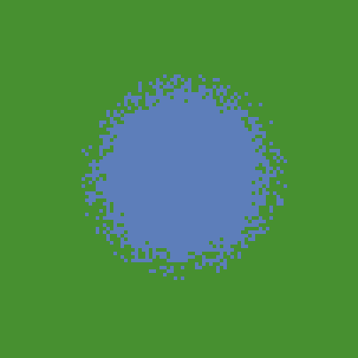

# Archaeological ABM at Cologne: from concept to application
Materials for the session organized by the [CoDArchLab](http://archaeoinformatik.uni-koeln.de/) in the Institute of Archaeology at University of Cologne (20/6/2022).

This exercise introduces the basic concepts and workflow of Agent-based modelling (ABM), as it is used in archaeology. More specifically, it covers the prototyping of a conceptual model into a working simulation model, the 'refactoring' of code (cleaning, restructuring, optimizing), the re-use of published model parts and algorithms, the exploration of alternative designs, and the use of geographic, climatic and archaeological data to apply the model to a specific case study. The tutorial offers implementation examples of path cost analysis, hydrological and land productivity modelling, network dynamics, and cultural evolution.

This tutorial uses [NetLogo](https://ccl.northwestern.edu/netlogo/), a flexible well-established modelling platform known for its relatively low-level entry requirements in terms of programming experience. It has been particularly used in social sciences and ecology for research and educational purposes.

## Table of contents

- [Archaeological ABM at Cologne: from concept to application](#archaeological-abm-at-cologne-from-concept-to-application)
  - [Table of contents](#table-of-contents)
  - [Preparation](#preparation)
  - [Introduction](#introduction)
    - [Mathematical models](#mathematical-models)
    - [ABM main concepts](#abm-main-concepts)
    - [ABM in archaeology](#abm-in-archaeology)
    - [SES framework](#ses-framework)
    - [Modelling 'steps'](#modelling-steps)
    - [Modelling '(mis)steps'](#modelling-missteps)
    - [Refactoring regularly](#refactoring-regularly)
    - [Enforcing modularity](#enforcing-modularity)
    - [NOTE: where to find modules](#note-where-to-find-modules)
    - [Being explorative](#being-explorative)
    - [NOTE: documentation standards](#note-documentation-standards)
    - [References](#references)
  - [Block A](#block-a)
    - [Definition of domain/phenomenon/question](#definition-of-domainphenomenonquestion)
    - [Conceptual model](#conceptual-model)
      - [**NOTE: models as references**](#note-models-as-references)
      - [**The PondTrade model**](#the-pondtrade-model)
      - [**Base terrain**](#base-terrain)
      - [**First tier dynamics**](#first-tier-dynamics)
      - [**Second tier dynamics**](#second-tier-dynamics)
    - [NetLogo basics](#netlogo-basics)
      - [**Console interaction**](#console-interaction)
      - [**Entities**](#entities)
      - [**Variables**](#variables)
      - [**Expressing equations**](#expressing-equations)
      - [**Procedures**](#procedures)
      - [**Logic bifurcation: `if` and `ifelse`**](#logic-bifurcation-if-and-ifelse)
      - [**Entities with variables, logic operations, and procedures**](#entities-with-variables-logic-operations-and-procedures)
      - [**Grid**](#grid)
      - [**Commenting code**](#commenting-code)
      - [**Dictionary**](#dictionary)
    - [NOTE: other platforms/languages](#note-other-platformslanguages)
    - [Test-drive: creating a "pond" terrain](#test-drive-creating-a-pond-terrain)
      - [**Step 0: Drawing a blue circle**](#step-0-drawing-a-blue-circle)
      - [**Step 1a: De-composing "magic numbers"**](#step-1a-de-composing-magic-numbers)
      - [**Step 1b: Parameterizing**](#step-1b-parameterizing)
      - [**Step 1c: Optimasing**](#step-1c-optimasing)
      - [**Step 2a: Pacing comments and line breaks**](#step-2a-pacing-comments-and-line-breaks)
      - [**Step 2b: Exploring alternative designs**](#step-2b-exploring-alternative-designs)
      - [**Step 2c: Colors and shades**](#step-2c-colors-and-shades)
      - [**Step 3: Adding noise** (*stochasticity*)](#step-3-adding-noise-stochasticity)
      - [**Step 4b: design alternatives**](#step-4b-design-alternatives)
      - [**Step 4c: *keeping* design alternatives**](#step-4c-keeping-design-alternatives)
      - [**Step 4d: patch neighborhood**](#step-4d-patch-neighborhood)
      - [**Step 4e: iterative structures**](#step-4e-iterative-structures)
      - [**Step 4f: printing event messages**](#step-4f-printing-event-messages)
      - [**Step 5: refactoring (again)**](#step-5-refactoring-again)
  - [Block B](#block-b)
    - [First tier model](#first-tier-model)
      - [**Step 6: defining *agents***](#step-6-defining-agents)
      - [**Step 7: agent AI**](#step-7-agent-ai)
      - [**Step 8 and 9: feedback loops**](#step-8-and-9-feedback-loops)
    - [Second tier model](#second-tier-model)
      - [**Step 10: cultural vectors**](#step-10-cultural-vectors)
      - [**Step 11: trait selection**](#step-11-trait-selection)
      - [**Step 12: statistics**](#step-12-statistics)
      - [**Step 13: output statistics**](#step-13-output-statistics)
  - [Block C](#block-c)
    - [Spatial data as input](#spatial-data-as-input)
    - [Time-series data as input](#time-series-data-as-input)
    - [NOTE: degrees of model calibration](#note-degrees-of-model-calibration)
    - [Exporting and importing heavy data](#exporting-and-importing-heavy-data)
    - [PondTrade with land productivity](#pondtrade-with-land-productivity)
    - [Formating and exporting output data](#formating-and-exporting-output-data)
  - [TO DO:](#to-do)
    - [Strategies for model 'validation'](#strategies-for-model-validation)

## Preparation

To prepare for the tutorial, you only need to:

- Download and install the latest version of NetLogo. The operating system-specific installation files are found here: https://ccl.northwestern.edu/netlogo/download.shtml
- Download or 'clone' the contents of this repository into a local folder. Select  in the top right of the repository page in GitHub, and choose one of the options given.

---
---
## Introduction

This is a brief overview of agent-based modelling (ABM), primarily focusing on how it is used in archaeology.

To better contextualise ABM, we start by positioning this modelling approach in relation to others and even more used by researchers in archaeology and keen disciplines. We then describe ABM's central concepts, including what makes it often more intuitive and adequate for representing certain phenomena, particularly social interactions, yet paradoxically being more complex and unpredictable than other simulation models. We move forward with a few notes about the particularities of ABM in archaeology, and the potential and pitfalls of the socio-ecological systems (SES) theoretical approach, which has been strongly linked to the development of an ABM community in archaeology.

In the remaining sections within the Introduction, we go deeper into the workflow of ABM. First, we lay out this workflow as it is commonly declared by practitioners, as a sequence of well-ordered steps that may be iterated in a revision cycle. Then, we introduce a few elements 'behind the scene' that stretch the 'steps' metaphor to its limits. We then review a few 'hint bits' that, hopefully, will aid future ABM modellers. These include the verification-refactoring cycle in programming, the use of modular code, and the importance of remaining explorative in model design.

---
### Mathematical models

As the term is used in science, we can define models as representations of a system, as a composite of elements and their relationships. Mathematical models are simply more advanced in their logical definition through the process of *formalisation*. The *informal* or *less formal* models are those that are defined only through natural language speech (e.g., in a live discussion), text (e.g., in an article or book), or through certain graphical pieces (e.g., infographics, diagrams).

Despite this distinction, there is no genuine opposition between models with different levels of formalisation. Mathematical formalisation is mainly used to implement and test the logic models stated less formally. Among the advantages of mathematical formalisation, the most important are univocity (i.e., things have a single definition) and commensurability (i.e. things can be measured or counted). These properties set formal models apart from models formulated purely with natural languages, among other things, allowing for a significant improvement in the robustness of our reasoning. Keep in mind, though: formalisation can also harm the intelligibility of our models, *because* they move away from natural languages.

Within the large family of mathematical models, ABM models lie typically within a category that can be characterised as *explicative* or *mechanistic*. Explicative models are focused on an explanation, expressing processes through realistic relationships between variables, often including assumptions. Non-explicative or *descriptive* mathematical models are used more strictly to describe, reproduce or extrapolate the relationship between variables (i.e., most statistical models). The latter models are about *patterns* or *trends* in data, while the former are about the *mechanisms* underlying data, at least as we can define them based on our current understanding of the phenomena's domain.

The line between these categories is blurred and confounded by many models and model users. Notice, for example, that the very term "explanation" is widely used in non-mechanistic ways (e.g., when it is said that the educational level of a person *explains* that person's income). However, the bulk of models on each side is considerable, and ABM models, in particular, have traits that are undeniably linked to the formulation of *mechanisms*.

To help understand this distinction, we can think about one of the most simple and popular descriptive models used today: the linear regression model. Every regression model is a generalised equation based on a geometric pattern, a straight line in the case of the linear regression:

>y = a + b·x

  
*Geometric representation of a linear regression model*

A linear regression model has two variables, x and y, which define two orthogonal dimensions, and two parameters, a and b, which determine the value of y when x = 0 and the tangent of the angle formed by the line with the x dimension. These are "meaningless" in the model design, even if we deliberately choose x as the "independent" variable, despite how they are interpreted at a higher level of analysis.

To put an archaeological example, imagine we have two variables measured in a collection of sites, the estimated maximum area and the count of potsherds on the surface. Imagine that we can define a regression model that states a positive correlation exists between them. Assuming our dataset is large enough and not radically biased, we could probably interpret that built area *influences* (i.e., causes, in a weak sense) the abundance of potsherds on the surface. It would not be necessarily illogical to conclude this. Yet, the relationship described in the model is ultimately a correlation (no archaeologist would think that one is directly linked to the other).

The trend expressed by the linear model is but a "hint" of the mechanisms that are or could be postulated to explain it. Any hypotheses about the reason behind the correlation must be formulated outside the model, before or after its creation, for instance, by combining it with a natural language model. Thus, a descriptive model is inherently incomplete as an analytic tool and remains trivial unless it is associated with an external explicative model, formal or informal.

Still, mathematical models have been proven to be very useful and are widely adopted. Consider that in the field of artificial intelligence, the success of the descriptive models encompassed by the so-called *machine learning* have pushed aside the approach using programmed or procedural behaviour, from which ABM has branched. Within the wave of data-driven methods, some scholars have even started to question the concept of "explanation" itself, posing that it might be a well-hidden fallacy of human cognition. On the other hand, it is still debatable how much *human* understanding can come from descriptive models alone.

---
### ABM main concepts

In contrast with other mechanistic and dynamic mathematical modelling approaches, ABM seeks to represent a phenomenon by explicitly modeling its parts. Therefore, ABM involves the expectation that the phenomenon at the macro-level is an *emergency* of the dynamics at the micro-level. Moreover, ABM implies that the parts, the agents, constitute 'populations', *i.e.*, they share common properties and behavioral rules. The 'agency' behind the term 'agent' also implies that these parts have certain autonomy with respect to each other and the environment, which justifies simulating their behavior at an individual level.

In practice, 'autonomy' often translates as the agents' ability to take action, move, decide, or even think and remember. Nevertheless, agent-based models also include entities that are *technically* agents (on the terms of [multi-agent systems](https://en.wikipedia.org/wiki/Multi-agent_system)), but lack those abilities or are not considered real discrete entities. The most common case is to represent space sectors as agents fixed to unique positions in a grid to facilitate the implementation of distributed spatial processes (*e.g.*, the growth of vegetation dependent on local factors). In NetLogo, this type of agent is predefined as `patches` and is extensively used in models in ecology and geography.

Compared to other modeling and simulation approaches, ABM is more intuitive but also more complex. For example, the [Lotka-Volterra predator-prey model](https://en.wikipedia.org/wiki/Lotka%E2%80%93Volterra_equations) in ecology is a pair of differential equations that are relatively simple and conceptually straightforward. They essentially express the following dynamics:

>assumption: prey population grows based on unspecified resources (*intrinsic growth rate*)   
>more prey -> more food for predators, so more predators will survive and reproduce  
>more predators -> more prey will be killed, so less prey will survive and reproduce  
>less prey -> less food for predators, so fewer predators will survive and reproduce  
>fewer predators -> less prey will be killed, so more prey will survive and reproduce  
>more prey -> more food ... (the cycle begins again)

<p style="text-align: center;">
<a title="AspidistraK, CC BY-SA 4.0 &lt;https://creativecommons.org/licenses/by-sa/4.0&gt;, via Wikimedia Commons" href="https://commons.wikimedia.org/wiki/File:Lotka_Volterra_dynamics.svg"></a>
<br>
<i style="color: grey;">Example of Lotka Volterra dynamics</i>
</p>

The same model can also be implemented with ABM (see the comparison in [NetLogo's Model Library Wolf-Sheep Predation (Docked Hybrid)](http://ccl.northwestern.edu/netlogo/models/WolfSheepPredation(DockedHybrid))). The ABM implementation requires many additional specifications on how predator and prey agents should behave individually. Even though it is not strictly necessary, ABM variations of the Lotka-Volterra model often aim to include more complexity. In the case of the Wolf-Sheep model mentioned, there is an explicit account of the base resource (*i.e.*, the prey of the prey), named `grass`, which is implemented as a property of spatial units. These additional specifications normally help the model be more intuitive and realistic but also significantly complicate the model design and implementation, even though generating the same aggregate dynamics as the equation-based version (*i.e.*, oscillation harmony between prey and predator populations).

<p style="text-align: center;">
<a title="SethTisue, GPL &lt;http://www.gnu.org/licenses/gpl.html&gt;, via Wikimedia Commons" href="https://commons.wikimedia.org/wiki/File:Netlogo-ui.png"></a>
<br>
<i style="color: grey;">NetLogo user interface running the Wolf-Sheep Predation model</i>
</p>

Another important and distinctive aspect of agent-based models is that they are unavoidably *stochastic*, i.e., at least some processes are fed by random sequences.

By definition, the order in which agents of a type perform their processes should not be predefined and, overall, should not be the same followed every iteration of the model. Thus, the only unbiased way of *scheduling* processes in ABM is to randomize all distributed sequences. This is (usually) not the case in models based on differential/difference equations, where the equations calculating variables are solved following a particular fixed order.

Methodologically, introducing randomness is a way of accounting for the entire spectrum of possibilities, whenever a certain aspect of the model is undertheorized or cannot be controled in real scenarios. More importantly, it is justified whenever the modeler believes that the intended behavior is independent of a specific value or order. 

For those with no previous experience with computer science: note that "random" for a computer is not like "rolling dices". We are getting values of a preordered sequence presumably unrelated to the process at hand. The programs creating these sequences are called [pseudorandom number generator](https://en.wikipedia.org/wiki/Pseudorandom_number_generator) or RNG, for short. Sequences will be different every time we run our program (*i.e.*, simulation), unless we preset the RNG using a specific 'seed', an integer often spanning a massive range of positive and negative numbers. Setting a particular RNG seed is, in fact, good practice, and it helps enforce the reproducibility of simulation results.

This technique is also helpful in creating variation within a population of agents or between the global conditions of simulation runs. Such a thing is accomplished by drawing the values of variables from probability distributions, defined through *hyperparameters* (*e.g.*, drawing the age of individuals in a classroom from a normal distribution defined by two parameters, `age_mean` and `age_standardDeviation`). Unfortunately, a common bad practice is not exposing such hyperparameters, having these 'hard-coded' as if their value were an intrinsic part of the model and thus the mechanisms it represents. This bad coding element often called "magic numbers", can and should be addressed during model implementation (see [Verification-refactoring cycle](#verification-refactoring-cycle)).

---
### ABM in archaeology

particularities of ABM in archaeology

---
### SES framework

the behaviour-environment balance

---
### Modelling 'steps'

Modelling with ABM can be divided into a series of steps, most of which are identified by the community of practitioners as either normative or recommended phases of model development. With minor variations, these are also recognised in other simulation and non-simulation modelling approaches.

The steps are: 

- *definition* of research question and phenomenon
- *design*
- *implementation*
- *verification*
- *Validation*

TO DO: brief description of each step

>**Definition**. Al identificar el sistema se estable las relaciones entre observador y alguna parte del realidad, definida como una colección de objetos y sus relaciones y comportamientos relevantes. En este paso inicial es clave ubicar las fronteras del sistema, dentro de las cuales la interacción entre objetos no implica influencias externas relevantes, al menos en la escala temporal enfocada. Esto es especialmente significativo para la representación del sistema, en la cual se une las imágenes simbólicas de los elementos del sistema al paradigma de resolución de problemas utilizado por el observador. Durante esta etapa hemos de descartar detalles irrelevantes y definir interacciones funcionales entre los elementos del sistema, creando una topología con definiciones matemáticas (formales) o de comportamiento (pseudoformales). Además, cualquier entrada, salida y comportamientos de sus elementos han de ser mesurables, de modo que el futuro modelo pueda referenciarse a la realidad correspondiente y ser validado.

>**Design**. Una vez identificado el sistema y hecha su representación, se inicia el proceso de diseño del modelo, que no es más que desarrollar representaciones “adecuadas” del sistema en cuestión. Se trata de traducir los elementos y sus relaciones en los elementos de diseño formal necesarios para expresar la topología definida en las etapas anteriores. 

>**Implementation**. Esta etapa se confunde a menudo con la implementación del modelo (i.e. programación, sensu stricto), ya que ambos pueden ser procesos simultáneos y retroalimentados. 

>**Verification**. 

>**Validation**. Validation, which is considered a fifth step by most of the modeling literature, is regarded here as an extra, lengthy process, often separable from the tasks involved in defining, implementing and exploring a model. 
>La etapa final y más importante de todo el procedimiento de modelización es la validación del modelo. Su importancia está en que las simulaciones de sistemas no lineares deberían ser cuidadosamente testadas, para confirmar que su comportamiento es consistente con aquel observado en el sistema real. Se ha de notar, no obstante, que la validación no es un atributo del modelo, sino un proceso y un conjunto de decisiones. No existen modelos perfectos; éstos serán siempre mejorables, ya que son por definición simplificaciones. Pero tampoco existen modelos falsos, en tanto que no existen representaciones falsas de la realidad, sino mejores o peores, según los criterios de validación que elijamos (Legay 1973). En este sentido, la validación ideal es aquella que aprueba el modelo según todos los criterios posibles, desde su ajuste frente series de datos externos a su fiabilidad como instrumento (e.g. utilidad, simplicidad, generalidad, coherencia, fecundidad, convergencia, estabilidad, no identidad con el sistema representado). Asimismo, se puede mostrar muy útil en esta etapa la comparación entre diferentes modelos, desde diferentes aproximaciones y ámbitos de interés (Erwin 1997).


  
Furthermore, a few of us also like to highlight two additional steps that are not normally acknowledged: 

- *understanding*
- *documenting*
  


---
### Modelling '(mis)steps'

However, building an ABM model is in practice a process that is significantly more complicated than the steps listed above. There are many shortcuts, such as finding a model or piece of code that can save months of work, but, more often, there are obstacles, fallbacks and failures that test ABM modellers and the teams of researchers working with them. Some modellers (myself included) have characterized this as an 'reiterative' process, often drawing diagrams where these steps are shown well-planned cycles. It might be more exact, however, to loose the walking metaphor altogether. 

The first problematic situation that comes to mind are, of course, the "technical issues". Developing ABM models requires a set of skills that are rare and hard to obtain and maintain, meanwhile doing other research tasks. Probably the most prominent skill of a modeller is programming, which involves both conceptual abstraction and certain agility with the software being used. The latter is made even more relevant when the software used is poorly documented or requires a special setup upon installation. This is certainly the first entry toll of the ABM community for researchers in the humanities and social sciences. Still, the hardships on this side are normally surpassable with continuous training, support from more experience modellers, and choosing the right software. Still, it is undeniably a long-term commitment. 

Unfortunately, there are issues related to ABM that go deeper than code and software. For example, during the model design process, researchers might need to ask inconvenient and apparently trivial questions about the phenomena represented, which raise an unexpected amount of controversy and doubt, and can even challenge some of the core assumptions behind a study. In archaeology, this may come as aspects that are considered out of the scope of empirical research, due to the limiting nature of archaeological data in comparison to disciplines that focus on contemporary observations (e.g. anthropology, sociology, geography). Should an archaeological ABM model include mechanisms that cannot be 'validated' by archaeological data (at least not in the same sense of experimental sciences)? This is probably the biggest unresolved question in this field and possibly the one most responsible of hindering the use of ABM in archaeology.

All of these complications can be considered problems as well as opportunities, depending on if and how they are eventually resolved. In some cases, the complication will present a new idea or approach while, in other cases, dealing with it might cost valuable time and delay the research outcomes beyond any external deadlines (e.g. project funding, dissertation submission). The tutorial below is presented in the spirit of safeguarding modellers in training from being stopped short by some of these obstacles, while pursuing their own research agendas using ABM.

Before jumping into coding, let us go over three general strategies that can offer a way out to at least some of the problems mentioned here. These strategies are: *refactoring regularly*, *enforcing modularity* and *being explorative*.

---
### Refactoring regularly

By definition, refactoring means that your code change but still remains capable of producing the same result. Refactoring encompases all tasks aiming to generalize the code, make it extendable, but also make it cleaner (more readable) and faster.

(example of modalities of refactoring)

However, there are a trade-off between these three goals. For example, replacing default values with calculations or indirect values will probably increase the time of processing. In practice, this trade-off is not relevant until your model is very complex, very populated (many entities), or must be simulated for many different conditions. I recommend to be always especially atentative with the readability, commentary and documentation of your code. Assuming you are interested in creating models for academic discussion (i.e., science rather than enginering purposes), the priority is to communicate your models to other people.

---
### Enforcing modularity 

Modularity and re-use
TO DO

---
### NOTE: where to find modules

TO DO NetLogo Modelling Commons, CoMSES, NASSA

---
### Being explorative

Exploring alternative and additional designs
TO DO

---
### NOTE: documentation standards

A short disclaimer before we start: the approach used here for conceptual modelling and model documentation is **not** considered a standard in the ABM community. In the bibliography, you will find many other recommendations and examples, particularly those converging into the practices closer to Computer Science and Ecology. For example, many consider a necessary standard to be the [Unified Modeling Language (UML)](https://en.wikipedia.org/wiki/Unified_Modeling_Language). The Overview-Design-Details (ODD) protocol is also quite strongly advocated by ABM practicioners (see **_On the ODD protocol_** in [References](#references)).

Over years of creating and reviewing ABM models, I would argue that these are not so useful or applicable as claimed, and the time spend in learning these could be better used in improving one's programming skills. However, I believe that any student of ABM should judge these proposed standards and decide for themselves. For the purpose of this tutorial, I only use simple text and free-styled graphs, while trying to enforce the clearest code as possible.

---
### References

This introductory session on ABM in archaeology is neither complete nor the necessary standard. The following materials can be very helpful to delve deeper into the subject, experiment various perspectives and cases, and possibly build a specialised profile in this field.

**_Introductions to ABM in archaeology_**

> Romanowska, Iza. 2021. Agent-Based Modeling for Archaeology. Electronic. SFI Press. https://doi.org/10.37911/9781947864382.

> Romanowska, Iza, Stefani A. Crabtree, Kathryn Harris, and Benjamin Davies. 2019. ‘Agent-Based Modeling for Archaeologists: Part 1 of 3’. Advances in Archaeological Practice 7 (2): 178–84. https://doi.org/10.1017/aap.2019.6.

> Davies, Benjamin, Iza Romanowska, Kathryn Harris, and Stefani A. Crabtree. 2019. ‘Combining Geographic Information Systems and Agent-Based Models in Archaeology: Part 2 of 3’. Advances in Archaeological Practice 7 (2): 185–93. https://doi.org/10.1017/aap.2019.5.

> Crabtree, Stefani A., Kathryn Harris, Benjamin Davies, and Iza Romanowska. 2019. ‘Outreach in Archaeology with Agent-Based Modeling: Part 3 of 3’. Advances in Archaeological Practice 7 (2): 194–202. https://doi.org/10.1017/aap.2019.4.

> Graham, Shawn, Neha Gupta, Jolene Smith, Andreas Angourakis, Andrew Reinhard, Ellen Ellenberger, Zack Batist, et al. n.d. ‘4.4 Artificial Intelligence in Digital Archaeology’. In The Open Digital Archaeology Textbook. Ottawa: ECampusOntario. https://o-date.github.io/draft/book/artificial-intelligence-in-digital-archaeology.html.

> Breitenecker, Felix, Martin Bicher, and Gabriel Wurzer. 2015. ‘Agent-Based Simulation in Archaeology: A Characterization’. In Agent-Based Modeling and Simulation in Archaeology, edited by Gabriel Wurzer, Kerstin Kowarik, and Hans Reschreiter, 53–76. Springer, Cham. https://doi.org/10.1007/978-3-319-00008-4_3.

> Cegielski, Wendy H., and J. Daniel Rogers. 2016. ‘Rethinking the Role of Agent-Based Modeling in Archaeology’. Journal of Anthropological Archaeology 41 (March): 283–98. https://doi.org/10.1016/J.JAA.2016.01.009.

> Graham, Shawn, Neha Gupta, Jolene Smith, Andreas Angourakis, Andrew Reinhard, Ellen Ellenberger, Zack Batist, et al. 2020. ‘4.4 Artificial Intelligence in Digital Archaeology’. In The Open Digital Archaeology Textbook. Ottawa: ECampusOntario. https://o-date.github.io/draft/book/artificial-intelligence-in-digital-archaeology.html.

**_Examples of ABM and other simulation approaches in archaeology_**

> Isaac Ullah (2022, June 01). “The Archaeological Sampling Experimental Laboratory (tASEL)” (Version 1.1.1). CoMSES Computational Model Library. Retrieved from: https://www.comses.net/codebases/addd3c54-d89a-4773-a639-8bf19bcf59ea/releases/1.1.1/

> Angourakis, Andreas, Jennifer Bates, Jean-Philippe Baudouin, Alena Giesche, Joanna R. Walker, M. Cemre Ustunkaya, Nathan Wright, Ravindra Nath Singh, and Cameron A. Petrie. 2022. ‘Weather, Land and Crops in the Indus Village Model: A Simulation Framework for Crop Dynamics under Environmental Variability and Climate Change in the Indus Civilisation’. Quaternary 5 (2): 25. https://doi.org/10.3390/quat5020025.

> Angourakis, Andreas, Matthieu Salpeteur, Verònica Martínez Ferreras, Josep Maria Gurt Esparraguera, Verònica Martínez Ferreras, and Josep Maria Gurt Esparraguera. 2017. ‘The Nice Musical Chairs Model: Exploring the Role of Competition and Cooperation Between Farming and Herding in the Formation of Land Use Patterns in Arid Afro-Eurasia’. Journal of Archaeological Method and Theory 24 (4): 1177–1202. https://doi.org/10.1007/s10816-016-9309-8.

> Madella, Marco, Bernardo Rondelli, Carla Lancelotti, Andrea L. Balbo, Débora Zurro, Xavier Rubio Campillo, and Sebastian Stride. 2014. ‘Introduction to Simulating the Past’. Journal of Archaeological Method and Theory 21 (2): 251–57. https://doi.org/10.1007/s10816-014-9209-8.

> Rubio Campillo, Xavier, Jose María Cela, and Francesc Xavier Hernàndez Cardona. 2012. ‘Simulating Archaeologists? Using Agent-Based Modelling to Improve Battlefield Excavations’. Journal of Archaeological Science 39 (2): 347–56. https://doi.org/10.1016/j.jas.2011.09.020.

> Wilkinson, Tony J., John H. Christiansen, Jason Alik Ur, M. Widell, and Mark R. Altaweel. 2007. ‘Urbanization within a Dynamic Environment: Modeling Bronze Age Communities in Upper Mesopotamia’. American Anthropologist 109 (1): 52–68. https://doi.org/10.1525/aa.2007.109.1.52.

> Premo, L. S. 2006. ‘Agent-Based Models as Behavioral Laboratories for Evolutionary Anthropological Research’. Arizona Anthropologist 17: 91–113.

> Erwin, Harry R. 1997. ‘The Dynamics of Peer Polities’. In Time, Process, and Structured Transformations, edited by Sander E. Van der Leeuw and James McGlade, 57–97. One World Archaeology 26. London: Routledge.

**_On the ODD protocol_**

> Grimm, Volker, Uta Berger, Finn Bastiansen, Sigrunn Eliassen, Vincent Ginot, Jarl Giske, John Goss-Custard, et al. 2006. ‘A Standard Protocol for Describing Individual-Based and Agent-Based Models’. Ecological Modelling 198 (1–2): 115–26. https://doi.org/10.1016/J.ECOLMODEL.2006.04.023.

> Grimm, Volker, Uta Berger, Donald L. DeAngelis, J. Gary Polhill, Jarl Giske, and Steven F. Railsback. 2010. ‘The ODD Protocol: A Review and First Update’. Ecological Modelling 221 (23): 2760–68. https://doi.org/10.1016/J.ECOLMODEL.2010.08.019.

> Müller, Birgit, Friedrich Bohn, Gunnar Dreßler, Jürgen Groeneveld, Christian Klassert, Romina Martin, Maja Schlüter, Jule Schulze, Hanna Weise, and Nina Schwarz. 2013. ‘Describing Human Decisions in Agent-Based Models – ODD + D, an Extension of the ODD Protocol’. Environmental Modelling & Software 48 (October): 37–48. https://doi.org/10.1016/J.ENVSOFT.2013.06.003.

**_External bibliography of ABM in archaeology_**

https://github.com/ArchoLen/The-ABM-in-Archaeology-Bibliography

**_Other resources for learning ABM_**

>Hart, Vi, and Nicky Case. n.d. ‘Parable of the Polygons’. Parable of the Polygons. Accessed 24 May 2022. http://ncase.me/polygons.

> Izquierdo, Luis R., Segismundo S. Izquierdo, and William H. Sandholm. 2019. Agent-Based Evolutionary Game Dynamics. https://wisc.pb.unizin.org/agent-based-evolutionary-game-dynamics/.

---
---

## Block A

TO DO:

---
### Definition of domain/phenomenon/question

TO DO: INTRO

- **Case study**: settlement interaction and the emergence of hierarchical settlement structures in Prepalatial south-central Crete (Paliou & Bevan 2016)
- **Phenomena to represent**: cycles of growth and collapse (i.e., fluctuations in the scale of site occupation). Focus on site interconnectivity and its relationship with settlement size and the consolidation of territorial structures.
- **Main assumption**: topography, transport technology, exchange network, settlement size, wealth, and cultural diversity are intertwined in a positive feedback loop.

TO DO: formation of settlement hierarchical structures

TO DO: Brief Summary and mention of regression approach used in paper?

**Main Reference**

> Paliou, Eleftheria, and Andrew Bevan. 2016. ‘Evolving Settlement Patterns, Spatial Interaction and the Socio-Political Organisation of Late Prepalatial South-Central Crete’. Journal of Anthropological Archaeology 42 (June): 184–97. https://doi.org/10.1016/j.jaa.2016.04.006.

---
### Conceptual model 

 When creating your first conceptual model, I recommend starting from scratch, with the first intuition that comes to mind. Its logic structure may be oversimplified, incomplete, or faulty after later scrutiny. However, it would most likely represent the main elements of an informal model that you and other researchers share. Relying on an informed guess to start model development is the best remedy for the ‘blank page panic’. It will also help you avoid  overthinking and overworking what should be a mere preliminary schetch of the model.

Said this, we might still sufer when trying to jump-starting the modelling process. Even if (or maybe specially when) a large interdisciplinary team is involved, such as it is often the case in ABM-related projects.

#### **NOTE: models as references**

To complement the initial "brainstorming" of conceptual models, modellers will often search and review models already published on related subjects, considering if these could be reused, at least as an inspiration.

Here is when keeping yourself posted about the ABM community may give you an edge. Unfortunately, academic publishing have become a saturated media and it is relatively hard to be updated about certain types of research, such as ABM models, which are often spread in many types of specialised publications. Public model repositories, such as CoMSES, and initiatives, such as the modular library from NASSA, may aid you greatly in this task. But, ultimately, finding a relevent model will depend on your skills in Internet search, and the attention that others have put on preparing and publishing their models.

Regarding our case study, there are many models that we could adopt as a start point or as potential source of modules. ABM models in archaeology built from the SES framework are likely to be adaptable to our case study, however, with variable success regarding the relevance of its results to our main question. Most models in this category are indeed focused on elements of landscape archaeology, particularly settlement patterns and emerging social complexity in prehistoric to early-historic periods. Among the most prominent candidates, we could count, for example, [Artificial Anasazi](https://www.comses.net/codebases/2222/) and its variations, [MERCURY](https://www.comses.net/codebases/4347/) and its extensions, [MayaSim](https://www.comses.net/codebases/3063/), and especially [AncientS-ABM](https://www.comses.net/codebases/50cf5d2a-0f37-4d4d-84e0-715e641180d9/), which has been in fact designed for Minoan Bronze Age and applied to different parts of Crete.

However, given that this is a tutorial, we will be using another, much simpler model: the **_PondTrade_** model.

#### **The PondTrade model**

The PondTrade model was designed by me in 2018 to facilitate learning ABM and is designed particularly for archaeology and history. This model represents mechanisms that links cultural integration and economic cycles caused by the exchange of materials (“trade”) between settlements placed in a heterogeneous space (“pond”). The PondTrade design intentionally includes several aspects commonly used by other ABM models in archaeology and social sciences, such as multiple types of agents, the representation of a so-called “cultural vector”, procedural generation of data, network dynamics, and the reuse of published submodels and algorithms.

The Pond Trade model and all its versions were developed by myself, Andreas Angourakis, and are available for download in this repository: https://github.com/Andros-Spica/PondTrade (note that the content of PondTrade/README.md is a previous and incomplete version of what we will cover here in Block A). It has also been used in Graham et al. 2020, as one of several exercises on ABM, and the text in this tutorial relies partially in the content of that chapter.

Since our research question fits quite well with the scope of the PondTrade model, we will use it to approach our case, while also learning about ABM and NetLogo through following its development steps.

The Pond Trade model core idea is inspired on the premise that the size of settlement economy is dependent on the volume of materials exchanged between settlements for economic reasons (i.e. ‘trade’). The "economic" size of settlements stand as an overall measured of, e.g., population size, volume of material production, built surface, etc. specifically concerning maritime and fluvial routes as opportunities for transportation. The guiding suggestion was that, because of the shifting nature of trade routes, economy size displays a chaotic behavior as described by chaos theory (apparently ‘random’ oscillations).

Even though the initial inspiration may be theoretically profound, empirically-based, or well-connected to discussions in the academic literature, the primary core mechanism must narrow down to a straightforward, intelligible process. In this case, the focus is to represent a positive feedback loop between economic size and trade volume coming in and out, which can be described as follows:

>Ships stakeholders choose their destination trying to maximize the value of their cargo by considering settlement size and distance from their base settlement;
An active trade route will increase the economic size of settlements at both ends;
An increase in size will increase trade by: 3a. Making a settlement more attractive to ship stakeholders from other settlements; 3b. Allowing the settlement to host more ships;
In addition to the core mechanism, we may consider other aspects to represent the phenomenon better. For instance, the first implementation steps in the Pond Trade tutorial addresses the setting of a ‘geography’ of settlements implicit in the concept of route, which is not a trivial task from the programming perspective.


>Elements: “pond” or water body, settlements, ships, routes, goods.
Rules:
Coastal settlements of variable size around a rounded water body (“pond”).
Trade ships travel between the settlements.
Once in their base settlement, ships evaluate all possible trips and choose the one with the greater cost-benefit ratio.
Ships carry economic value and cultural traits between the base and destination settlements.
Settlement size depends on the economic value received from trading.
The economic value produced in a settlement depends on its size.
The number of ships per settlement depends on its size.

#### **Base terrain**

- Step 0: drawing a blue circle
- Step 1: replacing “magic numbers”
- Step 2: refactoring
- Step 3: adding noise
- Step 4: design alternatives and printing to the console
- Step 5: refactoring and organizing

#### **First tier dynamics**
- settlement size and growth maintained by production AND trade (exchange)
- specialisation/differentiation of settlements as the outcome of exchange network dynamics


- Step 6: agent types
- Step 7: agent AI
- Step 8: adding feedback loops I
- Step 9: adding feedback loops II


  
*Pond Trade conceptual model at start (first tier)*

#### **Second tier dynamics**
- production is 'grounded', i.e. dependent on each settlement catchment area size and productivity
- cultural integration as the outcome of exchange network dynamics

Step 10: cultural vectors
Step 11: trait selection
Step 12: interface statistics
Step 13: output statistics

  
*Pond Trade conceptual model at start (second tier)*

---
### NetLogo basics

>NOTE: In the explanation below I'm using `<UPPERCASE_TEXT>` to express the positions in the code to be filled by the name of entities, variables, and other elements, depending on the context. For instance, `<COLOR> <FRUIT>` would represent many possible phrases, such as "red apple", "brown kiwi", etc. 

#### **Console interaction**

As a preamble, important to anyone without previous experiences with programming languages, the very first thing one can do in NetLogo is give oneself a bit of encouragement. In the **NetLogo interface**, go to the bottom area named **'Command Center'** and type the following in the empty field on the right of **'observer>'** and press Enter:

```NetLogo
You can do it!
```

The console prints:

```
ERROR: Nothing named YOU has been defined. 
```

Oops! NetLogo still doesn't know "you". Or is it that it cannot *understand* you? Well let us get you two properly introduced...

#### **Entities**

The (real) first thing one should learn about NetLogo, and most agent-based modeling systems, is that it handles *mainly* two types of entities/agents: `patches`, cells of a square grid, and `turtles`, which are proper "agents" (i.e., mobile, autonomous entities). Both entities have *primitives* (built-in, default properties), some of which can be modified by processes in your model. For example, you can't modify the position of a patch, but you can change its filling color.

  
*NetLogo world and entities (Figure 2 in Izquierdo et al. 2019)*

As seen in the figure above, NetLogo also includes a third type of entity, `links`, which has the particularity of describing a connection between two `turtles` and thus not having specific spatial coordinates of their own. We will deal with links later on, but for now we focus on the other entities, which are more commonly used in models.

All `patches` and `turtles` can be identified individually through primitives. Turtles have a unique numerical identifier (`who`) that is assigned automatically upon the creation of the turtle. Patches, in turn, have an unique combination of x and y integer coordinates in 2D space (`pxcor` and `pycor`), as they occupy each a single position in a grid (see **Grid**). To reference a specific turtle or patch:

```NetLogo
turtle <WHO_NUMBER>
patch <PXCOR> <PYCOR>
```

NetLogo allows you to define types of `turtles` as if it where a primitive, declarings its name as a `breed`:

```NetLogo
breed [<BREED_1_NAME_PLURAL> <BREED_1_NAME_SINGULAR>]

breed [<BREED_2_NAME_PLURAL> <BREED_2_NAME_SINGULAR>]
```

We can then use the plural or singular form of the `breed` name directly, instead of referring to the generic `turtles`.

```NetLogo
<BREED_1_NAME_PLURAL> <WHO_NUMBER>
```

This is useful, of course, when there are more the one `breed`to be defined, so that they are easily distinguished and inteligible in the code.

Last, we should keep in mind that `turtles` can be created and destroyed on-the-fly during simulations, while `patches` are created in the background upon initialisation, according to the model settings (e.g. grid dimensions), but never destroyed during simulation runs.

See NetLogo's documentation on agents for further details (https://ccl.northwestern.edu/netlogo/docs/programming.html#agents).

#### **Variables**

The most fundamental elements of NetLogo, as in any programming language, is variables. To assign a value to a variable we use the general syntaxis or code structure:

```NetLogo
set <VARIABLE_NAME> <VALUE>
```

While variable names are fragments of contiguous text following a naming convention (*e.g.* `my-variable`, `myVariable`, `my_variable`, etc.), values can be of the following data types:

- Number (*e.g.*, `1`, `4.5`, `1E-6`)
- Boolean (*i.e.*, `true`, `false`)
- String (effectively text, but enclosed by quote marks: *e.g.*, `"1"`, `"my value"`)
- `turtles`, `patches` (*i.e.*, NetLogo's computation entities; see **Entities**)
- AgentSet (a set of either `turtles` or `patches`; see **Entities**)
- List (a list enclosed in squared brakets with values of any kind separated by spaces: *e.g.*, `[ "1" 1 false my-agents-bunch ["my value" true 4.5] ]`)

Before we assign a value to a variable, we must declare its scope and name, though not its data type, which is only defined when assigning an specific value. Variable declaration is typically done at the first section of a model script and its exact position will depend on if it is stored globally or inside entities. These types of declarations follow their own structures:

```NetLogo
globals [ <GLOBAL_VARIABLE_NAME> ]

turtles-own [ <TURTLE_VARIABLE_NAME> ]

<BREED_1_NAME_PLURAL>-own
[ 
  <BREED_1_VARIABLE_1_NAME>
  <BREED_1_VARIABLE_2_NAME>
]

patches-own [ <PATCHES_VARIABLE_NAME> ]
```

As an exception to this general rule, variables can also be declared "locally" using the following syntaxis:

```NetLogo
let <VARIABLE_NAME> <VALUE>
```

As in other programming languages, having a variable declared locally means it is inside a temporary computation environment, such as a procedure (see below). Once the environment is closed, the variable is automatically discarded in the background.

#### **Expressing equations**

As we will see examples further on, the values of variables can be transformed in different ways, using different syntaxis, depending on their type. Possibly the most straightforward case is to perform basic arithmetic operations over numerical variables, expressing equations. These can be writen using the special characters normally used in most programming languages (`+`, `-`, `*`, `/`, `(`, etc.):

```NetLogo
set myVariable (2 + 2) * 10 / ((2 + 2) * 10)
```

Notice that arithmetic symbols and numbers must be separated by spaces and that the order of operations can be structured using parentheses.

To help you read expressions that hold several operations, NetLogo allow line breaks, as long as these are placed after an operator (not a variable or value). The best and safer practice for this is to use parentheses abundantly to ensure the right sequence of operations is performed:

```NetLogo
set myVariable (
  (
    (2 + 2) * 
    10
  ) / (
    (2 + 2) * 
    10
  )
)
```

Additionally, as proper equations, such expressions in NetLogo will also accept variables names representing their current value. Equations can then serve to create far reaching dependencies between different parts of the model code:

```NetLogo
set myVariable 2
set myOtherVariable 10

<...>

let myTemporaryVariable 2 * myVariable * myOtherVariable

set myVariable myTemporaryVariable / myTemporaryVariable
```

#### **Procedures**

In NetLogo, any action we want to perform, that is not manually typed in the console, must be enclosed within a procedure that is declared in the model script (the text in **'Code'** tab in the user interface). Similarly to 'functions' or 'methods' in other programming languages, a procedure is the code scripted inside the following structure:

```NetLogo
to <PROCEDURE_NAME>
  <PROCEDURE_CODE>
end
```

Any procedure can be executed by typing `<PROCEDURE_NAME>` + Enter in the NetLogo's console at the bottom of the 'Interface' tab. The "Hello World" program, a typical minimum exercise when learning a programming language, correspond to the following procedure `hello-world`:

```NetLogo
to hello-world
  print "Hello World!"
end
```

which generates the following "prints" in the console:

```
observer> hello-world
Hello World!
```

Procedures are particularly useful to group and enclose a sequence of commands that are semantically connected for the programmer. For example, the following procedure declares a temporary (local) variable, assigns to it a number as value, and prints it in the console:

```NetLogo
to set-it-and-show-me
  let thisVariableOfMine 42
  print thisVariableOfMine
end
```

Procedures can then be used elsewhere by writing its name (more complications to come). A procedure can be included as a step in another procedure: 

```NetLogo
to <PROCEDURE NAME>
  <PROCEDURE_1>
  <PROCEDURE_2>
  <PROCEDURE_3>
  ...
end
```

NetLogo's interface editor allows us to create buttons that can execute one or multiple procedures (or even a snippet of *ad hoc* code). The interface system is quite straightforward. First, at the top of the interface tab, click "Add" and select a type of element in the drop-down list. Click anywhere in the window below to place it. Select it with click-dragging or using the "Select" option in the right-click pop-up menu. You can edit the element by selecting "Edit", also in the right-click pop-up menu. For any doubts on how to edit the interface tab, please refer to NetLogo's documentation (https://ccl.northwestern.edu/netlogo/docs/interfacetab.html).

#### **Logic bifurcation: `if` and `ifelse`**

>The code exemplifies how to create conditional rules according to predefined general conditions using if/else statements, which in NetLogo can be written as `if` or `ifelse`:

```NetLogo
if (<CONDITION_1_IS_TRUE>)
[
  <DO_ACTION_A>
]

ifelse (<CONDITION_2_IS_TRUE>)
[
  <DO_ACTION_B>
]
[
  <DO_ACTION_C>
]
```

#### **Entities with variables, logic operations, and procedures**

You can `ask` all or any subset of entities to perform specific commands by folowing the structure:

```NetLogo
ask <ENTITIES>
[ 
  <DO_SOMETHING>
]
```

Commands inside the `ask` structure can be both direct variable operations and procedures. For instance:

```NetLogo
ask <BREED_1_NAME_PLURAL>
[ 
  set <BREED_1_VARIABLE_2> <VALUE>
  <PROCEDURE_1>
  <PROCEDURE_2>
  <PROCEDURE_3>
]
```

However, all variables referenced inside these structures must be properly related to their scope, following NetLogo's syntax. For example, an agent is only able to access the variable in another agent if it we use the folowing kind of structure:

```NetLogo
ask <BREED_1_NAME_PLURAL>
[ 
  set <BREED_1_VARIABLE_2> of  <VALUE>
]
```

It is possible to select a subset of any set of entities through logic clauses to be checked separately for each individual entity. For example, to get all agents with a certain numeric property greater than a given threshold:

```NetLogo
<TYPE_NAME_PLURAL> with [ <VARIABLE_NAME_1> > <THRESHOLD> ]
```

As a summary minimum example, running the folowing script in NetLogo will define a type of turtle named `my-chatty-agents` (plural)

#### **Grid**

One should spend some time understanding the grid structure and associated syntaxis. It is recommendable to consult the "settings" pop-up window in the "interface tab":

  
*The settings pop-up window in NetLogo*

The default configuration is a 33x33 grid with the position (0,0) at the center. Both dimensions and center can be easily edited for each particular model. Moreover, we can specify agents behavior at the borders by ticking the "wrap" options. Wrapping the world limits means that, for instance, under the default setting mentioned above, the position (-16,0) is adjacent to (16,0). In the console, we can "ask" the patch at (-16,0) to print its distance to the patch at (16,0), using the primitive function `distance` (https://ccl.northwestern.edu/netlogo/docs/dictionary.html#distance):

```
observador> ask patch -16 0 [ print distance patch 16 0 ]
1
```

Wrapping one dimension represents a cylindrical surface while wrapping two depicts a strange toroidal object (Donut!). Although this aspect is relatively hidden among the options, it can have great importance if spatial relations play any part in a model. So if you want your grid to represent a geographical map, make sure to untick the wrapping features.

#### **Commenting code**

Annotations or comments (i.e., text that should be ignored when executing the code) can be added to the code by using the structure:

```NetLogo
<CODE>
; <FREE_TEXT>
<CODE>
```

or

```NetLogo
<CODE> ; <FREE_TEXT>
```

#### **Dictionary**

One of the most useful resources of NetLogo's documentation is the *dictionary* that can be accessed in the "Help" menu. This is true at any moment throughout your learning curve; even when you know all *primitives* and built-in functions by heart. Moreover, all documentation is present with any copy of NetLogo, so it is fully available offline. 

The dictionary is particularly useful whenever you are learning by example, as in our case. For instance, regarding the earlier mention of `distance`, you could have searched it in the dictionary directly. Whenever you find yourself reading NetLogo code with violet or blue words that you do not understand, take the habit of searching them in NetLogo's *dictionary*.

For **more information** consult [NetLogo Programming Guide](https://ccl.northwestern.edu/netlogo/docs/programming.html).

---
### NOTE: other platforms/languages


---
### Test-drive: creating a "pond" terrain 

>Once a minimum conceptual model is defined, we should use caution when attempting our first implementation. As seen in the previous exercise, a relatively simple model may still correspond to code that can be very difficult to control and understand. Simulation models are very sensitive to the presence of feedback loops. Notice in the tutorial that the positive feedback loops present in the conceptual model are not included until the most basic and predictable aspects are properly defined and their behaviors verified.

#### **Step 0: Drawing a blue circle**

Now, let us make a minimum working example of all elements explained above, while also advancing towards the Pond Trade model prototype.

Inside a single procedure, called `create-map`, we order (`ask`) all `patches` to do something using the structure: 

```NetLogo
to create-map

  ask patches
  [ 
    <DO_SOMETHING>
  ]

end
```

Next, we use the syntax for setting variables (`set <VARIABLE> <VALUE>`) inside the procedure to change `patches` color to blue:

```NetLogo
to create-map

  ask patches
  [ 
    set pcolor blue
  ]

end
```

Notice that both `pcolor` and `blue` are 'primitives', so they are automatically understood by NetLogo. Remember to consult NetLogo's Dictionary, if in doubt about such primitives. Color primitives such as `blue` or their numeric equivalent are shown in 'Color Swatches' inside the Tools menu tab.

Since we don't want all patches to have the same color, we need to build some structure that give different colors to patches depending on their position, so that a blue circle is draw.

Considering how to draw a circle, we need two bits of information: a *center* and a *radius*.

First, we must define a center. Because we won't use this information for anything else, we can declare and set a local variable (i.e., accessable only from its own context), using the syntax `let <VARIABLE> <VALUE>`. We define the center patch coordinates as (0,0):

```NetLogo
to create-map

  ask patches
  [ 
    let centralPatch patch 0 0

    set pcolor blue
  ]

end
```

We can set a radius for our circle using a single numeric value, e.g. 5, expressed in patch widths:

```NetLogo
to create-map

  ask patches
  [ 
    let centralPatch patch 0 0

    let minDistOfLandToCentre 5

    set pcolor blue
  ]

end
```

However, if we are passing a single absolute numeric value to be compared to a distance, the result will be sensitive to how large is our world grid. This is not wise, given that we might want to use this procedure in grids of different dimensions. Imagine that you are interested in changing the dimensions of the grid but want the circle to cover a similar proportion of it (e.g., adjusting the resolution of our map).

We can easily circunvent this code fragility by stepping-up its complexity. One alternative solution is to work with proportions of one of the grid dimensions, e.g. width (`world-width`). For the time being, we will set it to be half of half (a quater) of the width, since we have the circle positioned in the middle of the grid.

```NetLogo
to create-map

  ask patches
  [ 
    let centralPatch patch 0 0

    let minDistOfLandToCentre round (0.5 * (world-width / 2))

    set pcolor blue
  ]

end
```

We now use this variable for evaluating a criterium for a `ifelse` structure, finding out if a patch is inside or outside our circle. With this, we are ordering patches to paint themselves green or blue depending on if their distance to the center is less than a given value, i.e. `minDistOfLandToCentre`.

```NetLogo
ifelse (distance centralPatch < minDistOfLandToCentre)
[
  set pcolor blue ; water
]
[
  set pcolor green ; land
]
```

Now, the entire code for the `create-map` procedure is finally doing what we expected, drawing a blue circle over a green background:

```NetLogo
to create-map

  ask patches [

    ; set central patch
    let centralPatch patch 0 0

    ; set minimum distance to centre depending on world width
    let minDistOfLandToCentre round (0.5 * (world-width / 2))

    ifelse (distance centralPatch < minDistOfLandToCentre)
    [
      set pcolor blue ; water
    ]
    [
      set pcolor green ; land
    ]

  ]

end
 ```

  
*Pond Trade step 0*

#### **Step 1a: De-composing "magic numbers"**

The code we just created has several fixed arbitrary values (the coordinates of the `centralPatch`, the values used to calculate `minDistOfLandToCentre`). It is good enough for us to draw a *particular* blue circle, but it is insufficient to draw other *types of blue circle*. Of course, the code will never be able to draw *anything*, if we are not programming it to do it. For instance, the colors `blue` and `green` are also magic numbers, but we are hardly interest in having them as parameters. We must generalize but also compromise, accepting that there will be possibilities that are not covered by our model.

First, is there any case where the `patch 0 0` is not the one at the center of the grid? Imagine that you don't like to have negative coordinates in your model. Go to "Settings" and modify the "location of origin" to be at the corner. Now, test the `create-map` procedure:


Not at all what we are looking for! To correct this behavior, we must calculate the center coordinates, depending on the ranges or sizes of the grid width and height, whatever its configuration. Therefore, we must replace `0` with the calculation `minimum + range / 2` for both x and y coordinates:

```NetLogo
let centralPatch patch (min-pxcor + floor (world-width / 2)) (min-pycor + floor (world-height / 2))
```

We use the `floor` function to obtain the round lower grid position when the range is an odd number. Because this calculation uses only NetLogo primitives, you can test this by printing it in the console in any NetLogo model. It will return the central patch given your grid settings:

```NetLogo
observer> show patch (min-pxcor + floor (world-width / 2)) (min-pycor + floor (world-height / 2))
observer: (patch 16 16)
```

Now, regarding `minDistOfLandToCentre`, we could simply bring it as a parameter to be set in the interface instead of hard-coded (e.g. as a slider). This would be a better design, but we still would have a potential problem. Maybe you do not want the grid to be squared (e.g., 33x33), but rectangular (e.g., 100x20) instead. This is what you would get:


Again, not what we are looking for. No matter how strange our map is shaped, we want our pond to be always fully within the grid. To do this, we must modify our calculation of `minDistOfLandToCentre` to account for both width and height. One way of doing it is to calculate the radius for both dimensions and then choose the lowest value.

```NetLogo
let minXDistOfLandToCenter round 0.5 * (world-width / 2) ; minimum distance in X

let minYDistOfLandToCenter round 0.5 * (world-height / 2) ; minimum distance in Y

let minDistOfLandToCenter min (list minXDistOfLandToCenter minYDistOfLandToCenter)
```

To test our solution, we can run the procedure with different extreme grid settings:

| 100x20 | 20x100 |
| --- | --- |
|  |  |

Success!

#### **Step 1b: Parameterizing**

Once you defined a procedure in raw terms and tested that it does what you expect, you probably want to generalize it further. As the aim of modeling is to represent *a type of* phenomenon, it is a good practice to program all non-dynamic conditions as parameters. In NetLogo, parameters are often those variables that can be set through user input in the interface tab (e.g., slides, selectors, numeric fields).

After the later changes, we still have two magic numbers in our code. Regarding the calculation of `centralPatch` and `minDistOfLandToCentre`, we used `2` to divide `world-width` and `world-height`, so that the circle is always draw in the center of the grid. Although it is possible, we will not replace this value with a parameter. As an exercise aside, you can test the outcome of having different numbers instead of `2`.

The other "magic number" is `0.5`, used to represent the relative size of the pond radius, i.e., the *half* of the *half of the smaller dimension*.  Here we have a good candidate for a parameter. It is reasonable to believe that the size of the pond will be relevant to our model's results. Mainly, we expect that larger ponds will make trade slower, assuming a fixed number of settlements, evenly distributed around the pond.

In NetLogo, we create a parameter by adding an input element to the interface tab (e.g., slider) and naming it. In this case, we create a parameter called `pondSize` that represents the pond radius as the percentage of the smallest dimension, i.e. varing between 0 and 100. 
We can use it in the code to replace the two instances of `0.5` with `(pondSize / 100)`:

```NetLogo
let minXDistOfLandToCenter round ((pondSize / 100) * (world-width / 2)) ; minimum distance in X

let minYDistOfLandToCenter round ((pondSize / 100) * (world-height / 2)) ; minimum distance in Y

let minDistOfLandToCenter min (list minXDistOfLandToCenter minYDistOfLandToCenter)
```

Note that we use percentage, instead of a proportion (from 0 to 1), for no other reason than because it can improve the inteligibility of our model. I recommend using percentages to format this kind of parameters because they are more intuitive for humans and will be more easily understood by colleagues and the general public with no background in computer science or mathematics.

Once you close a version of any piece of code, it is good practice to increase the spacing between the lines or even break down single lines that are particularly complicated. NetLogo language allows much flexibility in this sense: you can add spaces, tabs, line breaks, and commentary between most elements of your code. Also, enclosing parenthesis are not required but may improve readability.

```NetLogo
to create-map

  ask patches [

    ; find central patch, depending on the size of dimensions
    
    let centralPatch
      patch
      ; position in X
      (
        min-pxcor +
        floor (world-width / 2)
      )
      ; position in Y
      (
        min-pycor +
        floor (world-height / 2)
      )

    print(centralPatch) ; print central patch

    ; find minimun distance of land pathes to the central patch, depending on the size of dimensions
    
    let minXDistOfLandToCenter round ((pondSize / 100) * (world-width / 2)) ; minimum distance in X
    
    let minYDistOfLandToCenter round ((pondSize / 100) * (world-height / 2)) ; minimum distance in Y
    
    let minDistOfLandToCenter min (list minXDistOfLandToCenter minYDistOfLandToCenter)

    ifelse (distance centralPatch < minDistOfLandToCenter)
    [
      set pcolor blue ; water
    ]
    [
      set pcolor green ; land
    ]

  ]

end
```

#### **Step 1c: Optimasing**

We increased significantly the `create-map` procedure, but we now have a process that is both flexible and controllable by user input. Yet, we still have a pending issue to solve.

The fact that the `centralPatch` and `minDistOfLandToCentre` are local variables (`let`) and placed inside `ask patches [ <ACTIONS> ]` means that we are creating and destroying a different variable once for every patch. We cannot use these variables (plural intended) outside their enclosing brackets and patches hold no memory of their values before or after this particular action. Does anything feel wrong about this? 

Besides taking unnecessary computational resources, this design does not generete any errors and, for now, is quite inofensive. However, while it can be easily solved in a short piece of code, it might become harder to find and have odd repercussions over other parts of our model later on. 

The solution is to extract the declaration of the local variables, `centralPatch` and `minDistOfLandToCenter`, from the patches commands. They are now calculated only once at the start of the procedure and then used by every patch:

```NetLogo
to create-map

  ; find central patch, depending on the size of dimensions
  let centralPatch
    patch
    ; position in X
    (
      min-pxcor +
      floor (world-width / 2)
    )
    ; position in Y
    (
      min-pycor +
      floor (world-height / 2)
    )
  print(centralPatch) ; print central patch

  ; find minimun distance of land pathes to the central patch, depending on the size of dimensions
  let minXDistOfLandToCenter round ((pondSize / 100) * (world-width / 2)) ; minimum distance in X
  let minYDistOfLandToCenter round ((pondSize / 100) * (world-height / 2)) ; minimum distance in Y
  let minDistOfLandToCenter min (list minXDistOfLandToCenter minYDistOfLandToCenter)

  ask patches [

    ifelse (distance centralPatch < minDistOfLandToCenter)
    [
      set pcolor blue ; water
    ]
    [
      set pcolor green ; land
    ]

  ]

end
```

  
*Pond Trade step 1*

#### **Step 2a: Pacing comments and line breaks**

Since our code for now is rather simple, we can downgrade the extensive commentary and line-breaking on the calculation of `centralPatch`.

Commenting and spacing your code is generally a good practice, but do not get carried away! You must assume that your reader has to know *something* about the programming language and the context of the model. Sometimes comments and line breaks might be just too many and end up defeating the purpuse of improving the code readabiity.

```NetLogo
to create-map

  let centralPatch patch (min-pxcor + floor (world-width / 2)) (min-pycor + floor (world-height / 2))

  ; find minimun distance to centre
  let minXDistOfLandToCenter round ((pondSize / 100) * (world-width / 2)) ; minimum distance in X
  let minYDistOfLandToCenter round ((pondSize / 100) * (world-height / 2)) ; minimum distance in Y
  let minDistOfLandToCenter min (list minXDistOfLandToCenter minYDistOfLandToCenter)

  ask patches [

    ifelse (distance centralPatch < minDistOfLandToCenter)
    [
      set pcolor blue ; water
    ]
    [
      set pcolor green ; land
    ]

  ]

end
```

At every step in this tutorial, we will be downgrading most commentaries added in the previous step.

#### **Step 2b: Exploring alternative designs**

During refactoring, we should always keep in mind that there are always alternative designs that could generate the outcome we seek, some of which might be more readable or optimal.

In this case, we can simplify the calculation of `minDistOfLandToCenter`. This new version initializes a local variable `halfSmallerDimension` assuming the smaller dimension is the width. Then, it checks that this is the case, and re-write this value if height is actually smaller. Finally, we calculate `minDistOfLandToCenter` as a proportion of `halfSmallerDimension`. 

```NetLogo
let halfSmallerDimension (world-width / 2)
if (world-width > world-height) [ set halfSmallerDimension (world-height / 2) ]

let minDistOfLandToCenter round ((pondSize / 100) * halfSmallerDimension)
```

This version is less redundant, uses two instead of three local variables, and expresses more clearly that the condition is the comparison between the grid width and height.

#### **Step 2c: Colors and shades**

Last, we replace the text reference for colors with NetLogo's numerical codes. Using this numeric system allow us to use many shades of any given color. In this case, we are selecting slightly different shades of blue (106) and green (54). You can consult the color codes in "Tools" > "Color Swatches" or in http://ccl.northwestern.edu/netlogo/docs/programming.html#colors:


  
*Pond Trade step 2*

Great, now we can draw a blue circle with a bulletproof piece of NetLogo code. Now let us go a few steps faster and aim at a more interesting outcome.

#### **Step 3: Adding noise** (*stochasticity*)

Stochasticity is intrinsic in NetLogo. We were already dealing with random processes since step 0, when asking patches to paint themselves. You probably did not realize, but the command `ask patches` demands that patches are ordered somehow. Think as if you were told to ask all your friends to have a look at your new model. Well, but who exactly are you going to ask first? NetLogo solves this dilemma automaticaly by randomizing the order of "asking". As an exercise, you can reduce the velocity of simulation (top of the interface tab), and execute the `create-map` procedure. You will observe each patch changing color, one at a time. This is also a nice example of using stochasticity to assure that an aggregated outcome (*i.e.* blue circle) is not a mere artefact of any particular schedulle of processes (*i.e.* the order in which patches change colors). Remember, sequences will be different every time we run our simulation, unless we preset the RNG using a specific 'seed' (see http://ccl.northwestern.edu/netlogo/docs/dict/random-seed.html).

But is it so important to have a random order? In our script so far, it is completely irrelevant. Our goal was to draw a blue circle; it does not matter which patch assumes the role of land or water first. However, this will became increasingly relevant as we advance in creating a proper agent-based model, because *agents' states DO normally depend on other agents' states*. Following the scenario where you want to show your model to your friends, imagine that your friends would talk to each other after one of them have seen your model and that some of them are more talkative and some more respected. Can you assume that the order in which you present your model would have no effect on the level of publicity and prestige of your model? *'I don't think so'*, *'Who knows?!'*, *'I don't really care about it'*? If these thoughts cross your mind while addressing a process in your model, you are probably better off using stochasticity. 

A perfect blue circle is great but it is a poor representation of a real water body. Once we implement the dynamics of the model, it will be quite difficult to explore the effect of geography solely by varying the size of the pond. The first step to creating more interesting set-ups is to add noise to the condition used to determine whether a patch is land or water. NetLogo has a family of primitive functions, `random` and alike, that can be used to generate random discrete (integer) and continuos (float) values, following different probability distributions (e.g., uniform, normal, exponential).

For each patch, we sample a random continuous number, add it to the `minDistOfLandToCenter`, and use as the threshold distance from the center:

```NetLogo
let coastThreshold minDistOfLandToCenter + random-float (halfSmallerDimension * coastalNoiseLevel / 100)

ifelse (distance centralPatch < coastThreshold)
[
  set pcolor 106 ; blue for water
]
[
  set pcolor 54 ; green for land
]
```

The function `random-float <number>` returns a random "float" number greater or equal to 0.0 and lower than `<number>`. To strech your learning skills, we are jumping a few minor steps in refactoring by defining a noise that is a portion of `halfSmallerDimension` and controlable through the parameter `coastalNoiseLevel`, exposed in the interface.

 ```NetLogo
to create-map

  let centralPatch patch (min-pxcor + floor (world-width / 2)) (min-pycor + floor (world-height / 2))

  let halfSmallerDimension (world-width / 2)
  if (world-width > world-height) [ set halfSmallerDimension (world-height / 2) ]

  let minDistOfLandToCenter round ((pondSize / 100) * halfSmallerDimension)

  ask patches
  [

    ; add noise to coast line
    let coastThreshold minDistOfLandToCenter + random-float (halfSmallerDimension * coastalNoiseLevel / 100)

    ifelse (distance centralPatch < coastThreshold)
    [
      set pcolor 106 ; blue for water
    ]
    [
      set pcolor 54 ; green for land
    ]

  ]

end
```

We now can generate strange "spray ponds". More importantly, we made the generation process controllable through two parameters that are easily understandable. Play with the parameters and meditate on their effects on the shape of the pond.

  
*Pond Trade step 3*

#### **Step 4b: design alternatives** 

Because a "spray pond" is not exactly what we want, let us implement another alternative to add stochasticity. NetLogo offers the `random-normal` primitive, which samples a random "float-point number" given the mean and standard deviation of a normal distribution, using the structure `random-normal <MEAN> <STD.DEV>` (https://ccl.northwestern.edu/netlogo/docs/dictionary.html#random-reporters). In this context, we can re-use the paramater `coastalNoiseLevel` for the latter and consider `minDistOfLandToCenter` as the mean.

Comment-out the line with `random-float` and add the following:

```NetLogo
; let coastThreshold minDistOfLandToCenter + random-float (halfSmallerDimension * coastalNoiseLevel / 100)
let coastThreshold random-normal minDistOfLandToCenter (halfSmallerDimension * coastalNoiseLevel / 100)
```

We can now experiment running `create-map` in three different ways: without noise, with uniform-distributed noise, and with normal-distributed noise. We can run each by commenting-out the line corresponding to the other two. For example, to come back to the no noise option:

```NetLogo
; no noise
let coastThreshold minDistOfLandToCenter
; uniform-distributed noise
; let coastThreshold minDistOfLandToCenter + random-float (halfSmallerDimension * coastalNoiseLevel / 100)
; normal-distributed noise
let coastThreshold random-normal minDistOfLandToCenter (halfSmallerDimension * coastalNoiseLevel / 100)
```

|  |  |
| --- | --- |
| no noise |  |
| uniform |  |
| normal |  |

But at this point, can we decide which option we want going forward? 

#### **Step 4c: *keeping* design alternatives** 

As mentioned, stochasticity may be the only honest way of defining values that are unknown or undefined in our conceptual model, but still need specification in the model implementation. Another useful, still honest approach is to consolidate alternative solutions and expose the criterium for deciding among them as a special type of parameter. Often, these will be Booleans (`true` or `false`), which can be set with "switchers" in NetLogo interface, or String (declarative text, e.g. `"option A"`, `"option B"`, `"option C"`), which can be selected through "choosers" or dropdown menus.

Create a chooser by clicking at "Add" and then "chooser" in the NetLogo Interface tab. Give it the name `noiseType` and write down a name for each alternative as String values:

  
*The configuration of a "chooser" for `noiseType`*

Then, we use this new parameter in `if` structures containing the code specific for each alternative:

```NetLogo
; no noise stands as the default alternative
let noiseRange (halfSmallerDimension * coastalNoiseLevel / 100)

ask patches
[
  if (noiseType = "uniform")
  [
    ; adds a random amount from a uniform distribution with mean minDistOfLandToCenter
    set noiseRange (random-float noiseRange) - (noiseRange / 2)
    set coastThreshold minDistOfLandToCenter + noiseRange
  ]
  if (noiseType = "normal")
  [
    ; adds a random amount from a normal distribution with mean minDistOfLandToCenter
    set coastThreshold random-normal minDistOfLandToCenter noiseRange
  ]

  ...
]
```

With this, we can now run `create-map` with any of the alternative designs without having to comment-out/in the code every time.

#### **Step 4d: patch neighborhood**

Despite having all the alternative modes of stochasticity, our ponds are still not quite what we need. This king of terrain might be valid to represent something like a swamp, but not a distinctive water body. There is no coastline, which makes PondTrade more interesting.

One generic, but very useful technique in distributed computation is "smoothing". More precisily, smoothing refers to the approximation of each point in a variable to the average of a sample of points, often taken from within the neighbourhood of the point.

In a two-dimensional grid such as in NetLogo, we can use the values in the immediate patch neighbourhood of each patch to adjust its value. In our present case, we want to switch the color of a patch, depending on the color of the adjacent patches. We can antecipate, however, that we will need to expose another paramater, one that can express how many neighbors (out of eight) of a type are enough to activate the change. We will call it `coastLineSmoothThreshold`. Notice that this step moves data in the opposite direction of our last steps, reducing stochasticity. Yet, it does not bringing us back to the original circle. Therefore, we want to smooth *after* adding noise.

Remembering our mandate of modularity, we want to avoid adding the code for this operation directly in `create-map`. Rather, we can implement it in a cleaner way by enclosing it in a new procedure:

```NetLogo
to smooth-coast-line

  ask patches
  [
    ifelse (pcolor = 106)
    [
      ; water patch
      if (count neighbors with [pcolor = 54] >= coastLineSmoothThreshold)
      [
        ; water patch has a certain number of land neighbors
        set pcolor 54 ; converted to land
      ]
    ]
    [
      ; land patch
      if (count neighbors with [pcolor = 106] >= coastLineSmoothThreshold)
      [
        ; land patch has a certain number of water neighbors
        set pcolor 106 ; converted to water
      ]
    ]
  ]

end
```

We can then used it by calling `smooth-coast-line` after `create-map`, either through the console or, better, by adding a button in the interface. Testing it for each `noiseType`:

|  |  |
| --- | --- |
| no noise |  |
| uniform |  |
| normal |  |

Notice that there is no effect visible on the no noise option, but we significantly modify the outcome of the others.

#### **Step 4e: iterative structures**

Try pressing the new `smooth-coast-line` button more than once after `create-map`. The coastline will become smoother and smoother, until it becomes stable. This behaviour indicates that we have a good opportunity for implementing and iterative structure. NetLogo has a easy option for this using the follow structure: `repeat <NUMBER OF ITERATIONS> [ <COMMANDS> ]`, requiring that we expose another parameter specifying the number of iterations, which we will call `smoothIterations`.

```NetLogo
to smooth-coast-line

  ; smooth coast line
  repeat smoothIterations
  [
    ask patches
    [
      ifelse (pcolor = 106)
      [
        ; water patch
        if (count neighbors with [pcolor = 54] >= coastLineSmoothThreshold)
        [
          ; water patch has a certain number of land neighbors
          set pcolor 54 ; converted to land
        ]
      ]
      [
        ; land patch
        if (count neighbors with [pcolor = 106] >= coastLineSmoothThreshold)
        [
          ; land patch has a certain number of water neighbors
          set pcolor 106 ; converted to water
        ]
      ]
    ]
  ]

end
```

#### **Step 4f: printing event messages** 

Since we are expanding considerably the complexity of our code, this is a good moment to consider printing messages for us to know what is happening in the background after pressing the buttons in the interface. This will be valuable specially when the code is encountering an error or outputing an unexpected result (i.e. *debugging*).

```NetLogo
to create-map

  print "Creating map..."

  ; erase previous data
  clear-all

  let centralPatch patch (min-pxcor + (floor world-width / 2)) (min-pycor + (floor world-height / 2))

  let halfSmallerDimension (world-width / 2)
  if (world-width > world-height) [ set halfSmallerDimension (world-height / 2) ]

  let minDistOfLandToCenter round ((pondSize / 100) * halfSmallerDimension)

  let coastThreshold minDistOfLandToCenter ; defaults to the basic value

  ;; add noise to coast line
  ; set general noise range depending on UI's coastalNoiseLevel and the size of world
  let noiseRange (halfSmallerDimension * coastalNoiseLevel / 100)

  print "Assigning initial patch types..."

  ask patches
  [
    ; noiseType is specified with the chooser in the UI
    if (noiseType = "uniform")
    [
      ; adds a random amount from a uniform distribution with mean minDistOfLandToCenter
      set noiseRange (random-float noiseRange) - (noiseRange / 2)
      set coastThreshold minDistOfLandToCenter + noiseRange
    ]
    if (noiseType = "normal")
    [
      ; adds a random amount from a normal distribution with mean minDistOfLandToCenter
      set coastThreshold random-normal minDistOfLandToCenter noiseRange
    ]

    ifelse (distance centralPatch < coastThreshold)
    [
      set pcolor 106 ; blue for water
    ]
    [
      set pcolor 54 ; green for land
    ]

  ]

  print "done."

end

to smooth-coast-line

  print "Smoothing..."

  ; smooth coast line
  repeat smoothIterations
  [
    ask patches
    [
      ifelse (pcolor = 106)
      [
        ; water patch
        if (count neighbors with [pcolor = 54] >= coastLineSmoothThreshold)
        [
          ; water patch has a certain number of land neighbors
          set pcolor 54 ; converted to land
        ]
      ]
      [
        ; land patch
        if (count neighbors with [pcolor = 106] >= coastLineSmoothThreshold)
        [
          ; land patch has a certain number of water neighbors
          set pcolor 106 ; converted to water
        ]
      ]
    ]
  ]
  print "done."

end
```

We just consolidated a version of our script that is able to create interesting (and more realistic) waterbody shapes with stochasticity, while being able to vary the output with a set of five parameters clearly displayed and no grave magic number unexposed.

  
*Pond Trade step 4*

#### **Step 5: refactoring (again)** 

We reached our initial objective, to have a realistic procedurally-generated terrain upon which we can build PondTrade. As before, we should now stop ourselves and think about refactoring, again.

Here is a summary of the improvements we can make:

- Control the RNG seed and expose it in the interface
- Move the initialisation of `coastThreshold` and `noiseRange` before `ask patches`
- Declare a new patch Boolean variable called `isLand` and use it to replace color in the procedures for creating terrains
- Define a new procedure `paint-patches` dedicated only to set patch colors based on `isLand`
- Call `smooth-coast-line` and `paint-patches` at the end of `create-map`
- In the evaluation of `coastLineSmoothThreshold` used in `smooth-coast-line`, consider it in relation to the actual number of neighbors  instead of as an absolute number (to avoid having isolated water bodies adjacent to the world edges, where there are less than 8 neighbors)
- Rearrenge the interface elements to set apart the parameters we will be using for terrain generation 

```NetLogo
patches-own [ isLand ]

to setup

  clear-all

  ; set the random seed so we can reproduce the same experiment
  random-seed seed

  create-map

end

to create-map

  let centralPatch patch (min-pxcor + (floor world-width / 2)) (min-pycor + (floor world-height / 2))

  let halfSmallerDimension (world-width / 2)
  if (world-width > world-height) [ set halfSmallerDimension (world-height / 2) ]

  let minDistOfLandToCenter round ((pondSize / 100) * halfSmallerDimension)

  let coastThreshold minDistOfLandToCenter ; defaults to the basic value

  ;; add noise to coast line
  ; set general noise range depending on UI's coastalNoiseLevel and the size of world
  let noiseRange (halfSmallerDimension * coastalNoiseLevel / 100)

  ask patches
  [
    ; noiseType is specified with the chooser in the UI
    if (noiseType = "uniform")
    [
      ; adds a random amount from a uniform distribution with mean minDistOfLandToCenter
      set noiseRange (random-float noiseRange) - (noiseRange / 2)
      set coastThreshold minDistOfLandToCenter + noiseRange
    ]
    if (noiseType = "normal")
    [
      ; adds a random amount from a normal distribution with mean minDistOfLandToCenter
      set coastThreshold random-normal minDistOfLandToCenter (halfSmallerDimension * coastalNoiseLevel / 100)
    ]

    ifelse (distance centralPatch < coastThreshold)
    [
      set isLand false
    ]
    [
      set isLand true
    ]

  ]

  smooth-coast-line

  paint-patches

end

to smooth-coast-line

  ; smooth coast line
  repeat smoothIterations
  [
    ask patches
    [
      ifelse (isLand = false)
      [
        ; water patch
        ; consider ratios instead of absolute numbers to avoid having isolated water bodies adjacent to the world limits (less than 8 neighbors)
        if (count neighbors with [isLand = true] / count neighbors >= coastLineSmoothThreshold / 8)
        [
          ; water patch has a certain number of land neighbors
          set isLand true ; converted to land
        ]
      ]
      [
        ; land patch
        if (count neighbors with [isLand = false] / count neighbors >= coastLineSmoothThreshold / 8)
        [
          ; land patch has a certain number of water neighbors
          set isLand false ; converted to water
        ]
      ]
    ]
  ]

end

to paint-patches

  ask patches
  [
    ifelse (isLand = false)
    [ set pcolor 106 ] ; blue for water
    [ set pcolor 54 ] ; green for land
  ]

end

```

  
*Pond Trade step 5*

---
## Block B

By now, you might be thinking this is all too complicated, fearing what is coming up next. No worries! The content of Block A is in fact the harder part of the learning curve. We have review much content that is not strictly required to implement most ABM models. However, I promise that learning these programming practices with a rather simple and seemly trivial task, such as creating pond-like terrains, will pay-off later.

In Block B, we will finally build a version of PondTrade through steps that will introduce you to more advanced algorithms that bring us closer to our conceptual model, such as path cost calculation, feedback loops, and evolution through vector variables.

So that we can cover all the steps in a good pace, we will not be delving into the same level of details as in Block A. If there are any doubts about NetLogo primitives, for example, remeber to consult the NetLogo Dictionary from the Help menu. 

---
### First tier model

Our first aim is to reach a consolidated version that corresponds to the first tier conceptual model. In the original PondTrade repository, this will cover the development steps 6 to 9.

  
*Pond Trade conceptual model at start (first tier)*

#### **Step 6: defining *agents***

One of the necessary first steps in implementing and ABM model is to define the types of agents we plan to have, based on our initial conceptual model. We must emphasise on the *plan* part here, because there is always a possibility that we revise the conceptual model up to the point we require more or less specifications about the agents.

According to our conceptual model so far, we need two types of agents:

- `settlements`: fixed to a patch and with an "economic" size fed by trade, these will be producing goods, according to their size and a productivity term, and then emiting and receiving traders and their goods to and from other settlements.
- `traders`: mobile but with a fixed base at a settlement, these will take some goods from their base and deliver it to another settlement, which is chosen based on size and distance, and then return with goods from that settlement.

  
*Pond Trade step 6*

#### **Step 7: agent AI**

TO DO: 

modified from Meghendra Singh's Astardemo1 model in NetLogo User Community Models. http://ccl.northwestern.edu/netlogo/models/community/Astardemo1
; modified lines/fragments are marked with ";-------------------------------*"
; In this version, patches have different movement cost.

Russell, S. J.; Norvig, P. (2003). Artificial Intelligence: A Modern Approach. Upper Saddle River, N.J.: Prentice Hall. pp. 97�104. ISBN 0-13-790395-2

http://en.wikipedia.org/wiki/A*_search_algorithm

  
*Pond Trade step 7*


#### **Step 8 and 9: feedback loops**

TO DO: 

  
*Pond Trade step 8*

TO DO: 

  
*Pond Trade step 9*

  
*Pond Trade conceptual model revised at step 9 (first tier)*

---
### Second tier model

TO DO: INTRO
(Pond Trade modelling step 10-13)

#### **Step 10: cultural vectors**

TO DO: 

  
*Pond Trade step 10*

#### **Step 11: trait selection**

TO DO: 

  
*Pond Trade step 11*

#### **Step 12: statistics**

TO DO: 

  
*Pond Trade step 12*

#### **Step 13: output statistics**

TO DO: 

  
*Pond Trade step 13*

  
*Pond Trade conceptual model at step 13 (second tier)*

 (see http://ccl.northwestern.edu/netlogo/docs/dict/random-seed.html)

---
## Block C

TO DO: INTRO

---
### Spatial data as input

The NetLogo default installation includes an extension to support GIS that can be used by adding the following to the first section of your script:

```NetLogo
extensions [ gis ]
```

This extension allows you to perform a variety of GIS operations and to connect patch and turtle behaviour to data expressed in GIS files, supporting both vector and raster. The description of its contents can be found here: https://ccl.northwestern.edu/netlogo/docs/gis.html

In this tutorial, we will only reference a few of the aspects of GIS in NetLogo. You will find useful 

  
*Screenshot of the 'load-gis-data' module*

---
### Time-series data as input

TO DO: 

---
### NOTE: degrees of model calibration

TO DO: 

---
### Exporting and importing heavy data

TO DO: 

  
*Screenshot of the 'routes' module displaying routes between EMIII-MMIA sites*

  
*Screenshot of the 'routes' module displaying routes between MMIB sites*

---
### PondTrade with land productivity

TO DO: 

  
*Pond Trade conceptual model at step 14 (second tier)*

---
### Formating and exporting output data

TO DO: 
---
### Strategies for model 'validation'

TO DO: 