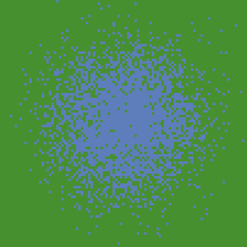

# Archaeological ABM at Cologne: from concept to application
Materials for the session organized by the [CoDArchLab](http://archaeoinformatik.uni-koeln.de/) in the Institute of Archaeology at University of Cologne (20/6/2022).

This exercise introduces the basic concepts and workflow of Agent-based modelling (ABM), as it is used in archaeology. More specifically, it covers the prototyping of a conceptual model into a working simulation model, the 'refactoring' of code (cleaning, restructuring, optimizing), the re-use of published model parts and algorithms, the exploration of alternative designs, and the use of geographic, climatic and archaeological data to apply the model to a specific case study. The tutorial offers implementation examples of path cost analysis, hydrological and land productivity modelling, network dynamics, and cultural evolution.

This tutorial uses [NetLogo](https://ccl.northwestern.edu/netlogo/), a flexible well-established modelling platform known for its relatively low-level entry requirements in terms of programming experience. It has been particularly used in social sciences and ecology for research and educational purposes.

## Table of contents

- [Archaeological ABM at Cologne: from concept to application](#archaeological-abm-at-cologne-from-concept-to-application)
  - [Table of contents](#table-of-contents)
  - [Preparation](#preparation)
  - [Introduction](#introduction)
    - [What is Agent-based modelling (ABM)](#what-is-agent-based-modelling-abm)
      - [**Mathematical models**](#mathematical-models)
      - [**ABM main concepts**](#abm-main-concepts)
    - [ABM in archaeology](#abm-in-archaeology)
    - [How to do ABM](#how-to-do-abm)
      - [**Modelling 'steps'**](#modelling-steps)
      - [**Modelling '(mis)steps'**](#modelling-missteps)
      - [**Refactoring regularly**](#refactoring-regularly)
      - [**Enforcing modularity**](#enforcing-modularity)
      - [**NOTE: where to find modules**](#note-where-to-find-modules)
      - [**Being explorative**](#being-explorative)
      - [**NOTE: documentation standards**](#note-documentation-standards)
    - [References](#references)
      - [**Introductions to ABM and social simulation**](#introductions-to-abm-and-social-simulation)
      - [**Introductions to ABM in archaeology**](#introductions-to-abm-in-archaeology)
      - [**Examples of ABM and other simulation approaches in archaeology**](#examples-of-abm-and-other-simulation-approaches-in-archaeology)
      - [**On the ODD protocol**](#on-the-odd-protocol)
      - [**External bibliography of ABM in archaeology**](#external-bibliography-of-abm-in-archaeology)
      - [**Other resources for learning ABM**](#other-resources-for-learning-abm)
  - [Block A](#block-a)
    - [Definition of the target system](#definition-of-the-target-system)
    - [Conceptual model](#conceptual-model)
      - [**NOTE: models as references**](#note-models-as-references)
      - [**The PondTrade model**](#the-pondtrade-model)
      - [**Base terrain**](#base-terrain)
      - [**First-tier dynamics**](#first-tier-dynamics)
      - [**Second-tier dynamics**](#second-tier-dynamics)
      - [**Expanding the PondTrade model**](#expanding-the-pondtrade-model)
    - [NetLogo basics](#netlogo-basics)
      - [**Console interaction**](#console-interaction)
      - [**Entities**](#entities)
      - [**Variables**](#variables)
      - [**Expressing equations**](#expressing-equations)
      - [**Procedures**](#procedures)
      - [**Logic bifurcation: `if` and `ifelse`**](#logic-bifurcation-if-and-ifelse)
      - [**Entities with variables, logic operations, and procedures**](#entities-with-variables-logic-operations-and-procedures)
      - [**Grid**](#grid)
      - [**Commenting code**](#commenting-code)
      - [**Dictionary**](#dictionary)
    - [NOTE: other platforms/languages](#note-other-platformslanguages)
    - [Test-drive: creating a "pond" terrain](#test-drive-creating-a-pond-terrain)
      - [**Step 0: Drawing a blue circle**](#step-0-drawing-a-blue-circle)
      - [**Step 1a: De-composing "magic numbers"**](#step-1a-de-composing-magic-numbers)
      - [**Step 1b: Parameterizing**](#step-1b-parameterizing)
      - [**Step 1c: Optimasing**](#step-1c-optimasing)
      - [**Step 2a: Pacing comments and line breaks**](#step-2a-pacing-comments-and-line-breaks)
      - [**Step 2b: Exploring alternative designs**](#step-2b-exploring-alternative-designs)
      - [**Step 2c: Colors and shades**](#step-2c-colors-and-shades)
      - [**Step 3: Adding noise** (*stochasticity*)](#step-3-adding-noise-stochasticity)
      - [**Step 4b: design alternatives**](#step-4b-design-alternatives)
      - [**Step 4c: *keeping* design alternatives**](#step-4c-keeping-design-alternatives)
      - [**Step 4d: patch neighborhood**](#step-4d-patch-neighborhood)
      - [**Step 4e: iterative structures**](#step-4e-iterative-structures)
      - [**Step 4f: printing event messages**](#step-4f-printing-event-messages)
      - [**Step 5: refactoring (again)**](#step-5-refactoring-again)
  - [Block B](#block-b)
    - [First-tier model](#first-tier-model)
      - [**Step 6: defining *agents***](#step-6-defining-agents)
      - [**Step 7: agent AI**](#step-7-agent-ai)
      - [**Step 8 and 9: feedback loops**](#step-8-and-9-feedback-loops)
    - [Second-tier model](#second-tier-model)
      - [**Step 10: cultural vectors**](#step-10-cultural-vectors)
      - [**Step 11: trait selection**](#step-11-trait-selection)
      - [**Step 12 and 13: statistics**](#step-12-and-13-statistics)
  - [Block C](#block-c)
    - [Spatial data](#spatial-data)
    - [Calculating flow accumulation](#calculating-flow-accumulation)
    - [Weather data and ARID](#weather-data-and-arid)
    - [Route calculation with A*](#route-calculation-with-a)
    - [The MesaraTrade model](#the-mesaratrade-model)

## Preparation

To prepare for the tutorial, you only need to:

- Download and install the latest version of NetLogo. The operating system-specific installation files are found here: https://ccl.northwestern.edu/netlogo/download.shtml
- Download or 'clone' the contents of this repository into a local folder. Select  in the top right of the repository page in GitHub, and choose one of the options given.

---
---
## Introduction

This is a brief overview of agent-based modelling (ABM), primarily focusing on how it is used in archaeology.

---
### What is Agent-based modelling (ABM)

To better contextualise ABM, we start by positioning this modelling approach in relation to others and even more used by researchers in archaeology and keen disciplines. We then describe ABM's central concepts, including what makes it often more intuitive and adequate for representing certain phenomena, particularly social interactions, yet paradoxically being more complex and unpredictable than other simulation models. 

---
#### **Mathematical models**

As the term is used in science, we can define models as representations of a system, as a composite of elements and their relationships. Mathematical models are simply more advanced in their logical definition through the process of *formalisation*. The *informal* or *less formal* models are those that are defined only through natural language speech (*e.g.*, in a live discussion), text (*e.g.*, in an article or book), or through certain graphical pieces (*e.g.*, infographics, diagrams).

Despite this distinction, there is no genuine opposition between models with different levels of formalisation. Mathematical formalisation is mainly used to implement and test the logic models stated less formally. Among the advantages of mathematical formalisation, the most important are univocity (i.e., things have a single definition) and commensurability (i.e. things can be measured or counted). These properties set formal models apart from models formulated purely with natural languages, among other things, allowing for a significant improvement in the robustness of our reasoning. Keep in mind, though: formalisation can also harm the intelligibility of our models, *because* they move away from natural languages.

Within the large family of mathematical models, ABM models lie typically within a category that can be characterised as *explicative* or *mechanistic*. Explicative models are focused on an explanation, expressing processes through realistic relationships between variables, often including assumptions. Non-explicative or *descriptive* mathematical models are used more strictly to describe, reproduce or extrapolate the relationship between variables (i.e., most statistical models). The latter models are about *patterns* or *trends* in data, while the former are about the *mechanisms* underlying data, at least as we can define them based on our current understanding of the phenomena's domain.

The line between these categories is blurred and confounded by many models and model users. Notice, for example, that the very term "explanation" is widely used in non-mechanistic ways (*e.g.*, when it is said that the educational level of a person *explains* that person's income). However, the bulk of models on each side is considerable, and ABM models, in particular, have traits that are undeniably linked to the formulation of *mechanisms*.

To help understand this distinction, we can think about one of the most simple and popular descriptive models used today: the linear regression model. Every regression model is a generalised equation based on a geometric pattern, a straight line in the case of the linear regression:

>y = a + b·x

  
*Geometric representation of a linear regression model*

A linear regression model has two variables, x and y, which define two orthogonal dimensions, and two parameters, a and b, which determine the value of y when x = 0 and the tangent of the angle formed by the line with the x dimension. These are "meaningless" in the model design, even if we deliberately choose x as the "independent" variable, despite how they are interpreted at a higher level of analysis.

To put an archaeological example, imagine we have two variables measured in a collection of sites, the estimated maximum area and the count of potsherds on the surface. Imagine that we can define a regression model that states a positive correlation exists between them. Assuming our dataset is large enough and not radically biased, we could probably interpret that built area *influences* (i.e., causes, in a weak sense) the abundance of potsherds on the surface. It would not be necessarily illogical to conclude this. Yet, the relationship described in the model is ultimately a correlation (no archaeologist would think that one is directly linked to the other).

The trend expressed by the linear model is but a "hint" of the mechanisms that are or could be postulated to explain it. Any hypotheses about the reason behind the correlation must be formulated outside the model, before or after its creation, for instance, by combining it with a natural language model. Thus, a descriptive model is inherently incomplete as an analytic tool and remains trivial unless it is associated with an external explicative model, formal or informal.

Still, mathematical models have been proven to be very useful and are widely adopted. Consider that in the field of artificial intelligence, the success of the descriptive models encompassed by the so-called *machine learning* have pushed aside the approach using programmed or procedural behaviour, from which ABM has branched. Within the wave of data-driven methods, some scholars have even started to question the concept of "explanation" itself, posing that it might be a well-hidden fallacy of human cognition. On the other hand, it is still debatable how much *human* understanding can come from descriptive models alone.

---
#### **ABM main concepts**

In contrast with other mechanistic and dynamic mathematical modelling approaches, ABM seeks to represent a phenomenon by explicitly modeling its parts. Therefore, ABM involves the expectation that the phenomenon at the macro-level is an *emergency* of the dynamics at the micro-level. Moreover, ABM implies that the parts, the agents, constitute 'populations', *i.e.*, they share common properties and behavioral rules. The 'agency' behind the term 'agent' also implies that these parts have certain autonomy with respect to each other and the environment, which justifies simulating their behavior at an individual level.

In practice, 'autonomy' often translates as the agents' ability to take action, move, decide, or even think and remember. Nevertheless, agent-based models also include entities that are *technically* agents (on the terms of [multi-agent systems](https://en.wikipedia.org/wiki/Multi-agent_system)), but lack those abilities or are not considered real discrete entities. The most common case is to represent space sectors as agents fixed to unique positions in a grid to facilitate the implementation of distributed spatial processes (*e.g.*, the growth of vegetation dependent on local factors). In NetLogo, this type of agent is predefined as `patches` and is extensively used in models in ecology and geography.

Compared to other modeling and simulation approaches, ABM is more intuitive but also more complex. For example, the [Lotka-Volterra predator-prey model](https://en.wikipedia.org/wiki/Lotka%E2%80%93Volterra_equations) in ecology is a pair of differential equations that are relatively simple and conceptually straightforward. They essentially express the following dynamics:

>assumption: prey population grows based on unspecified resources (*intrinsic growth rate*)   
>more prey → more food for predators, so more predators will survive and reproduce  
>more predators → more prey will be killed, so less prey will survive and reproduce  
>less prey → less food for predators, so fewer predators will survive and reproduce  
>fewer predators → less prey will be killed, so more prey will survive and reproduce  
>more prey → more food ... (the cycle begins again)

<p style="text-align: center;">
<a title="AspidistraK, CC BY-SA 4.0 &lt;https://creativecommons.org/licenses/by-sa/4.0&gt;, via Wikimedia Commons" href="https://commons.wikimedia.org/wiki/File:Lotka_Volterra_dynamics.svg"></a>
<br>
<i style="color: grey;">Example of Lotka Volterra dynamics</i>
</p>

The same model can also be implemented with ABM (see the comparison in [NetLogo's Model Library Wolf-Sheep Predation (Docked Hybrid)](http://ccl.northwestern.edu/netlogo/models/WolfSheepPredation(DockedHybrid))). The ABM implementation requires many additional specifications on how predator and prey agents should behave individually. Even though it is not strictly necessary, ABM variations of the Lotka-Volterra model often aim to include more complexity. In the case of the Wolf-Sheep model mentioned, there is an explicit account of the base resource (*i.e.*, the prey of the prey), named `grass`, which is implemented as a property of spatial units. These additional specifications normally help the model be more intuitive and realistic but also significantly complicate the model design and implementation, even though generating the same aggregate dynamics as the equation-based version (*i.e.*, oscillation harmony between prey and predator populations).

<p style="text-align: center;">
<a title="SethTisue, GPL &lt;http://www.gnu.org/licenses/gpl.html&gt;, via Wikimedia Commons" href="https://commons.wikimedia.org/wiki/File:Netlogo-ui.png"></a>
<br>
<i style="color: grey;">NetLogo user interface running the Wolf-Sheep Predation model</i>
</p>

Another important and distinctive aspect of agent-based models is that they are unavoidably *stochastic*, i.e., at least some processes are fed by random sequences.

By definition, the order in which agents of a type perform their processes should not be predefined and, overall, should not be the same followed every iteration of the model. Thus, the only unbiased way of *scheduling* processes in ABM is to randomize all distributed sequences. This is (usually) not the case in models based on differential/difference equations, where the equations calculating variables are solved following a particular fixed order.

Methodologically, introducing randomness is a way of accounting for the entire spectrum of possibilities, whenever a certain aspect of the model is undertheorized or cannot be controled in real scenarios. More importantly, it is justified whenever the modeler believes that the intended behavior is independent of a specific value or order. 

For those with no previous experience with computer science: note that "random" for a computer is not like "rolling dices". We are getting values of a preordered sequence presumably unrelated to the process at hand. The programs creating these sequences are called [pseudorandom number generator](https://en.wikipedia.org/wiki/Pseudorandom_number_generator) or RNG, for short. Sequences will be different every time we run our program (*i.e.*, simulation), unless we preset the RNG using a specific 'seed', an integer often spanning a massive range of positive and negative numbers. Setting a particular RNG seed is, in fact, good practice, and it helps enforce the reproducibility of simulation results.

This technique is also helpful in creating variation within a population of agents or between the global conditions of simulation runs. Such a thing is accomplished by drawing the values of variables from probability distributions, defined through *hyperparameters* (*e.g.*, drawing the age of individuals in a classroom from a normal distribution defined by two parameters, `age_mean` and `age_standardDeviation`). Unfortunately, a typical bad practice is not exposing such hyperparameters, having these 'hard-coded' as if their value were an intrinsic part of the model and thus the mechanisms it represents. This bad coding element, often called "magic numbers", can and should be addressed during model implementation (see [Verification-refactoring cycle](#verification-refactoring-cycle)).

Last, another significant advantage of ABM is that it can include parts (algorithms, submodels) that belong to other modelling approaches, while these cannot integrate ABM. For example, we can quickly devise a model where a population of agents runs in parallel with a full-fledged Dynamic Systems model through a set of difference equations. Commonly, ABM models are ensembles created with parts that technically are not ABM. This is why some ABM modellers and modelling platforms use terms like "multiparadigmatic modelling" or "hybrid modelling", which is more precise for many cases. Unfortunately, these were not adopted more widely.

---
### ABM in archaeology

ABM has conceptual roots and applications in other fields relatively early, hand-to-hand with the history of computer science. However, this methodology was formed as it is today and introduced more broadly into social sciences until the late 1990s. In its many forms, simulation methods only started to be used in disciplines like archaeology due to the development of personal computers, which progressively lowered computational times from days to seconds.

ABM has been exceptionally well accepted by archaeologists, given its pre-adaptation towards distributed and stochastic processes. In theory, most phenomena of interest for archaeology can be represented with ABM, to the satisfaction of archaeologists. Other modelling and simulation approaches (*e.g.*, Dynamic Systems) were and still are used but often encounter great resistance due to their higher abstraction and simplification.  

Here is a non-exhaustive list of topics that have or could have been investigated with ABM in archaeology:

- **Physico-chemical dynamics**
  - *Artefact production*: *e.g.*, chaîne opératoire, authorship, material transformations.
  - *Site formation*: *e.g.*, artefact and structure distributions, preservation, deposition, stratification and post-depositional processes, sample bias.
- **Ecological dynamics**
  - *Climate patterns*: *e.g.*, seasonality, regional variations, climate change.
  - *Hydrological dynamics*: *e.g.*, water availability. 
  - *Vegetation*: *e.g.*, crop dynamics.
  - *Non-human animal behaviour*: *e.g.*, herd behaviour, animal husbandry, transhumance.
- **Anthropological dynamics**
  - *Individuals*: *e.g.*, pedestrian dynamics, metabolic scavenging, kinship, micro-economics, mating and marriage, reproduction, cognition (memory, rationality and learning), individual-to-individual cooperation and competition, social learning, norms.
  - *Groups*: *e.g.*, households, organisations, group-to-group cooperation and competition, prestige, reward and punishment, cultural transmission. 
  - *Settlements*: *e.g.*, population dynamics, migration, macro-economics, trade, urbanisation, cultural evolution, settlement patterns, land use, politogenesis.
  - *Regional to global*: *e.g.*, center-periphery dynamics, genetic and cultural diffusions.

ABM flexibility is also very much appreciated by researchers involved in archaeology, given that it is a discipline both historically and thematically positioned in-between other disciplines in the overlap of the so-called natural and artificial worlds. An ABM model can handle multiple layers of entities and relationships, allowing it to integrate entire models under the same hood.

The same advantage was exploited by disciplines such as ecology, environmental science, and geography. The approach used by these disciplines has been the main motor driving the development of models in archaeology for more than two decades. Some authors have named this *trans*disciplinary framework as the research of socio-ecological systems (SES), which has been defined in close relationship with the more general *complexity science* approach. One of the first cases of public success of ABM in archaeology, the *Artificial Anasazi* model (Axtell et al. 2002), emerged from this approach and as a collaboration between researchers orbiting the [Santa Fe Institute](https://www.santafe.edu/).

Despite its positive influence in pushing the field forward, the SES approach has also limited the diversity of scope and theory used with ABM in archaeology. ABM under SES aligns particularly well, for example, with research questions related to landscape and environmental archaeology and formulated from a perspective biased towards processualism. This tutorial is no exception. To the potential "new-blood" in this field, I recommend always keeping the mind open to all questions and theoretical frameworks, particularly those you are invested in.

ABM in archaeology has been a prolific field, despite being still enclosed in a small community. Here, we will only cover a small part of the field, specifically from my perspective. For a broader introduction to the multitude of contributions in this field, I refer to any of the many introductory references included later in this section (see [References - Introductions to ABM and Social Simulation](#introductions-to-abm-and-social-simulation)). I recommend the recent textbook by Romanowska, Wren & Crabtree (2021), which also includes many practical exercises, using a programming style and philosophy significantly different from this tutorial.

---
### How to do ABM

In the remaining sections of the Introduction, we will go deeper in describing the workflow of ABM. First, we lay out this workflow as it is commonly declared by practitioners, as a sequence of well-ordered steps that may be iterated in a revision cycle. Then, we introduce a few elements 'behind the scene' that stretch the 'steps' metaphor to its limits. We then review a few practical recommendations that, hopefully, will aid future ABM modellers. These include the verification-refactoring cycle in programming, the use of modular code, and the importance of remaining explorative while designing a model.

---
#### **Modelling 'steps'**

Modelling with ABM can be divided into steps, most of which are identified by the community of practitioners as either normative or recommended phases of model development. With minor variations, these are also recognised in other simulation and non-simulation modelling approaches. The steps are:

>**Definition of the research question and phenomenon**. To define a research question and the phenomena involved, we must think in terms of systems, identifying and defining a set of elements we deem relevant and their interrelationships. In this initial step, the key is to delimitate the target system, within which external, undefined factors do not overly determine the interaction of elements. Here, we must decide on what is relevant *for us* and set aside the rest. Ideally, we should move to the next step only once we have a hypothetical mechanism to focus on, formulated roughly but in detail enough so we can formalise it later. We will call this our **_conceptual model_**.

>**Design**. Designing a model is essentially to find a formal definition able to represent the phenomena, as we have defined in the previous step. In this step, we go from a vague text description of the *natural* system we observe and its expected dynamics to a mathematical or algorithmic representation of the *artificial* system we want to build. At this stage, it is critical to define our model's main variables, including any inputs and outputs. The latter will be particularly important to how simulation results can be compared to empirical data to validate the model. During model design, our conceptual model is formalised progressively, ideally up to the point where implementation is made immediate. 

>**Implementation**. To implement the model is to effectively write down our model design as a piece of software (*i.e.*, through programming). While other mathematical models could remain unimplemented, ABM models are hardly useful if not able to be solved through computer simulation. However, a model implementation carries much extra baggage, and many possible implementations exist for the same model. Therefore, modellers and their audience must differentiate between the model and its implementation.

>**Verification**. To verify a model implementation, we run a series of tests on the model code and compare the results with our expectations as model designers. If we wrote a fragment of code to calculate "2 + 2" expecting "4", we should get "4" after running it. On the other hand, verifying a model (not its implementation) can only be done by running an implementation, which we assume is correctly representing the model. If our model states that "2 + 2 = 4", and our implementation returns "4", then we would conclude that the logic behind our model is correct. 

>**Validation**. To validate a model is to iteratively match the conditions of our model (assumptions, parameter values, etc.) to measurable conditions in the targeted system and the results of simulations to equivalent variables measured in the targeted system. ABM modellers often regard validation as an extra, lengthy process, usually separable from the tasks involved in defining, implementing, and exploring a model. Validation is never an absolute term: it will depend on the amount of data available and the specific criteria chosen. A validated model is not a "correct" model, nor a model failing validation is a "useless" model.

Furthermore, a few authors, myself included, also like to highlight two additional steps that are generally not acknowledged: 

>**Understanding**. The modeller must understand the model, know the variety of dynamics it can generate, and be aware of its limitations regarding the representation of the target system.

>**Documenting**. The understanding obtained by the modeller at one point is of little use to others and, eventually, her or himself in the long-term future. To ensure that such an understanding is passed through, we must invest significant time in documenting the model's conceptual design and source code. Note that this is not equivalent to an academic publication, especially because most scientific journals push for a greater emphasis on the results rather than the bits and pieces of simulation models.

---
#### **Modelling '(mis)steps'**

However, building an ABM model is, in practice, a process that is significantly more complicated than the steps listed above. There are many shortcuts, such as finding a model or piece of code that can save months of work, but, more often, there are obstacles, fallbacks, and failures that test ABM modellers and the teams of researchers working with them. Some modellers (myself included) have characterized this as a 'reiterative' process, often drawing diagrams showing these steps in well-planned cycles. However, it might be more exact to lose the walking metaphor altogether. 

The first problematic situation that comes to mind is, of course, the "technical issues". Developing ABM models requires a set of skills that are rare and hard to obtain and maintain meanwhile doing other research tasks. Probably the most prominent skill of a modeller is programming, which involves conceptual abstraction and certain agility with the software being used. The latter is made even more relevant when the software used is poorly documented or requires a particular setup upon installation. This is undoubtedly the first entry toll of the ABM community for researchers in the humanities and social sciences. Still, the hardships on this side usually are surpassable with continuous training, support from more experienced modellers, and choosing the right software. Still, it is undeniably a long-term commitment. 

Unfortunately, issues related to ABM go deeper than code and software. For example, during the model design process, researchers might need to ask inconvenient and trivial questions about the phenomena represented, which raise a surprising amount of controversy and doubt and can even challenge some of the core assumptions behind a study. In archaeology, this may come as aspects that are considered out of the scope of empirical research due to the limiting nature of archaeological data compared to disciplines that focus on contemporary observations (*e.g.*, anthropology, sociology, geography). Should an archaeological ABM model include mechanisms that cannot be validated by archaeological data (at least not in the same sense as experimental sciences)? This is probably the most important unresolved question in this field and possibly the one most responsible for hindering the use of ABM in archaeology.

These complications can be considered problems and opportunities, depending on if and how they are eventually resolved. In some cases, the difficulty will present a new idea or approach. In contrast, in other cases, dealing with it might cost valuable time and delay the research outcomes beyond any external deadlines (*e.g.*, project funding, dissertation submission). The tutorial below is presented in the spirit of safeguarding modellers in training from being stopped short by some obstacles while pursuing their research agendas using ABM.

Before jumping into coding, let us go over three general strategies that can offer a way out to at least some of the problems mentioned here. These strategies are: *refactoring regularly*, *enforcing modularity* and *being explorative*.

---
#### **Refactoring regularly**

By definition, refactoring means that your code change but remains capable of producing the same result. Refactoring encompasses all tasks aiming to generalize the code, make it extendable, and also make it cleaner (more readable) and faster.

However, there is a trade-off between these three goals. For example, replacing default values with calculations or indirect values will probably increase processing time. In practice, this trade-off is irrelevant until your model is very complex, populated (many entities), or must be simulated for many different conditions. I recommend always being attentive to the readability, commentary, and documentation of your code. Assuming you are interested in creating models for academic discussion (i.e., science rather than engineering), the priority is to communicate your models to others.

There are many actions in code that can be considered refactoring. Too many for us to enumerate here. Probably the best and more educational approach is to encounter examples of practices, both good and bad, think about them, and try to do better. In this sense, we will go over several examples along with the tutorial that hopefully will illustrate when and how you should refactor your model code.

---
#### **Enforcing modularity** 

One of the most critical aspects related to refactoring is code modularity. The so-called [Single Responsibility Principle (SRP)](https://en.wikipedia.org/wiki/Single-responsibility_principle) has been established in software engineering and serves as an excellent guiding principle for building complex code.

In software like ABM models, modularity also has application at a higher level, in the form of submodels. Creating models as assembles of submodels enables researchers to focus on their areas of interest and expertise without necessarily over reducing the complexity of everything else.

ABM has been, and still is, often critisised for being a too complex and arbitrary approach in its aim and domain. Truthfully, ABM models tend to overgrow in detail regarding certain aspects while bluntly simplifying other elements. This is primarily a combined effect of the internal limitations of the modellers and their teams (time, budget, expertise, etc.) and the lack of opportunities for code reuse. Modularity offers an exit to this.

Modules can be built as original contributions, implemented from published model specifications, reimplemented from another programming language, or taken and modified as code snippets. We will encounter all these cases later on in this tutorial. 

---
#### **NOTE: where to find modules**

There are many sources of potential modules. The most direct source is, of course, your relevant bibliography. Despite the number of models and modellers, the likely scenario is that the modules you need are still not available as usable implementations. In such cases, you might need to translate model specifications, with a varied level of formalisation, into a working piece of code. The less formalise is the original contribution, the harder will be the challenge. Thankfully, there are a few alternatives where modules can be taken almost without extra coding.

When using NetLogo, we first count with the [Netlogo's Models Library](https://ccl.northwestern.edu/netlogo/models/), a collection of implementation examples classified by discipline and domain. All files are included in the installation of NetLogo and can be accessed through File > Models Library.

The wide community of NetLogo users also hosts two extra libraries, the [NetLogo User Community Models](http://ccl.northwestern.edu/netlogo/models/community/index.cgi) and the [NetLogo Modelling Commons](http://modelingcommons.org/), where modellers from different disciplines can upload their models, and share and discuss them with others.

A similar initiative was created from modellers more strongly associated with the SES framework. Today named as [CoMSES Model Library](https://www.comses.net/), former openABM, it holds almost the same amount of models as NetLogo Modelling Commons and, despite being cross-platform, the majority of entries are implemented in NetLogo. CoMSES also hosts a curated bibliographic database, which can help search subject-related models. Even though massive, it does not represent all ABM and related modelling being done worldwide. CoMSES relies on voluntary work, as most scientific associations do, and its updates rely on a relatively small community.

More recently, a growing group of researchers involved in ABM in archaeology, including myself, have created an initiative, [Network for Agent-based modelling of Socio-ecological Systems in Archaeology (NASSA)](https://archaeology-abm.github.io/NASA/), whose principal goal is to create and maintain a public library of modules (*i.e.*, formatted as modules). Hopefully, this library's first version will be available sometime later this year. You are welcome to join our activities and help create this community asset (write me an e-mail!). 

---
#### **Being explorative**

The last general recommendation to be made about doing ABM is: to be explorative. As mentioned, some have critisised ABM for being too speculative and arbitrary. Yes, ABM models often require many specifications to work, some of which escape the modeller's expertise entirely. In front of this, we can either avoid ABM altogether or accept it, going the proverbial extra mile in making most "free decisions" based on a deeper study of possible design alternatives.

Similar to how we can use stochasticity, creating and exploring design alternatives is always a good idea to better understand our conceptual model's weak points. Observing the differences in dynamics generated by those alternatives will help us decide how to define those uncertain areas further while reducing the risk of unconsciously running over important modelling decisions. In the tutorial, we will illustrate a few strategies for implementing and handling design alternatives.

---
#### **NOTE: documentation standards**

A short disclaimer before we start: the approach used here for conceptual modelling and model documentation is **not** considered a standard in the ABM community. In the bibliography, you will find many other recommendations and examples, particularly those converging into the practices closer to Computer Science and Ecology. For example, many consider a necessary standard to be the [Unified Modeling Language (UML)](https://en.wikipedia.org/wiki/Unified_Modeling_Language). The Overview-Design-Details (ODD) protocol is also quite strongly advocated by ABM practitioners (see **_On the ODD protocol_** in [References](#references)).

After years of creating and reviewing ABM models, I would argue that these are not as useful or applicable as claimed, and the time spent in learning these could be better used to improve one's programming skills. However, I believe that any student of ABM should know about these proposed standards and then judge and decide for themselves. I only use simple text and free-styled graphs for this tutorial while trying to enforce the most clarity in the code possible.

---
### References

This introductory session on ABM in archaeology is neither complete nor the necessary standard. The following materials can help delve deeper into the subject, experiment with various perspectives and cases, and possibly build a specialised profile in this field.

#### **Introductions to ABM and social simulation**

> Manson, Steven M., Shipeng Sun, and Dudley Bonsal. 2012. ‘Agent-Based Modeling and Complexity’. In Agent-Based Models of Geographical Systems, edited by Alison J. Heppenstall, Andrew T. Crooks, Linda M. See, and Michael Batty, 125–39. Dordrecht: Springer Netherlands. https://doi.org/10.1007/978-90-481-8927-4_7.

> Epstein, Joshua M. 2006. Generative Social Science: Studies in Agent-Based Modeling. Princeton: Princeton University Press.

> Bonabeau, Eric. 2002. ‘Agent-Based Modeling: Methods and Techniques for Simulating Human Systems’. Proceedings of the National Academy of Sciences of the United States of America 99 (SUPPL. 3): 7280–87. https://doi.org/10.1073/pnas.082080899.

> Epstein, Joshua M., and Robert Axtell. 1996. Growing Artificial Societies: Social Science from the Bottom Up. Brookings Institution Press. https://www.brookings.edu/book/growing-artificial-societies/.

#### **Introductions to ABM in archaeology**

> Romanowska, Iza, Colin D. Wren, and Stefani A. Crabtree. 2021. Agent-Based Modeling for Archaeology. Electronic. SFI Press. https://doi.org/10.37911/9781947864382.

> Graham, Shawn, Neha Gupta, Jolene Smith, Andreas Angourakis, Andrew Reinhard, Ellen Ellenberger, Zack Batist, et al. 2020. ‘4.4 Artificial Intelligence in Digital Archaeology’. In The Open Digital Archaeology Textbook. Ottawa: ECampusOntario. https://o-date.github.io/draft/book/artificial-intelligence-in-digital-archaeology.html.

> Romanowska, Iza, Stefani A. Crabtree, Kathryn Harris, and Benjamin Davies. 2019. ‘Agent-Based Modeling for Archaeologists: Part 1 of 3’. Advances in Archaeological Practice 7 (2): 178–84. https://doi.org/10.1017/aap.2019.6.

> Davies, Benjamin, Iza Romanowska, Kathryn Harris, and Stefani A. Crabtree. 2019. ‘Combining Geographic Information Systems and Agent-Based Models in Archaeology: Part 2 of 3’. Advances in Archaeological Practice 7 (2): 185–93. https://doi.org/10.1017/aap.2019.5.

> Crabtree, Stefani A., Kathryn Harris, Benjamin Davies, and Iza Romanowska. 2019. ‘Outreach in Archaeology with Agent-Based Modeling: Part 3 of 3’. Advances in Archaeological Practice 7 (2): 194–202. https://doi.org/10.1017/aap.2019.4.

> Cegielski, Wendy H., and J. Daniel Rogers. 2016. ‘Rethinking the Role of Agent-Based Modeling in Archaeology’. Journal of Anthropological Archaeology 41 (March): 283–98. https://doi.org/10.1016/J.JAA.2016.01.009.

> Wurzer, Gabriel, Kerstin Kowarik, and Hans Reschreiter. 2015. Agent-Based Modeling and Simulation in Archaeology. Edited by Gabriel Wurzer, Kerstin Kowarik, and Hans Reschreiter. Advances in Geographic Information Science. Vol. 7. Advances in Geographic Information Science. Cham: Springer International Publishing. https://doi.org/10.1007/978-3-319-00008-4.

> Lake, Mark W. 2014. ‘Trends in Archaeological Simulation’. Journal of Archaeological Method and Theory 21 (2): 258–87. https://doi.org/10.1007/s10816-013-9188-1.

> Costopoulos, André, and Mark W. Lake, eds. 2010. Simulating Change: Archaeology into the Twenty-First Century. Salt Lake City: University of Utah Press.

#### **Examples of ABM and other simulation approaches in archaeology**

> Isaac Ullah (2022, June 01). “The Archaeological Sampling Experimental Laboratory (tASEL)” (Version 1.1.1). CoMSES Computational Model Library. Retrieved from: https://www.comses.net/codebases/addd3c54-d89a-4773-a639-8bf19bcf59ea/releases/1.1.1/

> Angourakis, Andreas, Jennifer Bates, Jean-Philippe Baudouin, Alena Giesche, Joanna R. Walker, M. Cemre Ustunkaya, Nathan Wright, Ravindra Nath Singh, and Cameron A. Petrie. 2022. ‘Weather, Land and Crops in the Indus Village Model: A Simulation Framework for Crop Dynamics under Environmental Variability and Climate Change in the Indus Civilisation’. Quaternary 5 (2): 25. https://doi.org/10.3390/quat5020025.

> Andreas Angourakis. (2021). Two-Rains/indus-village-model: The Indus Village model development files (May 2021) (v0.4). Zenodo. https://doi.org/10.5281/zenodo.4814255.

> Angelos Chliaoutakis (2020, April 09). “AncientS-ABM: Agent-Based Modeling of Past Societies Social Organization” (Version 1.0.0). CoMSES Computational Model Library. Retrieved from: https://www.comses.net/codebases/50cf5d2a-0f37-4d4d-84e0-715e641180d9/releases/1.0.0/

> Angourakis, Andreas, Matthieu Salpeteur, Verònica Martínez Ferreras, Josep Maria Gurt Esparraguera, Verònica Martínez Ferreras, and Josep Maria Gurt Esparraguera. 2017. ‘The Nice Musical Chairs Model: Exploring the Role of Competition and Cooperation Between Farming and Herding in the Formation of Land Use Patterns in Arid Afro-Eurasia’. Journal of Archaeological Method and Theory 24 (4): 1177–1202. https://doi.org/10.1007/s10816-016-9309-8.

> Madella, Marco, Bernardo Rondelli, Carla Lancelotti, Andrea L. Balbo, Débora Zurro, Xavier Rubio Campillo, and Sebastian Stride. 2014. ‘Introduction to Simulating the Past’. Journal of Archaeological Method and Theory 21 (2): 251–57. https://doi.org/10.1007/s10816-014-9209-8.

> Rubio Campillo, Xavier, Jose María Cela, and Francesc Xavier Hernàndez Cardona. 2012. ‘Simulating Archaeologists? Using Agent-Based Modelling to Improve Battlefield Excavations’. Journal of Archaeological Science 39 (2): 347–56. https://doi.org/10.1016/j.jas.2011.09.020.

> Wilkinson, Tony J., John H. Christiansen, Jason Alik Ur, M. Widell, and Mark R. Altaweel. 2007. ‘Urbanization within a Dynamic Environment: Modeling Bronze Age Communities in Upper Mesopotamia’. American Anthropologist 109 (1): 52–68. https://doi.org/10.1525/aa.2007.109.1.52.

> Kohler, Timothy A., and Sander van der Leeuw. 2007. The Model-Based Archaeology of Socionatural Systems. Santa Fe: AdvanceResearch Press.

> Premo, L. S. 2006. ‘Agent-Based Models as Behavioral Laboratories for Evolutionary Anthropological Research’. Arizona Anthropologist 17: 91–113.

> Graham, Shawn, and J. Steiner. 2009. ‘TravellerSim: Growing Settlement Structures and Territories with Agent-Based Modeling’. In Digital Discovery: Exploring New Frontiers in Human Heritage. CAA 2006. Computer Applications and Quantitative Methods in Archaeology. Proceedings of the 34th Conference, Fargo, United States, April 2006, edited by Jeffrey T. Clark and Emily M. Hagemeister. Budapest: Archaeolingua. https://electricarchaeology.ca/2009/10/16/travellersim-growing-settlement-structures-and-territories-with-agent-based-modeling-full-text/.

> Axtell, Robert L., Joshua M. Epstein, Jeffrey S. Dean, George J. Gumerman, Alan C. Swedlund, Jason Harburger, Shubha Chakravarty, Ross Hammond, Jon Parker, and Miles Parker. 2002. ‘Population Growth and Collapse in a Multiagent Model of the Kayenta Anasazi in Long House Valley’. Proceedings of the National Academy of Sciences 99 (Supplement 3): 7275–79. https://doi.org/10.1073/pnas.092080799.

> Kohler, Professor and Chair Department of Anthropology Timothy A., Timothy A. Kohler, George J. Gumerman, and Director Arizona State Museum and Research Professor of Anthropology George G. Gumerman. 2000. Dynamics in Human and Primate Societies: Agent-Based Modeling of Social and Spatial Processes. Oxford University Press.

> Winterhalder, Bruce. 1997. ‘Gifts given, Gifts Taken: The Behavioral Ecology of Nonmarket, Intragroup Exchange’. Journal of Archaeological Research 5 (2): 121–68. https://doi.org/10.1007/BF02229109.

> Erwin, Harry R. 1997. ‘The Dynamics of Peer Polities’. In Time, Process, and Structured Transformations, edited by Sander E. Van der Leeuw and James McGlade, 57–97. One World Archaeology 26. London: Routledge.

> Rihll, T. E., and A. G. Wilson. 1991. ‘Modelling Settlement Structures in Ancient Greece: New Approaches to the Polis’. In City and Country in the Ancient World. Routledge.

#### **On the ODD protocol**

> Grimm, Volker, Uta Berger, Finn Bastiansen, Sigrunn Eliassen, Vincent Ginot, Jarl Giske, John Goss-Custard, et al. 2006. ‘A Standard Protocol for Describing Individual-Based and Agent-Based Models’. Ecological Modelling 198 (1–2): 115–26. https://doi.org/10.1016/J.ECOLMODEL.2006.04.023.

> Grimm, Volker, Uta Berger, Donald L. DeAngelis, J. Gary Polhill, Jarl Giske, and Steven F. Railsback. 2010. ‘The ODD Protocol: A Review and First Update’. Ecological Modelling 221 (23): 2760–68. https://doi.org/10.1016/J.ECOLMODEL.2010.08.019.

> Müller, Birgit, Friedrich Bohn, Gunnar Dreßler, Jürgen Groeneveld, Christian Klassert, Romina Martin, Maja Schlüter, Jule Schulze, Hanna Weise, and Nina Schwarz. 2013. ‘Describing Human Decisions in Agent-Based Models – ODD + D, an Extension of the ODD Protocol’. Environmental Modelling & Software 48 (October): 37–48. https://doi.org/10.1016/J.ENVSOFT.2013.06.003.

#### **External bibliography of ABM in archaeology**

https://github.com/ArchoLen/The-ABM-in-Archaeology-Bibliography

#### **Other resources for learning ABM**

> Hart, Vi, and Nicky Case. n.d. ‘Parable of the Polygons’. Parable of the Polygons. Accessed 24 May 2022. http://ncase.me/polygons.

> Izquierdo, Luis R., Segismundo S. Izquierdo, and William H. Sandholm. 2019. Agent-Based Evolutionary Game Dynamics. https://wisc.pb.unizin.org/agent-based-evolutionary-game-dynamics/.

---
---

## Block A

In Block A, we will start by defining the target system based on a case study and composing a conceptual model based on a previous model (PondTrade). We will then advance to implementation, learning the basics of NetLogo and applying it, going over the initial steps of developing the PondTrade model.

---
### Definition of the target system

In this tutorial, we will proceed as if our goal were to address with ABM the case study and some of the research questions of the following publication:

> Paliou, Eleftheria, and Andrew Bevan. 2016. ‘Evolving Settlement Patterns, Spatial Interaction and the Socio-Political Organisation of Late Prepalatial South-Central Crete’. Journal of Anthropological Archaeology 42 (June): 184–97. https://doi.org/10.1016/j.jaa.2016.04.006.

- **Case study**: settlement interaction and the emergence of hierarchical settlement structures in Prepalatial south-central Crete
- **Phenomena to represent**: cycles of growth and collapse (i.e., fluctuations in the scale of site occupation). Focus on site interconnectivity and its relationship with settlement size.
- **Main assumption**: topography, transport technology, exchange network, settlement size, wealth, and cultural diversity are intertwined in a positive feedback loop.
- **Dynamics we expect and want to explore**: the long-term consolidation of central sites and larger territorial polities.

Our objective using ABM is to delve deeper into the expectations of our current knowledge about the growth of settlements and the formation of local polities in this crucial period, preluding the Minoan palatial institution. As in the original paper, we will need to assume a series of conditions and behaviour rules, considered valid for this context, given historical and anthropological parallels.

With site distributions and artefactual classifications, archaeology offers an opportunity for us to estimate aspects such as population density and economic and cultural interactions. However, to relate the socio-ecological past to the material evidence in the present, we must inevitably use an explanatory model. There are many published models relevant to this topic, several already mentioned by Paliou & Bevan (2016). However, few are formalised to some extent, and fewer are available as reusable implementations. Luckily, some of these are ABM models (you may consult them in the [References above](#references)).

As mentioned, ABM is particularly hungry for specifications, many of which are not even dreamed of by the average archaeologist. In this tutorial, we will try to maintain an intermediate level of model abstraction, avoiding many details that would normally be included in the ABM-SES approach in archaeology. 

Later, you can compare ABM with other approaches, such as the gravity models referenced in the original study. Hopefully, you will gain an intuitive perception of the advantages and caveats of ABM in front of more analytical approaches, in particular regarding the study of settlement patterns and interactions.

---
### Conceptual model 

 When creating your first conceptual model, I recommend starting from scratch with the first intuition that comes to mind. After later scrutiny, its logic structure may be oversimplified, incomplete, or faulty. However, it would most likely represent the main elements of an informal model that you and other researchers share. Relying on an informed guess to start model development is the best remedy for the "blank page panic". It will also help you avoid overthinking and overworking what should be a mere preliminary stretch of the model.

Said this, we might still suffer when trying to jump-start the modelling process. Even if (or maybe especially when) a sizeable interdisciplinary team is involved, such is often the case in ABM-related projects.

#### **NOTE: models as references**

To complement the initial "brainstorming" of conceptual models, modellers will often search and review models already published on related subjects, considering if these could be reused, at least as an inspiration.

Keeping yourself posted about the ABM community may give you an edge. Unfortunately, academic publishing has become a saturated media, and it is relatively hard to be updated about specific types of research, such as ABM models, which are often spread in many specialised publications. Public model repositories, such as CoMSES and initiatives like the modular library from NASSA may aid you greatly in this task. But, ultimately, finding a relevant model will depend on your skills in Internet search and the attention others have put to preparing and publishing their models.

Regarding our case study, there are many models that we could adopt as a start point or as a potential source of modules. ABM models in archaeology built from the SES framework are likely to be adaptable to our case study, however, with variable success regarding the relevance of its results to our main question. Most models in this category are indeed focused on elements of landscape archaeology, particularly settlement patterns and emerging social complexity in prehistoric to early-historic periods. Among the most prominent candidates, we could count, for example, [Artificial Anasazi](https://www.comses.net/codebases/2222/) and its variations, [MERCURY](https://www.comses.net/codebases/4347/) and its extensions, [MayaSim](https://www.comses.net/codebases/3063/), and especially [AncientS-ABM](https://www.comses.net/codebases/50cf5d2a-0f37-4d4d-84e0-715e641180d9/) (Chliaoutakis 2019), which has been designed for Minoan Bronze Age and applied to different parts of Crete.

However, given that this is a tutorial, we will be using another, much simpler model: the **_PondTrade_** model.

#### **The PondTrade model**

The PondTrade model was designed by me in 2018 to facilitate learning ABM and is designed mainly for archaeology and history.

The PondTrade model represents mechanisms that link cultural integration and economic cycles caused by the exchange of materials (“trade”) between settlements placed in a heterogeneous space (“pond”). The PondTrade design intentionally includes several aspects commonly used by other ABM models in archaeology and social sciences, such as multiple types of agents, the representation of a so-called “cultural vector”, procedural generation of data, network dynamics, and the reuse of published submodels and algorithms.

The Pond Trade model and all its versions were developed by myself, Andreas Angourakis, and are available for download in this repository: https://github.com/Andros-Spica/PondTrade. Note that the content of PondTrade/README.md is a previous and incomplete version of what we will cover here in Block A. It has also been used in Graham et al. 2020 as one of several exercises on ABM, and the text in this tutorial relies partially in the content of that chapter.

A similar model, TravellerSim, was presented by Graham & Steiner (2008), who were revisiting an older non-ABM model (Rihll & Wilson 1991, pp. 59-95), even though one was not based on the other. All three, and indeed many more, coincide in the "informal formulation" of the core mechanism, rooted in economic theory, relating the size of settlements to how they are interconnected. 

A side-note: such a situation, where similar mechanisms are modelled from scratch several times by different researchers, is, in fact, prevalent in the ABM community. There is a growing number of publications and models spreading over many specialised circles, which do not always cover all details about model implementation. Meanwhile, there is still no adequate logistical support for orderly sharing and searching for models across disciplines, despite the efforts made by CoMSES. The primary mission of NASSA is to offer a long-term solution to this problem.

Since our research question fits quite well with the scope of the PondTrade model, we will use it to approach our case while also learning about ABM and NetLogo by following its development steps.

The Pond Trade model core idea is inspired by the premise that the settlement economy's size depends on the volume of materials exchanged between settlements for economic reasons (i.e. ‘trade’). The "economic" size of settlements is an overall measure of, *e.g.*, population size, the volume of material production, built surface, etc. The guiding suggestion was that economy size displays a chaotic behavior as described by chaos theory (apparently "random" oscillations) because of the shifting nature of trade routes, explicitly concerning maritime and fluvial routes as opportunities for transportation.

The initial inspiration for a model design may be theoretically profound, empirically based, or well-connected to discussions in the academic literature. However, the primary core mechanism of a model must narrow down to a straightforward, intelligible process. In this case, the focus is to represent a positive feedback loop between settlement size and the trade volumes coming in and out, which can be described as follows:

**Core mechanism**:  
- Traders choose their destination trying to maximize the value of their cargo by considering settlement size and distance from their base settlement;  
- An active trade route will increase the economic size of settlements at both ends  
- An increase in size will increase trade by: 
  - Making a settlement more attractive to traders from other settlements  
  - Allowing the settlement to host more traders.
- An active trade route will increase the cultural similarity between two settlements through the movement of traders and goods from one settlement to the other (cultural transmission)  

**Elements** (potentially entities):  
- settlements  
- traders  
- terrain  
- routes  
- goods  

**Preliminary rules**:   
- Coastal settlements of variable size around a rounded water body (“pond”)  
- Traders travel between the settlements  
- Traders travel faster or slower depending on the terrain
- Once in their base settlement, traders evaluate all possible trips and choose the one with the greater cost-benefit ratio  
- Traders carry economic value and cultural traits between the base and destination settlements
- Settlement size depends on the economic value received from trading
- The economic value produced in a settlement depends on its size
- The number of traders per settlement depends on its size

**Targeted dynamics**:  
Settlements that become trade hubs will increase in size and have a greater cultural influence over their trade partners, though also receiving much of their aggregated influences

The display above might seem somewhat chaotic and vague, but it intends to represent one of the best-case scenarios in terms of the conciseness of the initial conceptual model. There are no golden rules, good-for-all schemes or "right words" at this stage. You should start from your (or your team's) knowledge and hypotheses and move these into implementation, where you may revise them. In my opinion, you should not limit your ideas beforehand to external frameworks (*e.g.*, some of the points required in the ODD).

Still, we count here on the second layer of the conceptual model, which allows us to have an overall plan of the implementation steps.   

#### **Base terrain**

The first implementation steps in the Pond Trade tutorial ([Test-drive: creating a "pond" terrain](#test-drive-creating-a-pond-terrain)) addresses the creation of a "geography" where settlements are placed around a water body. This gives us the context for having a differential cost in travelling between settlements (assuming that travel over water is easier/faster), and allows us to work with the concept of *route*, which is not a trivial task from the programming perspective.

We will cover those steps with special attention since they offer us an opportunity to address many fundamental aspects of programming in NetLogo:

- Step 0: drawing a blue circle  
- Step 1: replacing “magic numbers”  
- Step 2: refactoring  
- Step 3: adding noise  
- Step 4: design alternatives and printing to the console  
- Step 5: refactoring and organizing  

#### **First-tier dynamics**

To pace the complexity of modelling process, we organise the further development of the PondTrade conceptual model in two tiers. The first tier will aim to cover only some aspects of our initial formulation:

*Mechanisms*:
- ↑ global level of productivity → ↑ settlement production  
- ↑ number of settlements → ↓ distance between settlements
- ↑ settlement size → ↑ settlement production → ↑ trade flow from/to settlement → ↑ settlement size  
- ↑ settlement size → ↑ number of traders based in settlement → ↑ trade flow from/to settlement → ↑ settlement size  
- ↑ trade attractiveness of route A to B → ↑ trade flow A to B  
- ↑ distance A to B → ↓ trade attractiveness A to B
- ↑ size B → ↑trade attractiveness A to B
- ↑ trade flow A to B → ↑ trade flow B to A  

  
*Pond Trade conceptual model at start (first tier)*

Track the paths made by the arrows in our diagram. Notice that we have drawn a system with at least two positive feedback loops (cycles with "+" arrows), one mediated by the production and the other by the number of traders.

*Expected dynamics*: differentiation of settlements (size) according to their relative position  

To achieve this, we will go through steps 6 to 9 ([Block B - First-tier model](#first-tier-model)):

- Step 6: agent types  
- Step 7: agent AI  
- Step 8: adding feedback loops I  
- Step 9: adding feedback loops II  

#### **Second-tier dynamics**

To reach the full version of the PondTrade model, we also need to address the aspects related to cultural transmission and evolution:

*Mechanisms*:  

- ↑ global undirected variation in culture → ↑ or ↓ cultural similarity A and B (cultural drift)  
- ↑ trade flow A to B → ↑ cultural similarity A and B (cultural integration)  
- ↑ global cultural permeability → ↑ cultural similarity A and B, if A and B are trading (acceleration of cultural integration)  

  
*Pond Trade conceptual model at start (second tier)*

*Expected dynamics*: cultural integration as the outcome of exchange network dynamics  

To achieve this, we will go through steps 10 to 13 ([Block B - Second-tier model](#second-tier-model)):

- Step 10: cultural vectors  
- Step 11: trait selection  
- Step 12: interface statistics  
- Step 13: output statistics  

#### **Expanding the PondTrade model**

In addition to the core mechanism, we must consider another aspect to better approach our case study. 

The PondTrade model has several caveats. Like any other model, it is incomplete and greatly simplifies those aspects of reality that we *chose* not to prioritise. One of the most significant simplifications is that each settlement's production is only dependent on a general term of productivity, independent of the land accessible to its inhabitants.

This limitation is not a significant problem if we are dealing with a straightforward terrain, like in the original PondTrade where we only differentiate between land and water. However, we eventually aim to apply the model to a specific region and use the available geographical and archaeological data. Therefore, we lay out a potential expansion of the original PondTrade, which will enable us to factor in the diversity regarding the land productivity around settlements.  

*Mechanisms*:  

- ↑ settlement size → ↑ settlement territory  
- ↑ settlement territory → ↑ production (of land)  
- ↑ productivity (of land) → production (of land)  
- ↑ production (of land) → ↑ production (of settlement)  

  
*Expanded Pond Trade conceptual model at start*

Notice that, with this expansion, we are again introducing a positive feedback loop or splitting the one that already involves production. This time, however, instead of relying on a global parameter, we are regulating the process through a location-specific value (*i.e.*, productivity of land).

*Expected dynamics*: production is 'grounded', *i.e.*, dependent on each settlement catchment area size and productivity

To implement this expansion, we will need to complicate the original implementation of PondTrade further. To keep our code under control, we will consolidate a few modular implementations to bring them together into a new expanded PondTrade model centered on our case study. We will need modules covering the following:

- Load and prepare spatial data (raster and vector GIS layers)  
- Load and prepare time-series data
- Calculate best routes between settlements based on spatial data
- Calculate productivity of land-based on spatial and time-series data

We will go through these modules and the implementation of the expanded PondTrade in [Block C](#block-c).

Once a minimum conceptual model is defined, we should use caution when attempting our first implementation. A relatively simple model may still correspond to code that can be very difficult to control and understand. Simulation models are very sensitive to the presence of feedback loops. You will notice in the tutorial that the positive feedback loops present in the conceptual model are not included until the most basic and predictable aspects are properly defined and their behaviors verified.

---
### NetLogo basics

>NOTE: In the explanation below I'm using `<UPPERCASE_TEXT>` to express the positions in the code to be filled by the name of entities, variables, and other elements, depending on the context. For instance, `<COLOR> <FRUIT>` would represent many possible phrases, such as "red apple", "brown kiwi", etc. 

#### **Console interaction**

As a preamble, important to anyone without previous experiences with programming languages, the very first thing one can do in NetLogo is give oneself a bit of encouragement. In the **NetLogo interface**, go to the bottom area named **'Command Center'** and type the following in the empty field on the right of **'observer>'** and press Enter:

```NetLogo
You can do it!
```

The console prints:

```
ERROR: Nothing named YOU has been defined. 
```

Oops! NetLogo still doesn't know "you". Or is it that it cannot *understand* you? Well let us get you two properly introduced...

#### **Entities**

The (real) first thing one should learn about NetLogo, and most agent-based modeling systems, is that it handles *mainly* two types of entities/agents: `patches`, cells of a square grid, and `turtles`, which are proper "agents" (i.e., mobile, autonomous entities). Both entities have *primitives* (built-in, default properties), some of which can be modified by processes in your model. For example, you can't modify the position of a patch, but you can change its filling color.

<p style="text-align: center;">
<a title="NetLogo world and entities (Figure 2 in Izquierdo et al. 2019)" href="https://wisc.pb.unizin.org/agent-based-evolutionary-game-dynamics/"></a>
<br>
<i style="color: grey;">NetLogo world and entities (Figure 2 in Izquierdo et al. 2019)</i>
</p>

As seen in the figure above, NetLogo also includes a third type of entity, `links`, which has the particularity of describing a connection between two `turtles` and thus not having specific spatial coordinates of their own. We will deal with links later on, but for now we focus on the other entities, which are more commonly used in models.

All `patches` and `turtles` can be identified individually through primitives. Turtles have a unique numerical identifier (`who`) that is assigned automatically upon the creation of the turtle. Patches, in turn, have an unique combination of x and y integer coordinates in 2D space (`pxcor` and `pycor`), as they occupy each a single position in a grid (see **Grid**). To reference a specific turtle or patch:

```NetLogo
turtle <WHO_NUMBER>
patch <PXCOR> <PYCOR>
```

NetLogo allows you to define types of `turtles` as if it where a primitive, declarings its name as a `breed`:

```NetLogo
breed [<BREED_1_NAME_PLURAL> <BREED_1_NAME_SINGULAR>]

breed [<BREED_2_NAME_PLURAL> <BREED_2_NAME_SINGULAR>]
```

We can then use the plural or singular form of the `breed` name directly, instead of referring to the generic `turtles`.

```NetLogo
<BREED_1_NAME_PLURAL> <WHO_NUMBER>
```

This is useful, of course, when there are more the one `breed`to be defined, so that they are easily distinguished and inteligible in the code.

Last, we should keep in mind that `turtles` can be created and destroyed on-the-fly during simulations, while `patches` are created in the background upon initialisation, according to the model settings (*e.g.* grid dimensions), but never destroyed during simulation runs.

See NetLogo's documentation on agents for further details (https://ccl.northwestern.edu/netlogo/docs/programming.html#agents).

#### **Variables**

The most fundamental elements of NetLogo, as in any programming language, is variables. To assign a value to a variable we use the general syntaxis or code structure:

```NetLogo
set <VARIABLE_NAME> <VALUE>
```

While variable names are fragments of contiguous text following a naming convention (*e.g.* `my-variable`, `myVariable`, `my_variable`, etc.), values can be of the following data types:

- Number (*e.g.*, `1`, `4.5`, `1E-6`)
- Boolean (*i.e.*, `true`, `false`)
- String (effectively text, but enclosed by quote marks: *e.g.*, `"1"`, `"my value"`)
- `turtles`, `patches` (*i.e.*, NetLogo's computation entities; see **Entities**)
- AgentSet (a set of either `turtles` or `patches`; see **Entities**)
- List (a list enclosed in squared brakets with values of any kind separated by spaces: *e.g.*, `[ "1" 1 false my-agents-bunch ["my value" true 4.5] ]`)

Before we assign a value to a variable, we must declare its scope and name, though not its data type, which is only defined when assigning an specific value. Variable declaration is typically done at the first section of a model script and its exact position will depend on if it is stored globally or inside entities. These types of declarations follow their own structures:

```NetLogo
globals [ <GLOBAL_VARIABLE_NAME> ]

turtles-own [ <TURTLE_VARIABLE_NAME> ]

<BREED_1_NAME_PLURAL>-own
[ 
  <BREED_1_VARIABLE_1_NAME>
  <BREED_1_VARIABLE_2_NAME>
]

patches-own [ <PATCHES_VARIABLE_NAME> ]
```

As an exception to this general rule, variables can also be declared "locally" using the following syntaxis:

```NetLogo
let <VARIABLE_NAME> <VALUE>
```

As in other programming languages, having a variable declared locally means it is inside a temporary computation environment, such as a procedure (see below). Once the environment is closed, the variable is automatically discarded in the background.

#### **Expressing equations**

As we will see examples further on, the values of variables can be transformed in different ways, using different syntaxis, depending on their type. Possibly the most straightforward case is to perform basic arithmetic operations over numerical variables, expressing equations. These can be writen using the special characters normally used in most programming languages (`+`, `-`, `*`, `/`, `(`, etc.):

```NetLogo
set myVariable (2 + 2) * 10 / ((2 + 2) * 10)
```

Notice that arithmetic symbols and numbers must be separated by spaces and that the order of operations can be structured using parentheses.

To help you read expressions that hold several operations, NetLogo allow line breaks, as long as these are placed after an operator (not a variable or value). The best and safer practice for this is to use parentheses abundantly to ensure the right sequence of operations is performed:

```NetLogo
set myVariable (
  (
    (2 + 2) * 
    10
  ) / (
    (2 + 2) * 
    10
  )
)
```

Additionally, as proper equations, such expressions in NetLogo will also accept variables names representing their current value. Equations can then serve to create far reaching dependencies between different parts of the model code:

```NetLogo
set myVariable 2
set myOtherVariable 10

<...>

let myTemporaryVariable 2 * myVariable * myOtherVariable

set myVariable myTemporaryVariable / myTemporaryVariable
```

#### **Procedures**

In NetLogo, any action we want to perform, that is not manually typed in the console, must be enclosed within a procedure that is declared in the model script (the text in **'Code'** tab in the user interface). Similarly to 'functions' or 'methods' in other programming languages, a procedure is the code scripted inside the following structure:

```NetLogo
to <PROCEDURE_NAME>
  <PROCEDURE_CODE>
end
```

Any procedure can be executed by typing `<PROCEDURE_NAME>` + Enter in the NetLogo's console at the bottom of the 'Interface' tab. The "Hello World" program, a typical minimum exercise when learning a programming language, correspond to the following procedure `hello-world`:

```NetLogo
to hello-world
  print "Hello World!"
end
```

which generates the following "prints" in the console:

```
observer> hello-world
Hello World!
```

Procedures are particularly useful to group and enclose a sequence of commands that are semantically connected for the programmer. For example, the following procedure declares a temporary (local) variable, assigns to it a number as value, and prints it in the console:

```NetLogo
to set-it-and-show-me
  let thisVariableOfMine 42
  print thisVariableOfMine
end
```

Procedures can then be used elsewhere by writing its name (more complications to come). A procedure can be included as a step in another procedure: 

```NetLogo
to <PROCEDURE NAME>
  <PROCEDURE_1>
  <PROCEDURE_2>
  <PROCEDURE_3>
  ...
end
```

NetLogo's interface editor allows us to create buttons that can execute one or multiple procedures (or even a snippet of *ad hoc* code). The interface system is quite straightforward. First, at the top of the interface tab, click "Add" and select a type of element in the drop-down list. Click anywhere in the window below to place it. Select it with click-dragging or using the "Select" option in the right-click pop-up menu. You can edit the element by selecting "Edit", also in the right-click pop-up menu. For any doubts on how to edit the interface tab, please refer to NetLogo's documentation (https://ccl.northwestern.edu/netlogo/docs/interfacetab.html).

#### **Logic bifurcation: `if` and `ifelse`**

>The code exemplifies how to create conditional rules according to predefined general conditions using if/else statements, which in NetLogo can be written as `if` or `ifelse`:

```NetLogo
if (<CONDITION_1_IS_TRUE>)
[
  <DO_ACTION_A>
]

ifelse (<CONDITION_2_IS_TRUE>)
[
  <DO_ACTION_B>
]
[
  <DO_ACTION_C>
]
```

#### **Entities with variables, logic operations, and procedures**

You can `ask` all or any subset of entities to perform specific commands by folowing the structure:

```NetLogo
ask <ENTITIES>
[ 
  <DO_SOMETHING>
]
```

Commands inside the `ask` structure can be both direct variable operations and procedures. For instance:

```NetLogo
ask <BREED_1_NAME_PLURAL>
[ 
  set <BREED_1_VARIABLE_2> <VALUE>
  <PROCEDURE_1>
  <PROCEDURE_2>
  <PROCEDURE_3>
]
```

However, all variables referenced inside these structures must be properly related to their scope, following NetLogo's syntax. For example, an agent is only able to access the variable in another agent if it we use the folowing kind of structure:

```NetLogo
ask <BREED_1_NAME_PLURAL>
[ 
  set <BREED_1_VARIABLE_2> of  <VALUE>
]
```

It is possible to select a subset of any set of entities through logic clauses to be checked separately for each individual entity. For example, to get all agents with a certain numeric property greater than a given threshold:

```NetLogo
<TYPE_NAME_PLURAL> with [ <VARIABLE_NAME_1> > <THRESHOLD> ]
```

As a summary minimum example, running the folowing script in NetLogo will define a type of turtle named `my-chatty-agents` (plural)

#### **Grid**

One should spend some time understanding the grid structure and associated syntaxis. It is recommendable to consult the "settings" pop-up window in the "interface tab":

  
*The settings pop-up window in NetLogo*

The default configuration is a 33x33 grid with the position (0,0) at the center. Both dimensions and center can be easily edited for each particular model. Moreover, we can specify agents behavior at the borders by ticking the "wrap" options. Wrapping the world limits means that, for instance, under the default setting mentioned above, the position (-16,0) is adjacent to (16,0). In the console, we can "ask" the patch at (-16,0) to print its distance to the patch at (16,0), using the primitive function `distance` (https://ccl.northwestern.edu/netlogo/docs/dictionary.html#distance):

```
observer> ask patch -16 0 [ print distance patch 16 0 ]
1
```

Wrapping one dimension represents a cylindrical surface while wrapping two depicts a strange toroidal object (Donut!). Although this aspect is relatively hidden among the options, it can have great importance if spatial relations play any part in a model. So if you want your grid to represent a geographical map, make sure to untick the wrapping features.

#### **Commenting code**

Annotations or comments (i.e., text that should be ignored when executing the code) can be added to the code by using the structure:

```NetLogo
<CODE>
; <FREE_TEXT>
<CODE>
```

or

```NetLogo
<CODE> ; <FREE_TEXT>
```

#### **Dictionary**

One of the most useful resources of NetLogo's documentation is the *dictionary* that can be accessed in the "Help" menu. This is true at any moment throughout your learning curve; even when you know all *primitives* and built-in functions by heart. Moreover, all documentation is present with any copy of NetLogo, so it is fully available offline. 

The dictionary is particularly useful whenever you are learning by example, as in our case. For instance, regarding the earlier mention of `distance`, you could have searched it in the dictionary directly. Whenever you find yourself reading NetLogo code with violet or blue words that you do not understand, take the habit of searching them in NetLogo's *dictionary*.

For **more information** consult [NetLogo Programming Guide](https://ccl.northwestern.edu/netlogo/docs/programming.html).

---
### NOTE: other platforms/languages

You are now introduced to NetLogo. However, please remember that ABM is not limited to this language and platform. It is highly recommended that you learn and practice with other programming languages to experience ABM models beyond NetLogo implementations.

Potentially, any programming language can be used to implement an ABM model. However, it is useful to count on specific support software in most cases. A few of the most relevant platforms and libraries to know about are: [RePast](https://en.wikipedia.org/wiki/Repast_(modeling_toolkit)), [AnyLogic](https://www.anylogic.com/), [Mesa](https://mesa.readthedocs.io/), [Agents.jl](https://juliadynamics.github.io/Agents.jl/stable/), and [Pandora](http://xrubio.github.io/pandora/). See many others in [this list by SWARM.org](http://www.swarm.org/wiki/ABM_Resources).

---
### Test-drive: creating a "pond" terrain 

Now, let us make a minimum working example of all elements explained above while advancing towards the Pond Trade model prototype. Let us start with implementing a minimum base for the PondTrade model: the pond-like terrain.

For this section, I recommend starting your own NetLogo file (placed at the root directory of this repository) and writing the following steps progressively. Feel free to copy and paste whenever the code fragments become too long. If you run into any problems at the end of each step, you may check the corresponding complete script at the repository's root.

#### **Step 0: Drawing a blue circle**

Inside a single procedure, called `create-map`, we order (`ask`) all `patches` to do something using the structure: 

```NetLogo
to create-map

  ask patches
  [ 
    <DO_SOMETHING>
  ]

end
```

Next, we use the syntax for setting variables (`set <VARIABLE> <VALUE>`) inside the procedure to change `patches` color to blue:

```NetLogo
to create-map

  ask patches
  [ 
    set pcolor blue
  ]

end
```

Notice that both `pcolor` and `blue` are 'primitives', so they are automatically understood by NetLogo. Remember to consult NetLogo's Dictionary, if in doubt about such primitives. Color primitives such as `blue` or their numeric equivalent are shown in 'Color Swatches' inside the Tools menu tab.

Since we don't want all patches to have the same color, we need to build some structure that give different colors to patches depending on their position, so that a blue circle is draw.

Considering how to draw a circle, we need two bits of information: a *center* and a *radius*.

First, we must define a center. Because we won't use this information for anything else, we can declare and set a local variable (i.e., accessable only from its own context), using the syntax `let <VARIABLE> <VALUE>`. We define the center patch coordinates as (0,0):

```NetLogo
to create-map

  ask patches
  [ 
    let centralPatch patch 0 0

    set pcolor blue
  ]

end
```

We can set a radius for our circle using a single numeric value, *e.g.* 5, expressed in patch widths:

```NetLogo
to create-map

  ask patches
  [ 
    let centralPatch patch 0 0

    let minDistOfLandToCenter 5

    set pcolor blue
  ]

end
```

However, if we are passing a single absolute numeric value to be compared to a distance, the result will be sensitive to how large is our world grid. This is not wise, given that we might want to use this procedure in grids of different dimensions. Imagine that you are interested in changing the dimensions of the grid but want the circle to cover a similar proportion of it (*e.g.*, adjusting the resolution of our map).

We can easily circunvent this code fragility by stepping-up its complexity. One alternative solution is to work with proportions of one of the grid dimensions, *e.g.* width (`world-width`). For the time being, we will set it to be half of half (a quater) of the width, since we have the circle positioned in the middle of the grid.

```NetLogo
to create-map

  ask patches
  [ 
    let centralPatch patch 0 0

    let minDistOfLandToCenter round (0.5 * (world-width / 2))

    set pcolor blue
  ]

end
```

We now use this variable for evaluating a criterium for a `ifelse` structure, finding out if a patch is inside or outside our circle. With this, we are ordering patches to paint themselves green or blue depending on if their distance to the center is less than a given value, i.e. `minDistOfLandToCenter`.

```NetLogo
ifelse (distance centralPatch < minDistOfLandToCenter)
[
  set pcolor blue ; water
]
[
  set pcolor green ; land
]
```

Now, the entire code for the `create-map` procedure is finally doing what we expected, drawing a blue circle over a green background:

```NetLogo
to create-map

  ask patches [

    ; set central patch
    let centralPatch patch 0 0

    ; set minimum distance to center depending on world width
    let minDistOfLandToCenter round (0.5 * (world-width / 2))

    ifelse (distance centralPatch < minDistOfLandToCenter)
    [
      set pcolor blue ; water
    ]
    [
      set pcolor green ; land
    ]

  ]

end
 ```

  
*Pond Trade step 0*

#### **Step 1a: De-composing "magic numbers"**

The code we just created has several fixed arbitrary values (the coordinates of the `centralPatch`, the values used to calculate `minDistOfLandToCenter`). It is good enough for us to draw a *particular* blue circle, but it is insufficient to draw other *types of blue circle*. Of course, the code will never be able to draw *anything*, if we are not programming it to do it. For instance, the colors `blue` and `green` are also magic numbers, but we are hardly interest in having them as parameters. We must generalize but also compromise, accepting that there will be possibilities that are not covered by our model.

First, is there any case where the `patch 0 0` is not the one at the center of the grid? Imagine that you don't like to have negative coordinates in your model. Go to "Settings" and modify the "location of origin" to be at the corner. Now, test the `create-map` procedure:


Not at all what we are looking for! To correct this behavior, we must calculate the center coordinates, depending on the ranges or sizes of the grid width and height, whatever its configuration. Therefore, we must replace `0` with the calculation `minimum + range / 2` for both x and y coordinates:

```NetLogo
let centralPatch patch (min-pxcor + floor (world-width / 2)) (min-pycor + floor (world-height / 2))
```

We use the `floor` function to obtain the round lower grid position when the range is an odd number. Because this calculation uses only NetLogo primitives, you can test this by printing it in the console in any NetLogo model. It will return the central patch given your grid settings:

```NetLogo
observer> show patch (min-pxcor + floor (world-width / 2)) (min-pycor + floor (world-height / 2))
observer: (patch 16 16)
```

Now, regarding `minDistOfLandToCenter`, we could simply bring it as a parameter to be set in the interface instead of hard-coded (*e.g.* as a slider). This would be a better design, but we still would have a potential problem. Maybe you do not want the grid to be squared (*e.g.*, 33x33), but rectangular (*e.g.*, 100x20) instead. This is what you would get:


Again, not what we are looking for. No matter how strange our map is shaped, we want our pond to be always fully within the grid. To do this, we must modify our calculation of `minDistOfLandToCenter` to account for both width and height. One way of doing it is to calculate the radius for both dimensions and then choose the lowest value.

```NetLogo
let minXDistOfLandToCenter round 0.5 * (world-width / 2) ; minimum distance in X

let minYDistOfLandToCenter round 0.5 * (world-height / 2) ; minimum distance in Y

let minDistOfLandToCenter min (list minXDistOfLandToCenter minYDistOfLandToCenter)
```

To test our solution, we can run the procedure with different extreme grid settings:

| 100x20 | 20x100 |
| --- | --- |
|  |  |

Success!

#### **Step 1b: Parameterizing**

Once you defined a procedure in raw terms and tested that it does what you expect, you probably want to generalize it further. As the aim of modeling is to represent *a type of* phenomenon, it is a good practice to program all non-dynamic conditions as parameters. In NetLogo, parameters are often those variables that can be set through user input in the interface tab (*e.g.*, slides, selectors, numeric fields).

After the later changes, we still have two magic numbers in our code. Regarding the calculation of `centralPatch` and `minDistOfLandToCenter`, we used `2` to divide `world-width` and `world-height`, so that the circle is always draw in the center of the grid. Although it is possible, we will not replace this value with a parameter. As an exercise aside, you can test the outcome of having different numbers instead of `2`.

The other "magic number" is `0.5`, used to represent the relative size of the pond radius, i.e., the *half* of the *half of the smaller dimension*.  Here we have a good candidate for a parameter. It is reasonable to believe that the size of the pond will be relevant to our model's results. Mainly, we expect that larger ponds will make trade slower, assuming a fixed number of settlements, evenly distributed around the pond.

In NetLogo, we create a parameter by adding an input element to the interface tab (*e.g.*, slider) and naming it. In this case, we create a parameter called `pondSize` that represents the pond radius as the percentage of the smallest dimension, i.e. varing between 0 and 100. 
We can use it in the code to replace the two instances of `0.5` with `(pondSize / 100)`:

```NetLogo
let minXDistOfLandToCenter round ((pondSize / 100) * (world-width / 2)) ; minimum distance in X

let minYDistOfLandToCenter round ((pondSize / 100) * (world-height / 2)) ; minimum distance in Y

let minDistOfLandToCenter min (list minXDistOfLandToCenter minYDistOfLandToCenter)
```

Note that we use percentage, instead of a proportion (from 0 to 1), for no other reason than because it can improve the inteligibility of our model. I recommend using percentages to format this kind of parameters because they are more intuitive for humans and will be more easily understood by colleagues and the general public with no background in computer science or mathematics.

Once you close a version of any piece of code, it is good practice to increase the spacing between the lines or even break down single lines that are particularly complicated. NetLogo language allows much flexibility in this sense: you can add spaces, tabs, line breaks, and commentary between most elements of your code. Also, enclosing parenthesis are not required but may improve readability.

```NetLogo
to create-map

  ask patches [

    ; find central patch, depending on the size of dimensions
    
    let centralPatch
      patch
      ; position in X
      (
        min-pxcor +
        floor (world-width / 2)
      )
      ; position in Y
      (
        min-pycor +
        floor (world-height / 2)
      )

    print(centralPatch) ; print central patch

    ; find minimun distance of land pathes to the central patch, depending on the size of dimensions
    
    let minXDistOfLandToCenter round ((pondSize / 100) * (world-width / 2)) ; minimum distance in X
    
    let minYDistOfLandToCenter round ((pondSize / 100) * (world-height / 2)) ; minimum distance in Y
    
    let minDistOfLandToCenter min (list minXDistOfLandToCenter minYDistOfLandToCenter)

    ifelse (distance centralPatch < minDistOfLandToCenter)
    [
      set pcolor blue ; water
    ]
    [
      set pcolor green ; land
    ]

  ]

end
```

#### **Step 1c: Optimasing**

We increased significantly the `create-map` procedure, but we now have a process that is both flexible and controllable by user input. Yet, we still have a pending issue to solve.

The fact that the `centralPatch` and `minDistOfLandToCenter` are local variables (`let`) and placed inside `ask patches [ <ACTIONS> ]` means that we are creating and destroying a different variable once for every patch. We cannot use these variables (plural intended) outside their enclosing brackets and patches hold no memory of their values before or after this particular action. Does anything feel wrong about this? 

Besides taking unnecessary computational resources, this design does not generete any errors and, for now, is quite inofensive. However, while it can be easily solved in a short piece of code, it might become harder to find and have odd repercussions over other parts of our model later on. 

The solution is to extract the declaration of the local variables, `centralPatch` and `minDistOfLandToCenter`, from the patches commands. They are now calculated only once at the start of the procedure and then used by every patch:

```NetLogo
to create-map

  ; find central patch, depending on the size of dimensions
  let centralPatch
    patch
    ; position in X
    (
      min-pxcor +
      floor (world-width / 2)
    )
    ; position in Y
    (
      min-pycor +
      floor (world-height / 2)
    )
  print(centralPatch) ; print central patch

  ; find minimun distance of land pathes to the central patch, depending on the size of dimensions
  let minXDistOfLandToCenter round ((pondSize / 100) * (world-width / 2)) ; minimum distance in X
  let minYDistOfLandToCenter round ((pondSize / 100) * (world-height / 2)) ; minimum distance in Y
  let minDistOfLandToCenter min (list minXDistOfLandToCenter minYDistOfLandToCenter)

  ask patches [

    ifelse (distance centralPatch < minDistOfLandToCenter)
    [
      set pcolor blue ; water
    ]
    [
      set pcolor green ; land
    ]

  ]

end
```

  
*Pond Trade step 1*

#### **Step 2a: Pacing comments and line breaks**

Since our code for now is rather simple, we can downgrade the extensive commentary and line-breaking on the calculation of `centralPatch`.

Commenting and spacing your code is generally a good practice, but do not get carried away! You must assume that your reader has to know *something* about the programming language and the context of the model. Sometimes comments and line breaks might be just too many and end up defeating the purpuse of improving the code readabiity.

```NetLogo
to create-map

  let centralPatch patch (min-pxcor + floor (world-width / 2)) (min-pycor + floor (world-height / 2))

  ; find minimun distance to center
  let minXDistOfLandToCenter round ((pondSize / 100) * (world-width / 2)) ; minimum distance in X
  let minYDistOfLandToCenter round ((pondSize / 100) * (world-height / 2)) ; minimum distance in Y
  let minDistOfLandToCenter min (list minXDistOfLandToCenter minYDistOfLandToCenter)

  ask patches [

    ifelse (distance centralPatch < minDistOfLandToCenter)
    [
      set pcolor blue ; water
    ]
    [
      set pcolor green ; land
    ]

  ]

end
```

At every step in this tutorial, we will be downgrading most commentaries added in the previous step.

#### **Step 2b: Exploring alternative designs**

During refactoring, we should always keep in mind that there are always alternative designs that could generate the outcome we seek, some of which might be more readable or optimal.

In this case, we can simplify the calculation of `minDistOfLandToCenter`. This new version initializes a local variable `halfSmallerDimension` assuming the smaller dimension is the width. Then, it checks that this is the case, and re-write this value if height is actually smaller. Finally, we calculate `minDistOfLandToCenter` as a proportion of `halfSmallerDimension`. 

```NetLogo
let halfSmallerDimension (world-width / 2)
if (world-width > world-height) [ set halfSmallerDimension (world-height / 2) ]

let minDistOfLandToCenter round ((pondSize / 100) * halfSmallerDimension)
```

This version is less redundant, uses two instead of three local variables, and expresses more clearly that the condition is the comparison between the grid width and height.

#### **Step 2c: Colors and shades**

Last, we replace the text reference for colors with NetLogo's numerical codes. Using this numeric system allow us to use many shades of any given color. In this case, we are selecting slightly different shades of blue (106) and green (54). You can consult the color codes in "Tools" > "Color Swatches" or in http://ccl.northwestern.edu/netlogo/docs/programming.html#colors:


  
*Pond Trade step 2*

Great, now we can draw a blue circle with a bulletproof piece of NetLogo code. Now let us go a few steps faster and aim at a more interesting outcome.

#### **Step 3: Adding noise** (*stochasticity*)

Stochasticity is intrinsic in NetLogo. We were already dealing with random processes since step 0, when asking patches to paint themselves. You probably did not realize, but the command `ask patches` demands that patches are ordered somehow. Think as if you were told to ask all your friends to have a look at your new model. Well, but who exactly are you going to ask first? NetLogo solves this dilemma automaticaly by randomizing the order of "asking". As an exercise, you can reduce the velocity of simulation (top of the interface tab), and execute the `create-map` procedure. You will observe each patch changing color, one at a time. This is also a nice example of using stochasticity to assure that an aggregated outcome (*i.e.* blue circle) is not a mere artefact of any particular schedulle of processes (*i.e.* the order in which patches change colors). Remember, sequences will be different every time we run our simulation, unless we preset the RNG using a specific 'seed' (see http://ccl.northwestern.edu/netlogo/docs/dict/random-seed.html).

But is it so important to have a random order? In our script so far, it is completely irrelevant. Our goal was to draw a blue circle; it does not matter which patch assumes the role of land or water first. However, this will became increasingly relevant as we advance in creating a proper agent-based model, because *agents' states DO normally depend on other agents' states*. Following the scenario where you want to show your model to your friends, imagine that your friends would talk to each other after one of them have seen your model and that some of them are more talkative and some more respected. Can you assume that the order in which you present your model would have no effect on the level of publicity and prestige of your model? *'I don't think so'*, *'Who knows?!'*, *'I don't really care about it'*? If these thoughts cross your mind while addressing a process in your model, you are probably better off using stochasticity. 

A perfect blue circle is great but it is a poor representation of a real water body. Once we implement the dynamics of the model, it will be quite difficult to explore the effect of geography solely by varying the size of the pond. The first step to creating more interesting set-ups is to add noise to the condition used to determine whether a patch is land or water. NetLogo has a family of primitive functions, `random` and alike, that can be used to generate random discrete (integer) and continuos (float) values, following different probability distributions (*e.g.*, uniform, normal, exponential).

For each patch, we sample a random continuous number, add it to the `minDistOfLandToCenter`, and use as the threshold distance from the center:

```NetLogo
let coastThreshold minDistOfLandToCenter + random-float (halfSmallerDimension * coastalNoiseLevel / 100)

ifelse (distance centralPatch < coastThreshold)
[
  set pcolor 106 ; blue for water
]
[
  set pcolor 54 ; green for land
]
```

The function `random-float <number>` returns a random "float" number greater or equal to 0.0 and lower than `<number>`. To strech your learning skills, we are jumping a few minor steps in refactoring by defining a noise that is a portion of `halfSmallerDimension` and controlable through the parameter `coastalNoiseLevel`, exposed in the interface.

 ```NetLogo
to create-map

  let centralPatch patch (min-pxcor + floor (world-width / 2)) (min-pycor + floor (world-height / 2))

  let halfSmallerDimension (world-width / 2)
  if (world-width > world-height) [ set halfSmallerDimension (world-height / 2) ]

  let minDistOfLandToCenter round ((pondSize / 100) * halfSmallerDimension)

  ask patches
  [

    ; add noise to coast line
    let coastThreshold minDistOfLandToCenter + random-float (halfSmallerDimension * coastalNoiseLevel / 100)

    ifelse (distance centralPatch < coastThreshold)
    [
      set pcolor 106 ; blue for water
    ]
    [
      set pcolor 54 ; green for land
    ]

  ]

end
```

We now can generate strange "spray ponds". More importantly, we made the generation process controllable through two parameters that are easily understandable. Play with the parameters and meditate on their effects on the shape of the pond.

  
*Pond Trade step 3*

#### **Step 4b: design alternatives** 

Because a "spray pond" is not exactly what we want, let us implement another alternative to add stochasticity. NetLogo offers the `random-normal` primitive, which samples a random "float-point number" given the mean and standard deviation of a normal distribution, using the structure `random-normal <MEAN> <STD.DEV>` (https://ccl.northwestern.edu/netlogo/docs/dictionary.html#random-reporters). In this context, we can re-use the paramater `coastalNoiseLevel` for the latter and consider `minDistOfLandToCenter` as the mean.

Comment-out the line with `random-float` and add the following:

```NetLogo
; let coastThreshold minDistOfLandToCenter + random-float (halfSmallerDimension * coastalNoiseLevel / 100)
let coastThreshold random-normal minDistOfLandToCenter (halfSmallerDimension * coastalNoiseLevel / 100)
```

We can now experiment running `create-map` in three different ways: without noise, with uniform-distributed noise, and with normal-distributed noise. We can run each by commenting-out the line corresponding to the other two. For example, to come back to the no noise option:

```NetLogo
; no noise
let coastThreshold minDistOfLandToCenter
; uniform-distributed noise
; let coastThreshold minDistOfLandToCenter + random-float (halfSmallerDimension * coastalNoiseLevel / 100)
; normal-distributed noise
let coastThreshold random-normal minDistOfLandToCenter (halfSmallerDimension * coastalNoiseLevel / 100)
```

|  |  |
| --- | --- |
| no noise |  |
| uniform |  |
| normal |  |

But at this point, can we decide which option we want going forward? 

#### **Step 4c: *keeping* design alternatives** 

As mentioned, stochasticity may be the only honest way of defining values that are unknown or undefined in our conceptual model, but still need specification in the model implementation. Another useful, still honest approach is to consolidate alternative solutions and expose the criterium for deciding among them as a special type of parameter. Often, these will be Booleans (`true` or `false`), which can be set with "switchers" in NetLogo interface, or String (declarative text, *e.g.* `"option A"`, `"option B"`, `"option C"`), which can be selected through "choosers" or dropdown menus.

Create a chooser by clicking at "Add" and then "chooser" in the NetLogo Interface tab. Give it the name `noiseType` and write down a name for each alternative as String values:

  
*The configuration of a "chooser" for `noiseType`*

Then, we use this new parameter in `if` structures containing the code specific for each alternative:

```NetLogo
; no noise stands as the default alternative
let noiseRange (halfSmallerDimension * coastalNoiseLevel / 100)

ask patches
[
  if (noiseType = "uniform")
  [
    ; adds a random amount from a uniform distribution with mean minDistOfLandToCenter
    set noiseRange (random-float noiseRange) - (noiseRange / 2)
    set coastThreshold minDistOfLandToCenter + noiseRange
  ]
  if (noiseType = "normal")
  [
    ; adds a random amount from a normal distribution with mean minDistOfLandToCenter
    set coastThreshold random-normal minDistOfLandToCenter noiseRange
  ]

  ...
]
```

With this, we can now run `create-map` with any of the alternative designs without having to comment-out/in the code every time.

#### **Step 4d: patch neighborhood**

Despite having all the alternative modes of stochasticity, our ponds are still not quite what we need. This king of terrain might be valid to represent something like a swamp, but not a distinctive water body. There is no coastline, which makes PondTrade more interesting.

One generic, but very useful technique in distributed computation is "smoothing". More precisily, smoothing refers to the approximation of each point in a variable to the average of a sample of points, often taken from within the neighbourhood of the point.

In a two-dimensional grid such as in NetLogo, we can use the values in the immediate patch neighbourhood of each patch to adjust its value. In our present case, we want to switch the color of a patch, depending on the color of the adjacent patches. We can antecipate, however, that we will need to expose another paramater, one that can express how many neighbors (out of eight) of a type are enough to activate the change. We will call it `coastLineSmoothThreshold`. Notice that this step moves data in the opposite direction of our last steps, reducing stochasticity. Yet, it does not bringing us back to the original circle. Therefore, we want to smooth *after* adding noise.

Remembering our mandate of modularity, we want to avoid adding the code for this operation directly in `create-map`. Rather, we can implement it in a cleaner way by enclosing it in a new procedure:

```NetLogo
to smooth-coast-line

  ask patches
  [
    ifelse (pcolor = 106)
    [
      ; water patch
      if (count neighbors with [pcolor = 54] >= coastLineSmoothThreshold)
      [
        ; water patch has a certain number of land neighbors
        set pcolor 54 ; converted to land
      ]
    ]
    [
      ; land patch
      if (count neighbors with [pcolor = 106] >= coastLineSmoothThreshold)
      [
        ; land patch has a certain number of water neighbors
        set pcolor 106 ; converted to water
      ]
    ]
  ]

end
```

We can then used it by calling `smooth-coast-line` after `create-map`, either through the console or, better, by adding a button in the interface. Testing it for each `noiseType`:

|  |  |
| --- | --- |
| no noise |  |
| uniform |  |
| normal |  |

Notice that there is no effect visible on the no noise option, but we significantly modify the outcome of the others.

#### **Step 4e: iterative structures**

Try pressing the new `smooth-coast-line` button more than once after `create-map`. The coastline will become smoother and smoother, until it becomes stable. This behaviour indicates that we have a good opportunity for implementing and iterative structure. NetLogo has a easy option for this using the follow structure: `repeat <NUMBER OF ITERATIONS> [ <COMMANDS> ]`, requiring that we expose another parameter specifying the number of iterations, which we will call `smoothIterations`.

```NetLogo
to smooth-coast-line

  ; smooth coast line
  repeat smoothIterations
  [
    ask patches
    [
      ifelse (pcolor = 106)
      [
        ; water patch
        if (count neighbors with [pcolor = 54] >= coastLineSmoothThreshold)
        [
          ; water patch has a certain number of land neighbors
          set pcolor 54 ; converted to land
        ]
      ]
      [
        ; land patch
        if (count neighbors with [pcolor = 106] >= coastLineSmoothThreshold)
        [
          ; land patch has a certain number of water neighbors
          set pcolor 106 ; converted to water
        ]
      ]
    ]
  ]

end
```

#### **Step 4f: printing event messages** 

Since we are expanding considerably the complexity of our code, this is a good moment to consider printing messages for us to know what is happening in the background after pressing the buttons in the interface. This will be valuable specially when the code is encountering an error or outputing an unexpected result (i.e. *debugging*).

```NetLogo
to create-map

  print "Creating map..."

  ; erase previous data
  clear-all

  let centralPatch patch (min-pxcor + (floor world-width / 2)) (min-pycor + (floor world-height / 2))

  let halfSmallerDimension (world-width / 2)
  if (world-width > world-height) [ set halfSmallerDimension (world-height / 2) ]

  let minDistOfLandToCenter round ((pondSize / 100) * halfSmallerDimension)

  let coastThreshold minDistOfLandToCenter ; defaults to the basic value

  ;; add noise to coast line
  ; set general noise range depending on UI's coastalNoiseLevel and the size of world
  let noiseRange (halfSmallerDimension * coastalNoiseLevel / 100)

  print "Assigning initial patch types..."

  ask patches
  [
    ; noiseType is specified with the chooser in the UI
    if (noiseType = "uniform")
    [
      ; adds a random amount from a uniform distribution with mean minDistOfLandToCenter
      set noiseRange (random-float noiseRange) - (noiseRange / 2)
      set coastThreshold minDistOfLandToCenter + noiseRange
    ]
    if (noiseType = "normal")
    [
      ; adds a random amount from a normal distribution with mean minDistOfLandToCenter
      set coastThreshold random-normal minDistOfLandToCenter noiseRange
    ]

    ifelse (distance centralPatch < coastThreshold)
    [
      set pcolor 106 ; blue for water
    ]
    [
      set pcolor 54 ; green for land
    ]

  ]

  print "done."

end

to smooth-coast-line

  print "Smoothing..."

  ; smooth coast line
  repeat smoothIterations
  [
    ask patches
    [
      ifelse (pcolor = 106)
      [
        ; water patch
        if (count neighbors with [pcolor = 54] >= coastLineSmoothThreshold)
        [
          ; water patch has a certain number of land neighbors
          set pcolor 54 ; converted to land
        ]
      ]
      [
        ; land patch
        if (count neighbors with [pcolor = 106] >= coastLineSmoothThreshold)
        [
          ; land patch has a certain number of water neighbors
          set pcolor 106 ; converted to water
        ]
      ]
    ]
  ]
  print "done."

end
```

We just consolidated a version of our script that is able to create interesting (and more realistic) waterbody shapes with stochasticity, while being able to vary the output with a set of five parameters clearly displayed and no grave magic number unexposed.

  
*Pond Trade step 4*

#### **Step 5: refactoring (again)** 

We reached our initial objective, to have a realistic procedurally-generated terrain upon which we can build PondTrade. As before, we should now stop ourselves and think about refactoring, again.

Here is a summary of the improvements we can make:

- Control the RNG seed and expose it in the interface
- Move the initialisation of `coastThreshold` and `noiseRange` before `ask patches`
- Declare a new patch Boolean variable called `isLand` and use it to replace color in the procedures for creating terrains
- Define a new procedure `paint-patches` dedicated only to set patch colors based on `isLand`
- Call `smooth-coast-line` and `paint-patches` at the end of `create-map`
- In the evaluation of `coastLineSmoothThreshold` used in `smooth-coast-line`, consider it in relation to the actual number of neighbors  instead of as an absolute number (to avoid having isolated water bodies adjacent to the world edges, where there are less than 8 neighbors)
- Rearrenge the interface elements to set apart the parameters we will be using for terrain generation 

```NetLogo
patches-own [ isLand ]

to setup

  clear-all

  ; set the random seed so we can reproduce the same experiment
  random-seed seed

  create-map

end

to create-map

  let centralPatch patch (min-pxcor + (floor world-width / 2)) (min-pycor + (floor world-height / 2))

  let halfSmallerDimension (world-width / 2)
  if (world-width > world-height) [ set halfSmallerDimension (world-height / 2) ]

  let minDistOfLandToCenter round ((pondSize / 100) * halfSmallerDimension)

  let coastThreshold minDistOfLandToCenter ; defaults to the basic value

  ;; add noise to coast line
  ; set general noise range depending on UI's coastalNoiseLevel and the size of world
  let noiseRange (halfSmallerDimension * coastalNoiseLevel / 100)

  ask patches
  [
    ; noiseType is specified with the chooser in the UI
    if (noiseType = "uniform")
    [
      ; adds a random amount from a uniform distribution with mean minDistOfLandToCenter
      set noiseRange (random-float noiseRange) - (noiseRange / 2)
      set coastThreshold minDistOfLandToCenter + noiseRange
    ]
    if (noiseType = "normal")
    [
      ; adds a random amount from a normal distribution with mean minDistOfLandToCenter
      set coastThreshold random-normal minDistOfLandToCenter (halfSmallerDimension * coastalNoiseLevel / 100)
    ]

    ifelse (distance centralPatch < coastThreshold)
    [
      set isLand false
    ]
    [
      set isLand true
    ]

  ]

  smooth-coast-line

  paint-patches

end

to smooth-coast-line

  ; smooth coast line
  repeat smoothIterations
  [
    ask patches
    [
      ifelse (isLand = false)
      [
        ; water patch
        ; consider ratios instead of absolute numbers to avoid having isolated water bodies adjacent to the world limits (less than 8 neighbors)
        if (count neighbors with [isLand = true] / count neighbors >= coastLineSmoothThreshold / 8)
        [
          ; water patch has a certain number of land neighbors
          set isLand true ; converted to land
        ]
      ]
      [
        ; land patch
        if (count neighbors with [isLand = false] / count neighbors >= coastLineSmoothThreshold / 8)
        [
          ; land patch has a certain number of water neighbors
          set isLand false ; converted to water
        ]
      ]
    ]
  ]

end

to paint-patches

  ask patches
  [
    ifelse (isLand = false)
    [ set pcolor 106 ] ; blue for water
    [ set pcolor 54 ] ; green for land
  ]

end

```

  
*Pond Trade step 5*

---
## Block B

By now, you might think this is all too complicated, fearing what is coming next. No worries! Block A's content is the harder part of the learning curve. We have reviewed much content that is not strictly required to implement most ABM models. However, I promise that learning these programming practices with a relatively simple and seemly trivial task, such as creating pond-like terrains, will pay off later.

In Block B, we will finally build a version of PondTrade through steps that will introduce you to more advanced algorithms that bring us closer to our conceptual model, such as path cost calculation, feedback loops, and evolution through vector variables.

So that we can cover all the steps at a good pace, we will not be delving into the same details as in Block A. I recommend you follow the steps in this block using the copy-and-paste functionality to update your script. If your version at the end of each step does not work as expected, you may want to compare it to the corresponding script (.nlogo) included in the repository (use tools like [Text Compare!](https://text-compare.com/)). If there are any doubts about NetLogo primitives, for example, remember to consult the NetLogo Dictionary from the Help menu. 

---
### First-tier model

Our first aim is to reach a consolidated version corresponding to the first-tier conceptual model. In the original PondTrade repository, this will cover the development steps 6 to 9.

  
*Pond Trade conceptual model at start (first tier)*

#### **Step 6: defining *agents***

One of the necessary first steps in implementing and ABM model is to define the types of agents we plan to have, based on our initial conceptual model. We must emphasise the *plan* part here because there is always a possibility that we revise the conceptual model up to the point we require more or fewer specifications about the agents.

According to our conceptual model so far, we need two types of agents:

- `settlements`: fixed to a coastal patch and with an "economic size" (`sizeLevel`). Create traders according to their size. 
- `traders`: mobile agents but with a fixed base at a settlement (`base`).

```NetLogo
breed [ settlements settlement ]
breed [ traders trader ]

settlements-own [ sizeLevel ]

traders-own [ base ]
```

Notice that we intentionally avoid naming the size of settlements as `size`, since it is a NetLogo primitive used to scale the pixel size turtles in the view screen.

We then write a procedure to handle the creation of all settlements, which under the PondTrade specifications, should always be placed in an empty land patch adjacent to at least one water patch (*i.e.*, coastal settlements).

```NetLogo
to create-coastal-settlements

  ; consider only coastal patches
  let coastalPatches patches with [(isLand = true) and (any? neighbors with [isLand = false])]

  repeat numberOfSettlements
  [
    ; ask a random coastal patch without a settlement already
    ask one-of coastalPatches with [not any? settlements-here]
    [
      sprout-settlements 1 ; creates one "turtle" of breed settlements
      [
        set sizeLevel 1 + random 10; sets a random arbitrary size level for the settlement (between 1 and 10)

        ; give meaningful display proportional to size
        set shape "circle 2"
        set size 1 + sizeLevel / 3
      ]
      ; exclude this patch from the pool of coastal patches
      set coastalPatches other coastalPatches
    ]
  ]

end
```

We are introducing the parameter `numberOfSettlements`, which we add to the interface tab as a slider (*e.g.*, spanning from 0 to 100 by increments of 1). We randomise `sizeLevel` to get a sense of how we will visualise these agents.

We implement the procedure for creating `traders`, which is a call to all settlements to generate several traders proportional to ita `sizelevel`. We give them a nice sailboat shape and place them randomly inside the pond.

```NetLogo
to create-traders-per-settlement

  ask settlements
  [
    let thisSettlement self ; to avoid the confusion of nested agent queries
    hatch-traders round sizeLevel ; use the sizeLevel variable as the number of traders based in the settlement
    [
      set base thisSettlement

      ; give meaningful display related to base
      set shape "sailboat side" ; import this shape from the library (Tools > Shape editor > import from library)
      set color [color] of base
      set size 3

      ; place it somewhere in the pond, randomly for now (if not, the command "hatch-breed" will place them in the same patch of the settlement)
      move-to one-of patches with [isLand = false]
    ]
  ]

end
```

Add these procedures to `setup`, after `create-map`:

```NetLogo
to setup

  clear-all

  ; set the random seed so we can reproduce the same experiment
  random-seed seed

  create-map

  create-coastal-settlements

  create-traders-per-settlement

end
```

Press the Set up button and observe the outcome.

Given the appearance of the view screen so far, we might forsee it becoming too populated by agent icons later. As a precaution, let us enable a simple visualisation option, to switch on and off the settlement icons:

```NetLogo
to setup

  clear-all

  ; set the random seed so we can reproduce the same experiment
  random-seed seed

  create-map

  create-coastal-settlements

  create-traders-per-settlement

  update-display

end

to update-display

  ask settlements [ set hidden? not showSettlements ]

end
```

  
*Pond Trade step 6*

Unless specified otherwise, all new turtles created with `create-<BREED>` or `sprout-<BREED>` are assigned a random colour. In this case, settlements were created by specific patches with `sprout-settlements`, and these created traders with `hatch-traders`. Unlike the others, the latter command assumes that all variables in common between the creator (`turtle`) and the created (`turtle`) are to be inherited.

To check this, right-click on a trader and select "trader \<WHO NUMBER> > inspect trader \<WHO NUMBER>". You now get a focus pop-up window where the values of each agent variable are shown. Do the same to check the information about this trader `base`. This time, however, write the `inspect settlement <WHO NUMBER>` directly into the console. You can now verify that the trader and settlement were assigned the exact same colour.

  
*Pond Trade step 6 - agent detail*


#### **Step 7: agent AI**

We advance into implementing the behaviour rules, *i.e.* Artificial Inteligence, of each agent type, particularly `traders`. The conceptual model specifies the following: 

- `settlements`: produce goods according to their size and a productivity term. They create or destroy traders according to their current size. 
- `traders`: take some goods from their base and deliver them to another settlement, which is chosen based on the size of other settlements and the distance between these and the base settlement. Traders will then return with goods from that settlement back to the base and restart the cycle.

Implementing this will take us several steps in development (up to step 9). Given the importance and potential complexity of these behaviours, let us start by implementing the most fundamental aspect: the traders' criterium for choosing a destination settlement. We have mentioned "distance", yet how should traders measure such distance in a heterogeneous terrain?

In the original repository of the PondTrade model, you will notice an initial attempt to approach this aspect through a simple network implementation, using NetLogo's `links` ([PondTrade_step07_agent AI v1_links.nlogo](https://github.com/Andros-Spica/PondTrade/blob/master/PondTrade_step07_agent%20AI%20v1_links.nlogo)). This approach is similar to other ABM and network-based models applied to topics of trade and settlement interactions.

However, as you may know, there can be a significant difference between a straight line measurement (Euclidean distance) and a more complex path cost calculation that uses terrain data. As the PondTrade model eventually did, we will to "complicate" our design and make a proper "least-cost route" calculation using this as a perfect excuse for learning.

But how should we implement a least-cost path algorithm in NetLogo? We follow our modular philosophy, search and find an implementation of the [A* (A-star) algorithm in NetLogo User Community Models](http://ccl.northwestern.edu/netlogo/models/community/Astardemo1). We get the main fragment of the code and adapt it to our purposes, making sure we keep a clear reference to the source as a commentary header:shown. Do the same to check the information about this trader `base`. This time, however, write the `inspect settlement <WHO NUMBER>` directly into the console. You can now verify that the trader and settlement were assigned the same colour.

```NetLogo
patches-own
[
  isLand
  pathCost
  
  ;;; path-finding related
  parent-patch ; patch's predecessor
  f ; the value of knowledge plus heuristic cost function f()
  g ; the value of knowledge cost function g()
  h ; the value of heuristic cost function h()
]

...

;;;;;;;;;;;;;;;;;;;;;;;;;;;;;;;;;;;;;;;;;;;;;;;;;;;;;;;;;;;;;;;;;
;;; A* path finding algorithm ;;;;;;;;;;;;;;;;;;;;;;;;;;;;;;;;;;;
;;;;;;;;;;;;;;;;;;;;;;;;;;;;;;;;;;;;;;;;;;;;;;;;;;;;;;;;;;;;;;;;;
; modified from Meghendra Singh's Astardemo1 model in NetLogo User Community Models
; http://ccl.northwestern.edu/netlogo/models/community/Astardemo1
; modified lines/fragments are marked with ";-------------------------------*"
; In this version, patches have different movement cost.
;;;;;;;;;;;;;;;;;;;;;;;;;;;;;;;;;;;;;;;;;;;;;;;;;;;;;;;;;;;;;;;;;

; the actual implementation of the A* path finding algorithm
; it takes the source and destination patches as inputs
; and reports the optimal path if one exists between them as output
to-report find-a-path [ source-patch destination-patch]

  ; initialize all variables to default values
  let search-done? false
  let search-path []
  let current-patch 0
  let open [] ;-------------------------------*
  let closed [] ;-------------------------------*

  ;-------------------------------*
  ask patches with [ f != 0 ]
  [
    set f 0
    set h 0
    set g 0
  ]
  ;-------------------------------*

  ; add source patch in the open list
  set open lput source-patch open

  ; loop until we reach the destination or the open list becomes empty
  while [ search-done? != true]
  [
    ifelse length open != 0
    [
      ; sort the patches in open list in increasing order of their f() values
      set open sort-by [ [?1 ?2] -> [f] of ?1 < [f] of ?2 ] open

      ; take the first patch in the open list
      ; as the current patch (which is currently being explored (n))
      ; and remove it from the open list
      set current-patch item 0 open
      set open remove-item 0 open

      ; add the current patch to the closed list
      set closed lput current-patch closed

      ; explore the Von Neumann (left, right, top and bottom) neighbors of the current patch
      ask current-patch
      [
        ; if any of the neighbors is the destination stop the search process
        ifelse any? neighbors4 with [ (pxcor = [ pxcor ] of destination-patch) and (pycor = [pycor] of destination-patch)] ;-------------------------------*
        [
          set search-done? true
        ]
        [
          ; the neighbors should not already explored patches (part of the closed list)
          ask neighbors4 with [ (not member? self closed) and (self != parent-patch) ] ;-------------------------------*
          [
            ; the neighbors to be explored should also not be the source or
            ; destination patches or already a part of the open list (unexplored patches list)
            if not member? self open and self != source-patch and self != destination-patch
            [
              ;set pcolor 45 ;-------------------------------*

              ; add the eligible patch to the open list
              set open lput self open

              ; update the path finding variables of the eligible patch
              set parent-patch current-patch
              set g [g] of parent-patch + pathCost ;-------------------------------*
              set h distance destination-patch
              set f (g + h)
            ]
          ]
        ]
;        if self != source-patch ;-------------------------------*
;        [
;          set pcolor 35
;        ]
      ]
    ]
    [
      ; if a path is not found (search is incomplete) and the open list is exhausted
      ; display a user message and report an empty search path list.
      user-message( "A path from the source to the destination does not exist." )
      report []
    ]
  ]

  ; if a path is found (search completed) add the current patch
  ; (node adjacent to the destination) to the search path.
  set search-path lput current-patch search-path

  ; trace the search path from the current patch
  ; all the way to the source patch using the parent patch
  ; variable which was set during the search for every patch that was explored
  let temp first search-path
  while [ temp != source-patch ]
  [
;    ask temp ;-------------------------------*
;    [
;      set pcolor 85
;    ]
    set search-path lput [parent-patch] of temp search-path
    set temp [parent-patch] of temp
  ]

  ; add the destination patch to the front of the search path
  set search-path fput destination-patch search-path

  ; reverse the search path so that it starts from a patch adjacent to the
  ; source patch and ends at the destination patch
  set search-path reverse search-path

  ; report the search path
  report search-path
end
```

Because our model assigns different path costs for each patch (*i.e.*, land or water), we must create a new procedure that assigns these costs and add a call to it just after the other steps in `create-map`:

```NetLogo
to create-map

  ...

  assign-path-cost

  paint-patches

end

...

to assign-path-cost

  ask patches
  [
    ifelse (isLand = false)
    [ set pathCost 1 ] ; arbitrary unit for now
    [ set pathCost relativePathCostInLand ] ; defined by parameter in relation to the cost of path in water (i.e., 1)
  ]

end
```

We are forced then to introduce another parameter, `relativePathCostInLand`, which specifies how much the movement on land costs in relation to the movement on the water. Add a slider in the interface (from 0 to 100, by 0.01, default value at 50).

Given the special circumstance of traders arriving and leaving settlements, let us introduce a differential value for `pathCost` in patches with settlements. For this we should modify `create-coastal-settlements` and introduce the parameter `relativePathCostInPort` (from 0 to 100, by 0.01, default value at 10):

```NetLogo
to create-coastal-settlements

  ; consider only coastal patches
  let coastalPatches patches with [(isLand = true) and (any? neighbors with [isLand = false])]

  repeat numberOfSettlements
  [
    ; ask a random coastal patch without a settlement already
    ask one-of coastalPatches with [not any? settlements-here]
    [
      sprout-settlements 1 ; creates one "turtle" of breed settlements
      [
        set sizeLevel 1 + random 10 ; sets a random arbitrary size level for the settlement (between 1 and 10)

        ; give meaningful display proportional to size
        set shape "circle 2"
        set size 1 + sizeLevel / 3
      ]
      ; replace the land path cost with the port pathCost
      set pathCost relativePathCostInPort
      ; exclude this patch from the pool of coastal patches
      set coastalPatches other coastalPatches
    ]
  ]

end
```

Notice that `relativePathCostInPort` will generally not affect A* results since routes will always have two patches with this `pathCost`. However, it does matter because routes will more likely avoid going through a third settlement if a path through water is available.

You can now experiment with the A* algorithm by running `setup`as it is, and then `find-a-path` between two patches of your choosing. To observe how the algorithm works, you can "uncomment" the lines, including code about colouring patches within the algorithm code. Then, reduce the simulation speed in the interface and rerun the procedure.

|  |  |  |  |
| --- | --- | --- | --- |
|  |  |  |  |

Notice how the large difference in path cost between land and water (x50) makes A* avoid drawing a route through land, practically until all adjacent water patches are explored.

Now that we have confirmed the code we just introduced let us implement everything we will need to call A* and keep track of all routes between settlements. Given that A* takes time to compute, we should make everything possible to avoid repeating the calculation of routes.

```NetLogo
globals [ routes ]

...

to setup

  reset-timer
  clear-all

  ; set the random seed so we can reproduce the same experiment
  random-seed seed

  create-map

  create-coastal-settlements

  set-routes

  create-traders-per-settlement

  update-display

  output-print (word "Set up took " timer " seconds.")

end

...

to set-routes

  set routes [] ; initialize/reset the routes as an empty list

  let settlementsWithoutRoutes settlements ; helper variable to keep track of which settlement already searched for routes

  ask settlements
  [
    let thisSettlement self

    ask other settlementsWithoutRoutes
    [
      let optimalRoute find-a-path ([patch-here] of thisSettlement) ([patch-here] of self) ; find the optimal route to this settlement
      set routes lput optimalRoute routes ; add the optimal route to the end of the routes list

      ; paint route patches in shades of red depending on route frequency
      foreach optimalRoute
      [ ?1 ->
        ask ?1
        [
          ifelse (pcolor = 106 or pcolor = 54) ; if its the first route crossing the patch
          [
            set pcolor 11
          ]
          [
            set pcolor min (list (pcolor + 1) (19)) ; sets a maximum at 19 (the brightest)
          ]
        ]
      ]
    ]

    set settlementsWithoutRoutes other settlementsWithoutRoutes

  ]

end
```

Running the code as it is will generate the maximum number of routes given the settlements present (*e.g.*, if `numberOfSettlements = 10`, it will be 45 or 9 + 8 + 7 + 6 + 5 + 4 + 3 + 2 + 1). We store each route as a `list` of `patches`, and all routes as a `list` of routes (`routes`). These will be globally accessible by all traders in our model.

Notice that it takes a considerable time to calculate all possible routes, and the number of settlements increases this time exponentially. At this point, we should be aware of how to stop NetLogo while still running a long command. Go to Tools > Halt. This might not work if NetLogo interface is unresponsive. Then the only options are to wait or quit or force-quit NetLogo.

Having the calculation of routes solved, we now must use them to inform the decision of traders. Let us create a procedure to be called by traders named `choose-destination`, for which we will need to implement a few "helper" procedures:

```NetLogo
traders-own [ base route destination direction lastPosition ]

...

to choose-destination ; ego = trader

  let thisTrader self

  ; get routes connecting the base settlement
  let routesFromBase get-routes-from-settlement [base] of thisTrader

  ; order these routes by benefit/cost ratio
  set routesFromBase sort-by [ [?1 ?2] -> benefit-cost-of-route ?1 > benefit-cost-of-route ?2 ] routesFromBase

  ; print the options available
;  foreach routesFromBase
;  [
;    print "==============================================================="
;    print "route between:"
;    print [who] of get-origin-and-destination ?
;    print "has the benefit-cost ratio of:"
;    print benefit-cost-of-route ?
;  ]
;  print "-x-x-x-x-x-x-x-x-x-x-x-x-x-x-x-x-x-x-x-x-x-x"

  ; select the one with higher benefit/cost ratio
  set route first routesFromBase

  ; mark the most effective route
  foreach route
  [ ?1 ->
    ask ?1 [ set pcolor yellow ]
  ]

  ; get the settlement of destination
  set destination one-of (get-origin-and-destination route) with [who != [who] of ([base] of thisTrader)]

end

...

;;;;;;;;;;;;;;;;;;;;;;;;;;;;;;;;;;;;;;;;;;;;;;;;;;;;;;;;;;;;;;;;;;;;;;;;;;;;;;;;;;;;;;;;;;;;
;;; Get and set routes (helper 'to-report' procedures) ;;;;;;;;;;;;;;;;;;;;;;;;;;;;;;;;;;;;;
;;;;;;;;;;;;;;;;;;;;;;;;;;;;;;;;;;;;;;;;;;;;;;;;;;;;;;;;;;;;;;;;;;;;;;;;;;;;;;;;;;;;;;;;;;;;

to-report get-route [ settlement1 settlement2 ] ; accepts two settlements and returns a route

  ; get routes connecting settlement1
  let routesFromSettlement1 filter
  [ ?1 ->
    ([one-of settlements-here] of first ?1 = settlement1) or
    ([one-of settlements-here] of last ?1 = settlement1)
  ] routes

  ; get the route connecting settlement2 from the previous list
  let routeFromSettlement1ToSettlement2 filter
  [ ?1 ->
    ([one-of settlements-here] of first ?1 = settlement2) or
    ([one-of settlements-here] of last ?1 = settlement2)
  ] routesFromSettlement1

  report first routeFromSettlement1ToSettlement2

end

to-report get-routes-from-settlement [ aSettlement ] ; accepts a settlement and return a list of routes

  report filter
  [ ?1 ->
    ([one-of settlements-here] of first ?1 = aSettlement) or
    ([one-of settlements-here] of last ?1 = aSettlement)
  ] routes

end

to-report get-origin-and-destination [ aRoute ] ; accepts a route and returns a turtle-set with two settlements

  report (turtle-set ([ one-of settlements-here ] of first aRoute) ([one-of settlements-here ] of last aRoute))

end

to-report benefit-cost-of-route [ aRoute ] ; accepts a route and returns a number (the benefit/cost ratio of the route)

  let cost 0

  foreach aRoute ; for every patch in the given route
  [ ?1 ->
    set cost cost + [pathCost] of ?1
  ]

  let originAndDestination get-origin-and-destination aRoute
  let benefit 0
  ask originAndDestination [ set benefit benefit + sizeLevel ] ; the benefit is the sum of the sizeLevel of the two settlements

  report benefit / cost

end
```

Notice that `get-route` is only helpful for debugging and querying the information in `routes`.

To inform the traders' decisions, we specify a very simple calculation of the potential gain of a route (sum of sizeLevel of origin and destination) and calculate a ratio between the benefit and cost of routes. Traders will then compare these ratios for all possible routes from its base settlement and choose the one with the highest value.

Once a destination is decided, traders must move towards it and then, once there, start the return trip. We implement this behaviour assuming that movement must go through each patch center in the route and that traders move at a maximum speed of `1 / [pathCost] of patch-here`, meaning they will be delayed in proportion to the local value of `pathCost`. 

```NetLogo
to move-to-destination ; ego = trader

  ; update lastPosition if in a patch center
  if ((xcor = [pxcor] of patch-here) and (ycor = [pycor] of patch-here))
  [
    set lastPosition patch-here
  ]
  ; find where in the route list is the trader
  let currentPosition position lastPosition route

  ; set direction if in a settlement
  ifelse (currentPosition = 0) ; in the first extreme of the route list
  [
    set direction 1 ; move in the route list towards larger index numbers
  ]
  [
    if (currentPosition = (length route - 1)) ; in the last extreme of the route list
    [
      set direction -1 ; move in the route list towards smaller index numbers
    ]
  ]
  ; else the trader is in route to either the base or the destination

  ; move through the route following direction
  let targetPatch item (currentPosition + direction) route
  ;move-to targetPatch ; constant travel time (1 patch per tick)
  facexy ([pxcor] of targetPatch) ([pycor] of targetPatch)
  forward min (
    list
    (1 / [pathCost] of patch-here) ; the maximum distance in a tick in the current patch
    (distancexy ([pxcor] of targetPatch) ([pycor] of targetPatch)) ; the distance to the target patch
    )

end
```

We wrap up this development step by finally implementing our preliminary model cycle, ordering the behaviour of traders within the conventional `go` procedure:

```NetLogo
to go

  ask traders
  [
    if (patch-here = [patch-here] of base) ; update the destination whenever in the base settlement
    [
      choose-destination
    ]
    move-to-destination
  ]

end
```

As we specified in our conceptual model, traders will choose a destination whenever they are at their base and move towards their current destination.

To help visualise routes, implement the following version of `update-display`, call it at the end of `setup`, and add two switches, `showRoutes` and `showActiveRoutes` to the interface:

```NetLogo
to setup

  clear-all
  reset-ticks

  ; set the random seed so we can reproduce the same experiment
  random-seed seed

  create-map

  create-coastal-settlements

  set-routes

  create-traders-per-settlement

  update-display

end

...

to update-display

  paint-routes
  paint-active-routes

  ; scale the size of settlements according to their dynamic free-scaled sizeLevel
  let maxSettlementSize max [sizeLevel] of settlements

  ask settlements
  [
    set hidden? not showSettlements
    set size 1 + (sizeLevel / maxSettlementSize) * 9
  ]

end

to paint-routes

  ; resets route patches to the terrain color
  foreach routes
  [ ?1 ->
    let aRoute ?1

    foreach aRoute
    [ ??1 ->
      ask ??1 [ paint-terrain ]
    ]
  ]

  ; paint route patches in shades of red depending on route frequency
  foreach routes
  [ ?1 ->
    let aRoute ?1

    foreach aRoute
    [ ??1 ->
      ask ??1
      [
        if (showRoutes)
        [
          ifelse (pcolor < 11 or pcolor > 19) ; if its the first route crossing the patch
          [
            set pcolor 11
          ]
          [
            set pcolor min (list (pcolor + 1) (19)) ; sets a maximum at 19 (the brightest)
          ]
        ]
      ]
    ]
  ]

end

to paint-active-routes

  ask traders
  [
    foreach route
    [ ?1 ->
      ask ?1
      [
        ifelse (showActiveRoutes)
        [
          set pcolor yellow
        ]
        [
          if (not showRoutes) ; if not displaying all routes
          [
            ; resets to the patch terrain color
            paint-terrain
          ]
        ]
      ]
    ]
  ]

end
```

As a temporary "hack", replace the code `create-traders-per-settlement` with the following:

```NetLogo
to create-traders-per-settlement

  ; For now, we create only one trader to better control its behaviour
  ask one-of settlements
  [
    let thisSettlement self

    hatch-traders 1
    [
      set base thisSettlement

      set shape "sailboat side" ; import this shape from the library (Tools > Shape editor > import from library)
      set color [color] of base
      set size 3
    ]
  ]

; the previous code for creating traders can be commented out
; by adding ';' at the beggining of each line, or
; by selecting several lines and either selecting 'Edit > Comment' or pressing 'ctrl + ;'.
;  ask settlements
;  [
;    let thisSettlement self ; to avoid the confusion of nested agent queries
;    hatch-traders round sizeLevel ; use the sizeLevel variable as the number of traders based in the settlement
;    [
;      set base thisSettlement
;
;      ; give meaningful display related to base
;      set shape "sailboat side" ; import this shape from the library (Tools > Shape editor > import from library)
;      set color [color] of base
;      set size 3
;
;      ; place it somewhere in the pond, randomly for now (if not, the command "hatch-breed" will place them in the same patch of the settlement)
;      move-to one-of patches with [isLand = false]
;    ]
;  ]

end
```

Reduce `numberOfSettlements`, vary `seed`, and run `setup` again. Run `go` repeatedly to observe the behaviour of the loner trader.

  
*Pond Trade step 7*

#### **Step 8 and 9: feedback loops**

We now reach the "spicy" part of the development of PondTrade. Until this point, settlements are completely static, and traders are only created in `setup`, then travel back and forth without any consequence to settlements.

First, we want to implement the feedback loop described in the conceptual model, connecting settlement size, production, and trade inflow.

Let us re-organise the behavioural cycle of traders into a new separate procedure `update-traders`:

```NetLogo
to update-traders

  let tradersInBase traders with [is-in-base]
  let tradersInDestination traders with [is-in-destination]

  ; UPDATE LAST POSITION
  ask traders
  [
    ; update lastPosition if in a patch center
    if ((xcor = [pxcor] of patch-here) and (ycor = [pycor] of patch-here))
    [
      set lastPosition patch-here
    ]
  ]

  ; UNLOAD
  ask (turtle-set tradersInBase tradersInDestination) with [cargoValue > 0]
  [
    ; unload cargo (changes sizeLevel)
    unload-cargo
    ; load cargo (changes stock)
    load-cargo
  ]

  ; CHOOSE DESTINATION
  ask tradersInBase
  [
    ; update the destination whenever in the base settlement and there is cargo to transport
    choose-destination
  ]

  ; FIND DIRECTION in route
  ask (turtle-set tradersInBase tradersInDestination)
  [
    find-direction
  ]

  ; MOVE towards the next position in the route
  ask traders
  [
    ; move following the route when there is cargo to transport
    move-to-destination
  ]

end

to choose-destination ; ego = trader

  let thisTrader self

  ; get routes connecting the base settlement
  let routesFromBase get-routes-to-settlement [base] of thisTrader

  ; order these routes by benefit/cost ratio
  set routesFromBase sort-by [ [?1 ?2] -> benefit-cost-of-route ?1 > benefit-cost-of-route ?2 ] routesFromBase

  ; print the options available
;  foreach routesFromBase
;  [
;    print "==============================================================="
;    print "route between:"
;    print [who] of get-origin-and-destination ?
;    print "has the benefit-cost ratio of:"
;    print benefit-cost-of-route ?
;  ]
;  print "-x-x-x-x-x-x-x-x-x-x-x-x-x-x-x-x-x-x-x-x-x-x"

  ; select the one with higher benefit/cost ratio
  set route first routesFromBase

  ; get the settlement of destination
  set destination one-of (get-origin-and-destination route) with [who != [who] of ([base] of thisTrader)]

end

to find-direction ; ego = trader

  ; find where in the route list is the trader
  let currentPosition position lastPosition route

  ; set direction if in a settlement
  ifelse (currentPosition = 0) ; in the first extreme of the route list
  [
    ; move in the route list towards larger index numbers
    set direction 1
  ]
  [
    if (currentPosition = (length route - 1)) ; in the last extreme of the route list
    [
      ; move in the route list towards smaller index numbers
      set direction -1
    ]
  ]
  ; else the trader is in route to either the base or the destination

end

to move-to-destination ; ego = trader

  ; find where in the route list is the trader
  let currentPosition position lastPosition route

  ; move through the route following direction
  let targetPatch item (currentPosition + direction) route
  ;move-to targetPatch ; constant travel time (1 patch per tick)
  facexy ([pxcor] of targetPatch) ([pycor] of targetPatch)
  forward min (
    list
    (1 / [pathCost] of patch-here) ; the maximum distance in a tick in the current patch
    (distancexy ([pxcor] of targetPatch) ([pycor] of targetPatch)) ; the distance to the target patch
    )

end

to-report is-in-base ; ego = trader

  report (xcor = [xcor] of base) and (ycor = [ycor] of base) ; if the trader arrived at the center of the base patch

end

to-report is-in-destination ; ego = trader

  report (xcor = [xcor] of destination) and (ycor = [ycor] of destination) ; if the trader arrived at the center of the destination patch

end
```

Notice that we refactor the previous code, splitting the former procedures into several more specialised parts.

We then define the new procedures to handle the interaction between traders and settlements:

```NetLogo
traders-own [ base route destination direction lastPosition cargoValue ]

...

to unload-cargo ; ego = trader

  let thisTrader self
  let settlementHere one-of settlements-here

  ; unload cargo
  ask settlementHere [ add-trade-effect [cargoValue] of thisTrader ]

end

to load-cargo ; ego = trader

  let settlementHere one-of settlements-here

  ; load cargo
  set cargoValue [sizeLevel] of settlementHere

end

to add-trade-effect [ value ] ; ego = settlement

  set sizeLevel sizeLevel + value

end

```

Observe that we are defining a very simple "submodel" , where the economic size units of one settlement produce an equivalent amount of transportable value (`cargoValue`), which is transferred by traders to another settlement, again as economic size units. However, with this mechanism, we are increasing the economic size of settlements in every trader trip but never decrease it. To avoid this, we must specify a second mechanism that "decays" economic size with time, up to a baseline arbitrary value (*i.e.*, 1).

For now, we implement this mechanism directly inside the `go`procedure, where we also call `update-traders`:

```NetLogo
to go

  tick

  update-traders

  ; the size of settlements decays with a constant rate, up to 1 (minimum)
  ask settlements
  [
    set sizeLevel max (list 1 (sizeLevel * (1 - (settlementSizeDecayRate / 100)) ) )
  ]

  update-display

end
```

We must add to the interface yet another parameter to regulate decay, `settlementSizeDecayRate` (from 0 to 25, by 0.01, default value of 5). This is expressed as the percentage of sizeLevel that is subtracted at each simulation step.

To better explore the effects of this feedback loop, it is time for us to start adding some plots to the interface. Select Plot in the dropdown menu and add two plot objects, as you have done with buttons, sliders, etc. Configure them as follows:

|  |
| --- |
|  | 
|  |

We can now run the model with a few settlements and repeat `go` many times. Explore different `seed` numbers. Are settlements reacting to traders' dynamics at all? Is the value of `settlementSizeDecayRate` too high or low? What are we doing wrong?

  
*Pond Trade step 8*

Before moving to the second feedback loop, we must solve our problem. If you followed any of the different approaches for debugging (*e.g.*, inspecting agents, printing messages in mid-code), you have detected that traders are not transporting any cargoValue. The problem resides in how we have scheduled the calls for `unload-cargo`and `load-cargo`. Notice that we added `load-cargo` to a conditional call `ask (turtle-set tradersInBase tradersInDestination) with [cargoValue > 0]`, only relevant to traders *with cargo*, which is impossible for traders to fulfill initially.

We re-organise `update-traders`as follows:

```NetLogo
to update-traders
  
  ...

  ; UNLOAD
  ask (turtle-set tradersInBase tradersInDestination) with [cargoValue > 0]
  [
    ; unload cargo (changes sizeLevel)
    unload-cargo
  ]

  ; LOAD
  ask (turtle-set tradersInBase tradersInDestination)
  [
    ; load cargo (changes stock)
    load-cargo
  ]

  ...

end
```

  
*Pond Trade step 8 (after correction)*

We can now see how, quite often, one or very few hubs emerge among settlements.

---

The second positive feedback loop in our concept model relates settlement size, the number of traders per settlement, and trade inflow.

The key addition is that now we will have to differentiate, for each settlement, between `currentNumberOfTraders` and `potentialNumberOfTraders`, and update these according `sizeLevel`. To wrap up all this, we finally implement an update procedure specifically for settlements (`update-settlements`).

We will also need to manage the traders that are left outside the maximum value for its base settlement. We create the tag `isActivated`, in order to avoid creating and deleting too many traders in the same simulation run (*i.e.*, it might become a problem when `who` numbers start getting bigger and bigger).

```NetLogo
settlements-own
[
  sizeLevel
  currentNumberOfTraders potentialNumberOfTraders
]

traders-own
[
  isActivated
  base route destination direction lastPosition
  cargoValue
]

...


to create-traders-per-settlement

  ask settlements
  [
    let thisSettlement self ; to avoid the confusion of nested agent queries

    set potentialNumberOfTraders get-potential-number-of-traders

    hatch-traders potentialNumberOfTraders ; use the sizeLevel variable as the number of traders based in the settlement
    [
      setup-trader thisSettlement
    ]

    set currentNumberOfTraders get-current-number-of-traders
  ]

end

to setup-trader [ baseSettlement ]

  set base baseSettlement
  set isActivated true

  ; give meaningful display related to base
  set shape "sailboat side" ; import this shape from the library (Tools > Shape editor > import from library)
  set color [color] of base
  set size 3

  choose-destination

end

...

to update-settlements

  ask settlements
  [
    let thisSettlement self

    ; the sizeLevel of settlements decays with a constant rate, up to 1 (minimum)
    set sizeLevel max (list 1 (sizeLevel * (1 - (settlementSizeDecayRate / 100)) ) )

    ; determine the current and potential number of traders
    set currentNumberOfTraders get-current-number-of-traders
    set potentialNumberOfTraders get-potential-number-of-traders

    ; conditions favors the creation of new traders
    if (random-float 1 > currentNumberOfTraders / potentialNumberOfTraders )
    [
      ; create a new trader or activate an old one
      repeat 1
      [
        ifelse (any? traders with [not isActivated])
        [
          ask one-of traders with [not isActivated]
          [
            setup-trader thisSettlement
            move-to thisSettlement
          ]
        ]
        [
          hatch-traders 1
          [
            setup-trader thisSettlement
          ]
        ]
      ]
      set currentNumberOfTraders get-current-number-of-traders ; update currentNumberOfTraders
    ]
  ]

end

...

to-report get-potential-number-of-traders ; ego = settlement

  report (
    1 +
    (sizeLevel - 1)
    )

end

to-report get-current-number-of-traders ; ego = settlement

  let thisSettlement self
  report count traders with [isActivated and base = thisSettlement ]

end

```

Settlements will now calculate `potentialNumberOfTraders` at every simulation step as a number equal to its size and be allowed to create/reactivate or deactivate any traders accordingly.

Add a new Plot to visualise the count of traders through time, using the update command: `plot count traders with [isActivated]`

Our second feedback loop is now up and running!

However, our implementation is still rough on the edges and needs a bit of refactoring and model extensions.

The representation of the production process is overly simplistic. With no separable entity from sizeLevel, production value gets immediately replaced after traders load their cargo. We must introduce a new settlement variable, `stock`, to keep track of the flow of economic value and implement a more explicit representation of production and value decay, independent of size decay. For this, we introduce two new parameters, `productionRate` and `stockDecayRate` (use same interface configuration from `settlementSizeDecayRate`).

```NetLogo
settlements-own
[
  ...
  stock
]

...

to create-coastal-settlements

  ; consider only coastal patches
  let coastalPatches patches with [(isLand = true) and (any? neighbors with [isLand = false])]

  repeat numberOfSettlements
  [
    ; ask a random coastal patch without a settlement already
    ask one-of coastalPatches with [not any? settlements-here]
    [
      sprout-settlements 1 ; creates one "turtle" of breed settlements
      [
        set sizeLevel 1 ; the size level is initiated at minimum (i.e., 1)
        set stock 0
        set shape "circle 2"
      ]
      ; replace the land path cost with the port pathCost
      set pathCost relativePathCostInPort
      ; exclude this patch from the pool of coastal patches
      set coastalPatches other coastalPatches
    ]
  ]

end

...

to load-cargo ; ego = trader

  let settlementHere one-of settlements-here

  ; load cargo
  set cargoValue [stock] of settlementHere
  ask settlementHere [ set stock 0 ] ; empty the settlement stock

end

...

to update-settlements

  ask settlements
  [
    let thisSettlement self

    ; the sizeLevel of settlements decays with a constant rate, up to 1 (minimum)
    set sizeLevel max (list 1 (sizeLevel * (1 - (settlementSizeDecayRate / 100)) ) )
    ; production in stock also decays with a constant rate
    set stock stock * (1 - (stockDecayRate / 100))
    ; prodution is generated in proportion to sizeLevel, following a constant rate
    set stock stock + sizeLevel * (productionRate / 100)

    ; determine the current and potential number of traders
    set currentNumberOfTraders get-current-number-of-traders
    set potentialNumberOfTraders get-potential-number-of-traders

    ; conditions favors the creation of new traders
    if (random-float 1 > currentNumberOfTraders / potentialNumberOfTraders )
    [
      ; create a new trader or activate an old one
      repeat 1
      [
        ifelse (any? traders with [not isActivated])
        [
          ask one-of traders with [not isActivated]
          [
            setup-trader thisSettlement
            move-to thisSettlement
          ]
        ]
        [
          hatch-traders 1
          [
            setup-trader thisSettlement
          ]
        ]
      ]
      set currentNumberOfTraders get-current-number-of-traders ; update currentNumberOfTraders
    ]
  ]

end
```

In `get-potential-number-of-traders`, there is a *hidden* magic number worth exploring. We name it `frequencyOverQuality`and make it a "trait" of settlements, setting it in `create-coastal-settlements` as a random number between 0 and 1:

```NetLogo
settlements-own
[
  ...

  frequencyOverQuality
]

...

to create-coastal-settlements

  ; consider only coastal patches
  let coastalPatches patches with [(isLand = true) and (any? neighbors with [isLand = false])]

  repeat numberOfSettlements
  [
    ; ask a random coastal patch without a settlement already
    ask one-of coastalPatches with [not any? settlements-here]
    [
      sprout-settlements 1 ; creates one "turtle" of breed settlements
      [
        set sizeLevel 1 ; the size level is initiated at minimum (i.e., 1)
        set stock 0
        set frequencyOverQuality random-float 1
        set shape "circle 2"
      ]
      ; replace the land path cost with the port pathCost
      set pathCost relativePathCostInPort
      ; exclude this patch from the pool of coastal patches
      set coastalPatches other coastalPatches
    ]
  ]

end

to-report get-potential-number-of-traders ; ego = settlement

  report (
    1 +
    (sizeLevel - 1) * frequencyOverQuality
    )

end
```

As its name tries to state, this trait's meaning is: "how much the frequency of trade is prioritised over the quality of the cargo". This is because the more traders a settlement has, the less cargo each will be able to get from `stock`, which will have less time to recover. Therefore, this trait represents an interesting aspect of how different settlements could organise trade.

We can now observe how the number of traders in our pond reaches an oscillating, stable low level most of the time. We can observe some exceptions by exploring higher values of `numberOfSettlements`. With enough settlements, our feedback loops push the dynamics towards the emergence of hubs, boosting the overall number of traders.

  
*Pond Trade step 9*

We reach the end of the implementation steps for the first-tier PondTrade model. Given all changes and extensions we made, we must go back to our conceptual model and update it accordingly.

  
*Pond Trade conceptual model revised at step 9 (first tier)*

This graphical description is still far from the implementation code, as it should be. However, it is now adequate for the new conceptual changes we introduced in code. 

---
### Second-tier model

We will now go over the implementation of the second-tier PondTrade model (steps 10 to 13). The pace in this section will be significantly faster. I ask you only to comprehend the main aspects added at each step and concern yourself only with the files already in the root directory.

Remember the conceptual model for this tier, as we defined back at the beginning.

  
*Pond Trade conceptual model at start (second tier)*

Apart from assimilating the changes we made to the first-tier model, our goal here will be to implement the following:

- a cultural "vector" of settlements, representing a series of cultural traits of the aggregated population of the settlements  
- a mechanism to modify these cultural vectors through the movement of trade goods, according to a global measure of what we call here "cultural permeability"  
- a mechanism that modifies cultural vectors randomly through time (undirected variation)  

#### **Step 10: cultural vectors**

Let us start with implementing the settlements' cultural vector (`culturalVector`). Since there is, for now, no meaning of traits, we can use this new variable to hold the values of the three numbers defining an RGB colour (*i.e.*, red, green, blue; values between 0 and 255) that will then be shown as the icon colour of the settlement.

```NetLogo
settlements-own
[
  ...
  culturalVector
]

...

to create-coastal-settlements

  ; consider only coastal patches
  let coastalPatches patches with [(isLand = true) and (any? neighbors with [isLand = false])]

  repeat numberOfSettlements
  [
    ; ask a random coastal patch without a settlement already
    ask one-of coastalPatches with [not any? settlements-here]
    [
      sprout-settlements 1 ; creates one "turtle" of breed settlements
      [
        set sizeLevel 1 ; the size level is initiated at minimum (i.e., 1)
        set stock 0
        set frequencyOverQuality random-float 1
        set culturalVector extract-rgb color
        ; for now, we represent three continuos cultural traits of settlements
        ; initialized as the rgb values of the settlement color.

        set shape "circle 2"
      ]
      ; replace the land path cost with the port pathCost
      set pathCost relativePathCostInPort
      ; exclude this patch from the pool of coastal patches
      set coastalPatches other coastalPatches
    ]
  ]

end

to update-display

  paint-routes
  paint-active-routes

  ; scale the size of settlements according to their dynamic free-scaled sizeLevel
  let maxSettlementSize max [sizeLevel] of settlements

  ask settlements
  [
    set hidden? not showSettlements
    set size 1 + (sizeLevel / maxSettlementSize) * 9
    set color rgb (item 0 culturalVector) (item 1 culturalVector) (item 2 culturalVector)
  ]

  ask traders
  [
    ifelse (isActivated)
    [ set hidden? false ]
    [ set hidden? true ]
  ]

end
```

  
*Pond Trade step 10 - settlement with cultural vector*

Next, we add a mechanism for traders to record the state of their base `culturalVector` while loading their cargo and pass this vector as an influence over another settlement's `culturalVector`, when unloading. More specifically, this influence will decrease the difference between values in each trait to a measure dependent on the parameter `traitTransmissionRate` (slider, from 0 to 25, by 0.01, default value = 1).

```NetLogo
traders-own
[
  ...

  culturalSample
]

...

to load-cargo ; ego = trader

  let settlementHere one-of settlements-here

  ; load cargo
  set cargoValue [stock] of settlementHere
  ask settlementHere [ set stock 0 ] ; empty the settlement stock

  set culturalSample [culturalVector] of settlementHere

end

...

to add-trade-effect [ aTrader ] ; ego = settlement

  ; cultural transmission trader to port
  let newCulturalVector []
  foreach culturalVector
  [ ?1 ->
    let otherSettlementTrait item (length newCulturalVector) [culturalSample] of aTrader
    let traitChange (otherSettlementTrait - ?1) * (traitTransmissionRate / 100)
    set newCulturalVector lput (?1 + traitChange) newCulturalVector
  ]
;  print (word "========== " self " ============")
;  print (word "old vector: " culturalVector ", new vector: " newCulturalVector)
  set culturalVector newCulturalVector

  set sizeLevel sizeLevel + [cargoValue] of aTrader

end
```

With these changes, the model dynamics will now include a general cultural convergence whenever trade partners become stable, especially when trade hubs emerge. After a few thousand simulation steps, the visual result is that all settlements hold the same colour. 

  
*Pond Trade step 10*

According to our initial conceptual model, the next step is implementing a mechanism of undirected variation. We can easily include this as the addition of noise to the value of each trait on the pass of each time step. As with transmission, we could have it regulated by a global parameter of trait mutation rate. However, it may feel already that we have too many global parameters that we can easily conceive as varying widely among settlements. Thus, we move forward by breaking our plan and exploring the idea emerging during the implementation process, back when we defined `frequencyOverQuality`: *what if* most of the parameters about settlements were implemented instead as traits in `culturalVector` and allowed to evolve?

#### **Step 11: trait selection**

To internalise most parameters as trait values in `culturalVector`, we must convert all former parameters into *hyperparameters*, *i.e.* those values that will be used only to set a range of variation of the settlement-specific values.

| *before* (step 10) | *after* (step 11) |
| --- | --- |
| settlementSizeDecayRate | maxSettlementSizeDecayRate |
| stockDecayRate | maxStockDecayRate |
| productionRate | maxProductionRate |
| traitTransmissionRate | maxTraitTransmissionRate |
| (traitMutationRate) | maxMutationVariation |

 We will also exploit the opportunity further and create two extra elements to which we will refer as land and port technology, which will allow us to modify how `pathCost` affects traders' decisions and movements. For these, we need to introduce two extra hyperparameters `landTechVariation` and `portTechVariation`. Notice that we could do the same to the path cost in water, though it would affect the rhythm of the model more drastically.

We change the code for initialising settlements so that each trait within `culturalVector` is sampled randomly according to the hyperparameters above:

```NetLogo
to create-coastal-settlements

  ; consider only coastal patches
  let coastalPatches patches with [(isLand = true) and (any? neighbors with [isLand = false])]

  repeat numberOfSettlements
  [
    ; ask a random coastal patch without a settlement already
    ask one-of coastalPatches with [not any? settlements-here]
    [
      sprout-settlements 1 ; creates one "turtle" of breed settlements
      [
        set sizeLevel 1 ; the size level is initiated at minimum (i.e., 1)
        set stock 0

        set culturalVector extract-rgb color ; 0#, 1# and 2#
        ; We add seven continuos cultural traits to the neutral RGB traits,
        ; representing their attitude and ability involving
        ; aspects we previously fixed as parameters and one variable:
        ; 3# relativePathCostInLand (normal distribution around global parameter)
        set culturalVector lput (random-normal 0 landTechVariation) culturalVector
        ; 4# relativePathCostInPort (normal distribution around global parameter)
        set culturalVector lput (random-normal 0 portTechVariation) culturalVector
        ; 5# settlementSizeDecayRate [0 - maxSettlementSizeDecayRate)
        set culturalVector lput (random-float maxSettlementSizeDecayRate) culturalVector
        ; 6# stockDecayRate [0 - maxStockDecayRate)
        set culturalVector lput (random-float maxStockDecayRate) culturalVector
        ; 7# produtionRate [0 - maxProductionRate)
        set culturalVector lput (random-float maxProductionRate) culturalVector
        ; 8# frequencyOverQuality [0 - 1)
        set culturalVector lput (random-float 1) culturalVector
        ; 9# traitTransmissionRate [0 - maxTraitTransmissionRate) *** now, it means specifically the 'openess' of a settlement towards other variants of a trait
        set culturalVector lput (random-float maxTraitTransmissionRate) culturalVector
        ; 10# mutationVariation [0 - maxMutationVariation)
        set culturalVector lput (random-float maxMutationVariation) culturalVector

        set shape "circle 2"
      ]
      ; replace the land path cost with the port pathCost
      set pathCost relativePathCostInPort
      ; exclude this patch from the pool of coastal patches
      set coastalPatches other coastalPatches
    ]
  ]

end
```

And then replace the former parameters with the corresponding indexed values in `culturalVector`:

```NetLogo

to update-settlements

  ask settlements
  [
    let thisSettlement self

    ; the sizeLevel of settlements decays with a constant rate, up to 1 (minimum)
    set sizeLevel max (list 1 (sizeLevel * (1 - ((item 5 culturalVector) / 100)) ) )
    ; production in stock also decays with a constant rate
    set stock stock * (1 - ((item 6 culturalVector) / 100))
    ; prodution is generated in proportion to sizeLevel, following a constant rate
    set stock stock + sizeLevel * ((item 7 culturalVector) / 100)

    ; determine the current and potential number of traders
    set currentNumberOfTraders get-current-number-of-traders
    set potentialNumberOfTraders get-potential-number-of-traders

    ; conditions favors the creation of new traders
    if (random-float 1 > currentNumberOfTraders / potentialNumberOfTraders )
    [
      ; create a new trader or activate an old one
      repeat 1
      [
        ifelse (any? traders with [not isActivated])
        [
          ask one-of traders with [not isActivated]
          [
            setup-trader thisSettlement
            move-to thisSettlement
          ]
        ]
        [
          hatch-traders 1
          [
            setup-trader thisSettlement
          ]
        ]
      ]
      set currentNumberOfTraders get-current-number-of-traders ; update currentNumberOfTraders
    ]

    ; add variation to the settlement traits (mutation)
    mutate-traits
  ]

end

...

to add-trade-effect [ aTrader ] ; ego = settlement

  ; cultural transmission trader to port
  let newCulturalVector []
  foreach culturalVector
  [ ?1 ->
    let otherSettlementTrait item (length newCulturalVector) [culturalSample] of aTrader
    let traitChange (otherSettlementTrait - ?1) * ((item 9 culturalVector) / 100)
    set newCulturalVector lput (?1 + traitChange) newCulturalVector
  ]
;  print (word "========== " self " ============")
;  print (word "old vector: " culturalVector ", new vector: " newCulturalVector)
  set culturalVector newCulturalVector

  set sizeLevel sizeLevel + [cargoValue] of aTrader

end

...


to-report get-potential-number-of-traders ; ego = settlement

  report (
    1 +
    (sizeLevel - 1) * (item 8 culturalVector)
    )

end

...

to-report get-path-cost [ aPatch aTrader ]

  let pathCostOfPatch [pathCost] of aPatch
  if ([isLand] of aPatch)
  [
    ifelse ([any? settlements-here] of aPatch)
    [
      ; path cost in port apply
      set pathCostOfPatch pathCostOfPatch + [(item 4 culturalVector)] of [base] of aTrader
    ]
    [
      ; path cost in land apply
      set pathCostOfPatch pathCostOfPatch + [(item 3 culturalVector)] of [base] of aTrader
    ]
  ]
  report pathCostOfPatch

end
```

Finally, we add a new procedure that apply random (normally-distributed) mutations to all traits separately:

```NetLogo

to mutate-traits

  let mutationVariationToApply (item 10 culturalVector) / 100
  ;print "========================================"
  ;print culturalVector
  ; #1, #2 and #3
  set culturalVector replace-item 0 culturalVector mutate-trait (item 0 culturalVector) 0 255 mutationVariationToApply
  set culturalVector replace-item 1 culturalVector mutate-trait (item 1 culturalVector) 0 255 mutationVariationToApply
  set culturalVector replace-item 2 culturalVector mutate-trait (item 2 culturalVector) 0 255 mutationVariationToApply

  ; #3 and #4 (relativePathCostInLand, relativePathCostInPort)
  set culturalVector replace-item 3 culturalVector mutate-trait (item 3 culturalVector) (-1 * relativePathCostInLand + 1) 100 mutationVariationToApply ; arbitrary maximum
  set culturalVector replace-item 4 culturalVector mutate-trait (item 4 culturalVector) (-1 * relativePathCostInPort + 1) 100 mutationVariationToApply ; arbitrary maximum

  ; #5, #6 and #6 (settlementSizeDecayRate, stockDecayRate, produtionRate)
  set culturalVector replace-item 5 culturalVector mutate-trait (item 5 culturalVector) 0 maxSettlementSizeDecayRate mutationVariationToApply
  set culturalVector replace-item 6 culturalVector mutate-trait (item 6 culturalVector) 0 maxStockDecayRate mutationVariationToApply
  set culturalVector replace-item 7 culturalVector mutate-trait (item 7 culturalVector) 0 maxProductionRate mutationVariationToApply

  ; #8, #9 and #10 (frequencyOverQuality, traitTransmissionRate, mutationVariation)
  set culturalVector replace-item 8 culturalVector mutate-trait (item 8 culturalVector) 0 1 mutationVariationToApply
  set culturalVector replace-item 9 culturalVector mutate-trait (item 9 culturalVector) 0 maxTraitTransmissionRate mutationVariationToApply
  set culturalVector replace-item 10 culturalVector mutate-trait (item 10 culturalVector) 0 maxMutationVariation mutationVariationToApply

  ;print culturalVector

end

to-report mutate-trait [ traitValue minValue maxValue mutationVar ]

  report (max (list minValue min (list maxValue (traitValue + (random-normal 0 mutationVar) * (maxValue - minValue)))))

end
```

To better visualise the distribution of traits along with the simulation, we add four new Plots to our interface. These are histograms of the values of each trait and settlement, giving us a sense of both convergence or *cultural integration* and possibly revealing any evolutionary trends caused by trait selection. For instance, we would expect high selective pressure for settlements with a higher production rate since it is part of the positive feedback loops we implemented earlier in the first tier. 

  
*Pond Trade step 11*

At this stage, we also had to introduce stop conditions to interrupt simulation runs, especially given the potential number of traders under some parameter configurations. The conditions are added to the `go` procedure:

```NetLogo
to go

  tick

  if (ticks = 10000 or count turtles > 500) [ stop ]

  update-traders

  update-settlements

  update-display

end
```

#### **Step 12 and 13: statistics**

Apart from minor refactoring, the last implementation steps involve displaying (step 12) and recording (step 13) output statistics. These are essentially aggregate measurements about the state of the simulation at a given time step.

  
*Pond Trade step 12*

  
*Pond Trade step 13*

The statistics serve as indicators for monitoring complex results while manually running simulations in the interface. Most importantly, they can be used more systematically as data that can be exported for further use in other software, *e.g.*, to perform advanced statistical analyses and more sophisticated graphs.

Here is how step 13 implements those statistics:

```NetLogo
globals
[
  routes

  ;;; Output
  patchesCount
  coastalLandPatchesCount

  traderCount

  meanTraderCargoValue
  minTraderCargoValue
  maxTraderCargoValue

  minSettlementSize
  maxSettlementSize
  mainHub

  meanTotalPathCostOfActiveRoutes
  minTotalPathCostOfActiveRoutes
  maxTotalPathCostOfActiveRoutes

  meanRedTrait stdDevRedTrait modesRedTrait
  meanGreenTrait stdDevGreenTrait modesGreenTrait
  meanBlueTrait stdDevBlueTrait modesBlueTrait

  meanLandTechTrait stdDevLandTechTrait modesLandTechTrait
  meanPortTechTrait stdDevPortTechTrait modesPortTechTrait

  meanSizeDecayTrait stdDevSizeDecayTrait modesSizeDecayTrait
  meanStockDecayTrait stdDevStockDecayTrait modesStockDecayTrait
  meanProductionTrait stdDevProductionTrait modesProductionTrait

  meanFreqOverQualTrait stdDevFreqOverQualTrait modesFreqOverQualTrait
  meanTransmissionTrait stdDevTransmissionTrait modesTransmissionTrait
  meanMutationTrait stdDevMutationTrait modesMutationTrait
]

...


;;;;;;;;;;;;;;;;;;;;;;;;;;;;;;;;;;;;;;;;;;;;;;;;;;;;;;;;;;;;;;;;;;;;;;;;;;;;;;;;;;;;;;;;;;;;
;;; OUTPUT ;;;;;;;;;;;;;;;;;;;;;;;;;;;;;;;;;;;;;;;;;;;;;;;;;;;;;;;;;;;;;;;;;;;;;;;;;;;;;;;;;
;;;;;;;;;;;;;;;;;;;;;;;;;;;;;;;;;;;;;;;;;;;;;;;;;;;;;;;;;;;;;;;;;;;;;;;;;;;;;;;;;;;;;;;;;;;;

to update-output

  set coastalLandPatchesCount count patches with [isLand = true and any? neighbors with [isLand = false]]

  let activatedTraders traders with [isActivated]

  set traderCount count activatedTraders

  set meanTraderCargoValue mean [cargoValue] of activatedTraders
  set minTraderCargoValue min [cargoValue] of activatedTraders
  set maxTraderCargoValue max [cargoValue] of activatedTraders

  set minSettlementSize min [sizeLevel] of settlements
  set maxSettlementSize max [sizeLevel] of settlements
  set mainHub max-one-of settlements [sizeLevel]

  set meanTotalPathCostOfActiveRoutes mean [sum (map [ ?1 -> [pathCost] of ?1 ] route)] of activatedTraders
  set minTotalPathCostOfActiveRoutes min [sum (map [ ?1 -> [pathCost] of ?1 ] route)] of activatedTraders
  set maxTotalPathCostOfActiveRoutes max [sum (map [ ?1 -> [pathCost] of ?1 ] route)] of activatedTraders

  set meanRedTrait mean [item 0 culturalVector] of settlements
  set stdDevRedTrait standard-deviation [item 0 culturalVector] of settlements
  set modesRedTrait modes [ round (item 0 culturalVector) ] of settlements
  set meanGreenTrait mean [item 1 culturalVector] of settlements
  set stdDevGreenTrait standard-deviation [item 1 culturalVector] of settlements
  set modesGreenTrait modes [ round (item 1 culturalVector) ] of settlements
  set meanBlueTrait mean [item 2 culturalVector] of settlements
  set stdDevBlueTrait standard-deviation [item 2 culturalVector] of settlements
  set modesBlueTrait modes [ round (item 2 culturalVector) ] of settlements

  set meanLandTechTrait mean [item 3 culturalVector] of settlements
  set stdDevLandTechTrait standard-deviation [item 3 culturalVector] of settlements
  set modesLandTechTrait modes [ round (relativePathCostInLand + item 3 culturalVector) ] of settlements
  set meanPortTechTrait mean [item 4 culturalVector] of settlements
  set stdDevPortTechTrait standard-deviation [item 4 culturalVector] of settlements
  set modesPortTechTrait modes [ round (relativePathCostInPort + item 4 culturalVector) ] of settlements

  set meanSizeDecayTrait mean [item 5 culturalVector] of settlements
  set stdDevSizeDecayTrait standard-deviation [item 5 culturalVector] of settlements
  set modesSizeDecayTrait modes [ round (item 5 culturalVector) ] of settlements
  set meanStockDecayTrait mean [item 6 culturalVector] of settlements
  set stdDevStockDecayTrait standard-deviation [item 6 culturalVector] of settlements
  set modesStockDecayTrait modes [ round (item 6 culturalVector) ] of settlements
  set meanProductionTrait mean [item 7 culturalVector] of settlements
  set stdDevProductionTrait standard-deviation [item 7 culturalVector] of settlements
  set modesProductionTrait modes [ round (item 7 culturalVector) ] of settlements

  set meanFreqOverQualTrait mean [item 8 culturalVector] of settlements
  set stdDevFreqOverQualTrait standard-deviation [item 8 culturalVector] of settlements
  set modesFreqOverQualTrait modes [ round (item 8 culturalVector) ] of settlements
  set meanTransmissionTrait mean [item 9 culturalVector] of settlements
  set stdDevTransmissionTrait standard-deviation [item 9 culturalVector] of settlements
  set modesTransmissionTrait modes [ round (item 9 culturalVector) ] of settlements
  set meanMutationTrait mean [item 10 culturalVector] of settlements
  set stdDevMutationTrait standard-deviation [item 10 culturalVector] of settlements
  set modesMutationTrait modes [ round (item 10 culturalVector) ] of settlements

end

```

We could further implement a procedure to export these and more variables at a specific time of simulations. We will see an example of this in Block C. However, in most cases, we want to use [NetLogo Behavioral Space](https://ccl.northwestern.edu/netlogo/docs/behaviorspace.html). Find it in Tools > Behavior Space. This built-in tool allows you to configure experiments to be run in parallel, within a specific parameter space, and perform a series of commands before, during, or after a simulation run. It includes functionality for exporting simulation data as a CSV file (you will be prompt with a File Explorer window once you press "run" in an experiment).

As the final step in developing PondTrade, let us update our second-tier conceptual model, adding a more explicit representation of cultural vectors and their contents.

  
*Pond Trade conceptual model at step 13 (second tier)*

---
## Block C

In this last Block of the tutorial, we will take several advanced steps. Through a sequence of module development, we will reach a final extended version of the PondTrade model that can apply the dynamics we already implemented in combination with a 'grounded' production process and data that refers specifically to our case study.

We advance with a minor revision to our previous conceptual model:

  
*Pond Trade conceptual model at step 14 (second tier)*

---
### Spatial data

The NetLogo default installation includes an extension to support GIS that can be used by adding the following to the first section of your script:

```NetLogo
extensions [ gis ]
```

This extension allows you to perform a variety of GIS operations and to connect patch and turtle behaviour to data expressed in GIS files, supporting both vector and raster. The description of its contents can be found here: https://ccl.northwestern.edu/netlogo/docs/gis.html

In this tutorial, we will only reference a few aspects of GIS in NetLogo. You will find useful examples in NetLogo's Models Library (*e.g.*, Sample Models > Code Examples > Extensions Examples > gis > GIS General Examples).

We start by loading all GIS data into separate NetLogo variables. To know about the formats this extension accepts, see here: https://ccl.northwestern.edu/netlogo/docs/gis.html#gis:load-dataset. 

```NetLogo
globals
[
  ;;; GIS data holders
  sitesData_EMIII-MMIA
  sitesData_MMIB
  elevationData
  riversData
]

...

to load-gis

  ; Load all of our datasets
  set sitesData_EMIII-MMIA gis:load-dataset "data/Cretedata/EMIII_MMIAsites.shp"
  set sitesData_MMIB gis:load-dataset "data/Cretedata/MMIBsites.shp"

  set elevationData gis:load-dataset "data/Cretedata/dem15.asc"
  set riversData gis:load-dataset "data/Cretedata/rivers.shp"

  ; Set the world envelope to the union of all of our dataset's envelopes
  gis:set-world-envelope (gis:envelope-of elevationData)

end
```

The files in "data/Cretedata/" were distributed during our in-person session, courtesy of Dr Eleftheria Paliou (University of Cologne). However, these can be replaced with equivalent data, possibly with a few minor adjustments. We are using:

- Two shape files containing point coordinates of various archaeological sites in the region, corresponding to two aggregated periods (see [Minoan Chronology](https://en.wikipedia.org/wiki/Minoan_chronology)):  
  - `EMIII_MMIAsites.shp`: sites dating from the Prepalatial Period, specifically the Early Minoan III (EMIII) and Middle Minoan IA (MMIA) Periods
  - `MMIBsites.shp`: sites dating from the Protopalatial Period, specifically the Middle Minoan IB (MMIB) Period
- A DEM raster file: `dem15.asc` (elevation of the terrain with a 15m resolution)
- A third shape file, `rivers.shp`, contains line data with the rivers within the region.

The second step is ensuring that our world and world view in NetLogo fits the data we want to feed into them. In this case, we need to reduce the DEM resolution to handle all patch processes in a reasonable computation time.

```Netlogo
globals
[
  width
  height

  ;;; GIS data holders
  sitesData_EMIII-MMIA
  sitesData_MMIB
  elevationData
  riversData
]

to set-world-dimensions

  ;;; for better performance, we take a multiple fraction of the dimensions of elevationData,
  ;;; so that patches will get average values or more regular sets of pixels

  let patchXpixelScale 0.1 ;;; keep it less than 0.25
  let pixelExtentMargin 50

  set width ceiling ((pixelExtentMargin + gis:width-of elevationData) * patchXpixelScale)
  set height ceiling ((pixelExtentMargin + gis:height-of elevationData) * patchXpixelScale)

  resize-world 0 width 0 height

  set-patch-size 3

end
```

Next, we effectively apply the data to patches using the gis extension primitives:

```NetLogo
globals
[
  patchesWithElevationData
  noElevationDataTag
  maxElevation

  width
  height

  ;;; GIS data holders
  sitesData_EMIII-MMIA
  sitesData_MMIB
  elevationData
  riversData
]

breed [ sites site ]

sites-own
[
  name
  siteType
  period
]

patches-own
[
  elevation
  isRiver
]

to setup-patches

  setup-elevation

  setup-rivers

end

to setup-elevation

  gis:apply-raster elevationData elevation

  set patchesWithElevationData patches with [(elevation <= 0) or (elevation >= 0)]
  
  ;;; replace NaN values added by the gis extension with noElevationDataTag, so it does not generate problems after
  set noElevationDataTag -9999
  ask patches with [not ((elevation <= 0) or (elevation >= 0))] [ set elevation noElevationDataTag ]

  set maxElevation max [elevation] of patchesWithElevationData

end

to setup-rivers

  ask patchesWithElevationData
  [
    set isRiver gis:intersects? riversData self
  ]

end

to setup-sites

  ;;; gis extension will re-use a site, if it was already created in a position,
  ;;; and modify any values we already set.
  ;;; In order to avoid this, we cannot use gis:create-turtles-from-points
  
  let datasetPeriod "EMIII-MMIA"
  foreach gis:feature-list-of sitesData_EMIII-MMIA 
  [
    vectorFeature ->
    
    create-site-from-feature vectorFeature datasetPeriod
  ]
  
  set datasetPeriod "MMIB"
  foreach gis:feature-list-of sitesData_MMIB 
  [
    vectorFeature ->
    
    create-site-from-feature vectorFeature datasetPeriod
  ]

end

to create-site-from-feature [ vectorFeature datasetPeriod ]
  
  let coordTuple gis:location-of (first (first (gis:vertex-lists-of vectorFeature)))
  let featureName gis:property-value vectorFeature "NAME"
  let featureType gis:property-value vectorFeature "TYPE"

  let long item 0 coordTuple
  let lat item 1 coordTuple

  create-sites 1
  [ 
    setxy long lat
    set name featureName
    set siteType featureType
    set period datasetPeriod
    
    set shape "dot"
  ]
  
end
```

Notice that the gis extension generates NaN values on those patches outside the raster data. NetLogo does not handle NaNs, which can become a problem later. To solve this, we create a patch-set variable to filter patches with elevation data (`patchesWithElevationData`) and use a constant `noElevationDataTag` with an impossible elevation value to mark those outside the heightmap. From now on, we need to be careful not to use the `patches` primitive, which will call both kinds of patches.

We wrap up everything in a procedure `create-map`:

```NetLogo
to create-map

  load-gis  ;; load in the GIS data

  set-world-dimensions ;; set world dimensions according to GIS data

  setup-patches ;; use GIS data to set patch variables

  setup-sites ;; create site agents with properties from sitesData

end
```

Finally, we need to add some extra code in order to display our data: 

```NetLogo
to update-display

  display-rivers

  display-sites

  paint-elevation

end

to display-sites

  ;;; sites dated to EMIII-MMIA: yellow
  gis:set-drawing-color yellow
  gis:draw sitesData_EMIII-MMIA 2

  ;;; sites dated to MMIB: red
  gis:set-drawing-color red
  gis:draw sitesData_MMIB 2

  ;;; sites dated to both EMIII-MMIA and MMIB: orange

end

to display-rivers

  gis:set-drawing-color blue
  gis:draw riversData 1

end

to paint-elevation

  ;;; paint patches according to elevation
  ;;; NOTE: we must filter out those patches outside the DEM
  ask patchesWithElevationData
  [
    let elevationGradient 100 + (155 * (elevation / maxElevation))
    set pcolor rgb (elevationGradient - 100) elevationGradient 0
  ]

end
```

We then we place both in a higher-level procedure, using the conventional `setup` (and adding its button):

```NetLogo
to setup

  clear-all

  create-map

  update-display

end
```

  
*Screenshot of the 'load-gis-data' module*

See the fully implemented version of this module: `BlockC_module1_load-gis-data.nlogo`.

### Calculating flow accumulation

Towards our calculation of land productivity, we advance using our GIS data in combination with parts of the Land (sub)model in the [Indus Village model](https://github.com/Andros-Spica/indus-village-model) (Angourakis 2021). Our objective in this step is to reach a flow accumulation value for each patch according to their relative elevation within the terrain. This will serve as a proxy of the region hydrography beyond the data we have on rivers.

The submodel is based on the algorithm described in Jenson & Domingue (1988) through the implementation used by Huang & Lee (2015).

> Jenson, S. K., and J. O. Domingue. 1988. ‘Extracting Topographic Structure from Digital Elevation Data for Geographic Information System Analysis’. Photogrammetric Engineering and Remote Sensing 54 (11): 1593–1600.

> Huang, Pin Chun, and Kwan Tun Lee. 2015. ‘A Simple Depression-Filling Method for Raster and Irregular Elevation Datasets’. Journal of Earth System Science 124 (8): 1653–65. https://doi.org/10.1007/s12040-015-0641-2.

The algorithm uses a numeric codification of the eight neighbour directions and a tag that classifies patches as "start", "pending", "done", progressively converting the formers into the latter. Patches on the edge of the map are directed automatically towards the outside. Because this is an significant piece of code based on a specific reference, we will enclose all related procedures within a especial commentary note:

```NetLogo
globals
[
  ...

  ;;; variables
  maxFlowAccumulation
]

...

patches-own
[
  elevation ; elevation above sea level [m]

  flow_direction        ; the numeric code for the (main) direction of flow or
                        ; drainage within the land unit.
                        ; Following Jenson & Domingue (1988) convention:
                        ; NW = 64,   N = 128,        NE = 1,
                        ; W = 32,     <CENTRE>,   E = 2,
                        ; SW = 16,     S = 8,          SE = 4

  flow_receive          ; Boolean variable stating whether or not the land unit receives
                        ; the flow of a neighbour.

  flow_accumulation     ; the amount of flow units accumulated in the land unit.
                        ; A Flow unit is the volume of runoff water flowing from one land unit
                        ; to another (assumed constant and without losses).
  flow_accumulationState ; the state of the land unit regarding the calculation of flow
                        ; accumulation (auxiliary variable).

  isRiver
]

...

;=======================================================================================================
;;; START of algorithms based on:
;;; Jenson, S. K., & Domingue, J. O. (1988).
;;; Extracting topographic structure from digital elevation data for geographic information system analysis.
;;; Photogrammetric engineering and remote sensing, 54(11), 1593-1600.
;;; ===BUT used elsewhere, such as in the algorithms based on:
;;; Huang, P., Lee, K.T. A simple depression-filling method for raster and irregular elevation datasets.
;;; J Earth Syst Sci 124, 1653–1665 (2015). https://doi.org/10.1007/s12040-015-0641-2
;=======================================================================================================

to-report get-drop-from [ aPatch ] ; ego = patch

  ; "Distance- weighted drop is calculated by subtracting the neighbor’s value from the center cell’s value
  ; and dividing by the distance from the center cell, √2 for a corner cell and one for a noncorner cell." (p. 1594)

  report ([elevation] of aPatch - elevation) / (distance aPatch)

end

to-report is-at-edge ; ego = patch

  report any? neighbors with [elevation = noElevationDataTag]

end

to-report has-flow-direction-code ; ego = patch

  if (member? flow_direction [ 1 2 4 8 16 32 64 128 ]) [ report true ]

  report false

end

to-report flow-direction-is [ centralPatch ]

  if (flow_direction = get-flow-direction-encoding ([pxcor] of centralPatch - pxcor) ([pycor] of centralPatch - pycor))
  [ report true ]

  report false

end

to-report get-flow-direction-encoding [ x y ]

  if (x = -1 and y = -1) [ report 16 ] ; Southwest
  if (x = -1 and y = 0) [ report 32 ]  ; West
  if (x = -1 and y = 1) [ report 64 ]  ; Northwest

  if (x = 0 and y = -1) [ report 8 ]   ; South
  if (x = 0 and y = 1) [ report 128 ]  ; North

  if (x = 1 and y = -1) [ report 4 ]   ; Southeast
  if (x = 1 and y = 0) [ report 2 ]    ; East
  if (x = 1 and y = 1) [ report 1 ]    ; Northeast

end

to-report get-patch-in-flow-direction [ neighborEncoding ] ; ego = patch

  ; 64 128 1
  ; 32  x  2
  ; 16  8  4

  if (neighborEncoding = 16) [ report patch (pxcor - 1) (pycor - 1) ]
  if (neighborEncoding = 32) [ report patch (pxcor - 1) (pycor) ]
  if (neighborEncoding = 64) [ report patch (pxcor - 1) (pycor + 1) ]

  if (neighborEncoding = 8) [ report patch (pxcor) (pycor - 1) ]
  if (neighborEncoding = 128) [ report patch (pxcor) (pycor + 1) ]

  if (neighborEncoding = 4) [ report patch (pxcor + 1) (pycor - 1) ]
  if (neighborEncoding = 2) [ report patch (pxcor + 1) (pycor) ]
  if (neighborEncoding = 1) [ report patch (pxcor + 1) (pycor + 1) ]

  report nobody

end

to-report flow-direction-is-loop ; ego = patch

  let thisPatch self
  let dowstreamPatch get-patch-in-flow-direction flow_direction
  ;print (word "thisPatch: " thisPatch "dowstreamPatch: " dowstreamPatch)

  if (dowstreamPatch != nobody)
  [ report [flow-direction-is thisPatch] of dowstreamPatch ]

  report false

end

to set-flow-directions

  ask patchesWithElevationData
  [
    ifelse (is-at-edge)
    [
      ifelse ( pxcor = min-pxcor )
      [ set flow_direction 32 ] ; west
      [
        ifelse ( pxcor = max-pxcor )
        [ set flow_direction 2 ] ; east
        [
          ifelse ( pycor = min-pycor )
          [ set flow_direction 8 ] ; south
          [ set flow_direction 128 ] ; north
        ]
      ]
    ]
    [
      set-flow-direction
    ]
  ]

end

to set-flow-direction ; ego = patch

  let thisPatch self

  let downstreamPatch max-one-of neighbors with [elevation > noElevationDataTag] [get-drop-from thisPatch]
  set flow_direction get-flow-direction-encoding ([pxcor] of downstreamPatch - pxcor) ([pycor] of downstreamPatch - pycor)

end

to set-flow-accumulations

  ; From Jenson, S. K., & Domingue, J. O. (1988), p. 1594
  ; "FLOW ACCUMULATION DATA SET
  ; The third procedure of the conditioning phase makes use of the flow direction data set to create the flow accumulation data set,
  ; where each cell is assigned a value equal to the number of cells that flow to it (O’Callaghan and Mark, 1984).
  ; Cells having a flow accumulation value of zero (to which no other cells flow) generally correspond to the pattern of ridges.
  ; Because all cells in a depressionless DEM have a path to the data set edge, the pattern formed by highlighting cells
  ; with values higher than some threshold delineates a fully connected drainage network."

  ; identify patches that receive flow and those that do not (this makes the next step much easier)
  ask patchesWithElevationData
  [
    set flow_receive false
    set flow_accumulationState "start"
    ;set pcolor red
  ]

  ask patchesWithElevationData with [has-flow-direction-code]
  [
    let patchInFlowDirection get-patch-in-flow-direction flow_direction
    if (patchInFlowDirection != nobody)
    [
      ask patchInFlowDirection
      [
        set flow_receive true
        set flow_accumulationState "pending"
        ;set pcolor yellow
      ]
    ]
  ]

  let maxIterations 100000 ; just as a safety measure, to avoid infinite loop
  while [count patchesWithElevationData with [flow_accumulationState = "pending" and not flow-direction-is-loop] > 0 and maxIterations > 0 and count patchesWithElevationData with [flow_accumulationState = "start"] > 0 ]
  [
    ask one-of patchesWithElevationData with [flow_accumulationState = "start"]
    [
      let downstreamPatch get-patch-in-flow-direction flow_direction
      let nextFlow_accumulation flow_accumulation + 1

      set flow_accumulationState "done"
      ;set pcolor orange

      if (downstreamPatch != nobody)
      [
        ask downstreamPatch
        [
          set flow_accumulation flow_accumulation + nextFlow_accumulation
          if (count neighbors with [
            elevation > noElevationDataTag and
            get-patch-in-flow-direction flow_direction = downstreamPatch and
            (flow_accumulationState = "pending" or flow_accumulationState = "start")
            ] = 0
          )
          [
            set flow_accumulationState "start"
            ;set pcolor red
          ]
        ]
      ]
    ]

    set maxIterations maxIterations - 1
  ]

end

;=======================================================================================================
;;; END of algorithms based on:
;;; Jenson, S. K., & Domingue, J. O. (1988).
;;; Extracting topographic structure from digital elevation data for geographic information system analysis.
;;; Photogrammetric engineering and remote sensing, 54(11), 1593-1600.
;;; ===BUT used in the algorithms based on:
;;; Huang P C and Lee K T 2015
;;; A simple depression-filling method for raster and irregular elevation datasets
;;; J. Earth Syst. Sci. 124 1653–65
;=======================================================================================================
```

Outside this enclosed section, we add the two main procedures `set-flow-directions` and `set-flow-accumulations` inside a higher level `setup-flows`:

```NetLogo
to setup-flows

  fill-sinks
  
  set-flow-directions

  set-flow-accumulations

  ; set maximum flow accumulation as a reference
  set maxFlowAccumulation max [flow_accumulation] of patchesWithElevationData

end
```

We add an afterstep to get `maxFlowAccumulation`, which we will need for scaling purposes.

As usual, we need to implement some extra code to be able to visualise the outcome. In this case, however, we would like to observe simultaneously flow direction, flow accumulation *and* elevation. For this, we will use an accessory agent type whose only function is representing the flow of patches on top of its colour.

```NetLogo
breed [ flowHolders flowHolder ]

...

to display-flows

  if (not any? flowHolders)
  [
    ask patchesWithElevationData [ sprout-flowHolders 1 [ set hidden? true ] ]
  ]

  ifelse (show-flows)
  [
    ask patchesWithElevationData
    [
      let flow_directionHere flow_direction
      let nextPatchInFlow get-patch-in-flow-direction flow_direction
      if (not [((elevation <= 0) or (elevation >= 0))] of nextPatchInFlow) [ set nextPatchInFlow nobody ]
      let flow_accumulationHere flow_accumulation

      ask one-of flowHolders-here
      [
        ifelse (nextPatchInFlow != nobody)
        [
          if (link-with one-of [flowHolders-here] of nextPatchInFlow = nobody)
          [ create-link-with one-of [flowHolders-here] of nextPatchInFlow ]

          ask link-with one-of [flowHolders-here] of nextPatchInFlow
          [
            set hidden? false
            let multiplier 1E100 ^ (1 - flow_accumulationHere / (max [flow_accumulation] of patchesWithElevationData)) / 1E100
            set color 92 + (5 * multiplier)
            set thickness 0.4 * ( 1 - ((color - 92) / 5))
          ]
        ]
        [
          set hidden? false
          let multiplier 1E100 ^ (1 - flow_accumulationHere / (max [flow_accumulation] of patchesWithElevationData)) / 1E100
          set color 92 + (5 * multiplier)
          if (color <= 97) [ set shape "line half" ]
          if (color < 95) [ set shape "line half 1" ]
          if (color < 93) [ set shape "line half 2" ]
          set heading get-angle-in-flow-direction flow_direction
        ]
      ]
    ]
  ]
  [
    ask flowHolders
    [
      set hidden? true
      ask my-links [ set hidden? true ]
    ]
  ]

end

to-report get-angle-in-flow-direction [ neighborEncoding ]

  ; 64 128 1
  ; 32  x  2
  ; 16  8  4

  if (neighborEncoding = 16) [ report 225 ]
  if (neighborEncoding = 32) [ report 270 ]
  if (neighborEncoding = 64) [ report 315 ]

  if (neighborEncoding = 8) [ report 180 ]
  if (neighborEncoding = 128) [ report 0 ]

  if (neighborEncoding = 4) [ report 135 ]
  if (neighborEncoding = 2) [ report 90 ]
  if (neighborEncoding = 1) [ report 45 ]

  report nobody

end
```

Now, press "setup". The calculation of variables is made relatively fast, but displaying all flowHolders will take some time. 

  
*View of flow direction and accumulation, calculated with 'flows' module*

To better visualise how much `flow_accumulation` actually gets accumulated, let us run the following "highlight" command directly in the console:

```NetLogo
ask patches with [flow_accumulation > 10] [ set pcolor red ]
```

  
*Highlight of patches with flow accumulation greater than 10*


*Focus view on a sample of patches:*  
|  |  |
| --- | --- |
| patch 70 145 |  |
| patch 179 69 |  |
| patch 70 145 |  |
| patch 201 108 |  |
| patch 125 99 |  |
| patch 54 76 |  |

Our approximation of the region's hydrological system is definetely not perfect. As a minimum, we want the main river, Lithaíos, to emerge, even if following an approximated path. The problem is most likely generated by our previous step: reducing the resolution of the original DEM. The heightmap we are using has many "sinks" in it (*i.e.*, patches not at the edge with the lowest elevation among its neighbors).

Worse, it might be that the rugness of the terrain escapes even the lowest of the resolutions treatable at this scale, to a point where the pathways of rivers cannot be retraced using heightmaps. Let us work with the first hypothesis and address the sinks in our processed heightmap.

Our result could be improved by using the `fill-sink` procedure in the original Land model implementation (see code in the [Indus Village repository](https://github.com/Andros-Spica/indus-village-model/tree/master/03-land-model)), which is based on Huang & Lee (2015).

This procedure fills up the elevation of "sink" patches so flow can continue moving, until it reaches the edge of the map.

First, we can identify sink patches with the following procedure:

```NetLogo
to-report is-sink ; ego = patch

  let thisPatch self

  report (not is-at-edge) and (elevation <= min [elevation] of neighbors with [((elevation <= 0) or (elevation >= 0))])

end
```

We then used it together with our previous "highlight" command in the console:

```NetLogo
ask patches with [is-sink] [ set pcolor red ]
```

  
*Highlight of sink patches*

We then implement the `fill-sinks` algorithm:

```Netlogo
to fill-sinks

  while [ count patchesWithElevationData with [is-sink] > 0 ]
  [
    ask patchesWithElevationData with [is-sink]
    [
      set elevation [elevation] of min-one-of neighbors [elevation] + 1E-1
    ]
  ]

end
```

After running `setup` again, we obtain a much better result. We can now clearly identify what should be the Lithaíos river and its path is not too far from our original river data.

  
*View of flow direction and accumulation, calculated with 'flows' module with the `fill-sinks` procedure*

  
*Highlight of patches with flow accumulation greater than 10, after we include the `fill-sinks` procedure*

We should remember that this algorithm modifies our original DEM heightmap and costs more computation resources/time.

We do not want to repeat this every time we initialise a simulation run. Therefore, we will export the entire map configuration to a file for later use. We do this quickly with "File > Export... > Export World" and selecting the data folder. We could write procedures specific for exporting (and importing) a subset of data. Still, this option is much faster, given that this is the initial spatial data we want for all further versions.

Still, if you need to do this several times and want to keep track of the directory and file you are using, you can add a button to the interface with the following code, which is equivalent to the built-in option in the menu:

```Netlogo
export-world "data/terrainWithFlows/BlockC_module2_flows world.csv"
```

The same can be done to import the same file. Inside a new button, add:

```Netlogo
clear-all
import-world "data/terrainWithFlows/BlockC_module2_flows world.csv"
```

Now, you should be able to export and import your map with flows.

See the fully implemented version of this module: `BlockC_module2_flows.nlogo`.

For the sake of this tutorial, we will assume our approximation to be sufficient. Still, tackling this kind of problem exploring other solutions in your own time could be an excellent exercise for improving your skills.

---
### Weather data and ARID

To compromise model complexity and precision, we will regulate land productivity by combining flow accumulation with the Agricultural reference index of drought (ARID). We will calculate a time-series of ARID for each day-of-year and patch using a modified version of the Soil Water (sub)model, again in the [Indus Village model](https://github.com/Andros-Spica/indus-village-model) (Angourakis 2021). This submodel is a NetLogo implementation of the model defined by Wallach et al. 2019, which is based on Woli et al. 2012.

> Wallach, Daniel, David Makowski, James W. Jones, and Francois Brun. 2019. Working with Dynamic Crop Models (Third Edition). Academic Press. https://doi.org/10.1016/C2016-0-01552-8.

> Woli, Prem, James W. Jones, Keith T. Ingram, and Clyde W. Fraisse. 2012. ‘Agricultural Reference Index for Drought (ARID)’. Agronomy Journal 104 (2): 287. https://doi.org/10.2134/agronj2011.0286.

To calculate ARID, we will use a point sample of daily weather variables. The dataset metadata is as follows:

*File name*: POWER_Point_Daily_19840101_20201231_035d0309N_024d8335E_LST.csv

*Source*: NASA POWER (https://power.larc.nasa.gov/data-access-viewer/; see their sources and methodology at https://power.larc.nasa.gov/docs/methodology/)

*Point location*: Petrokefali (LAT: 35.0309; LON: 24.8335) 

*Time extent*: 01/01/1984 - 31/12/2020

*Variables*:
- YEAR, MO, DY: year (number), month (index in year) and day (index in month) of observation/row
- PRECTOTCORR: The bias corrected average of total precipitation at the surface of the earth in water mass (includes water content in snow).  
- T2M_MIN, T2M_MAX: The maximum/minimum/average hourly air (dry bulb) temperature at 2 meters above the surface of the earth.  
- ALLSKY_SFC_SW_DWN: The total solar irradiance incident (direct plus diffuse) on a horizontal plane at the surface of the earth under all sky conditions. An alternative term for the total solar irradiance is the "Global Horizontal Irradiance" or GHI.  

Based on code from the Indus Village, we implement the first module only for loading, running, and displaying the dataset as simulation input data.

This module uses the data structure `list` to hold and process the data. The dataset is loaded from the original CSV file into several global variables (using the CSV NetLogo extension). You may need to look at NetLogo's Dictionary several times to understand every step in this procedure.

```NetLogo
extensions [ csv ]

globals
[
  ;;; weather input data
  weatherInputData_firstYear
  weatherInputData_lastYear
  weatherInputData_YEARS
  weatherInputData_yearLengthInDays
  weatherInputData_DOY
  weatherInputData_YEAR-DOY
  weatherInputData_solarRadiation
  weatherInputData_precipitation
  weatherInputData_temperature
  weatherInputData_maxTemperature
  weatherInputData_minTemperature

  ;;;; Solar radiation (MJ/m2)
  solar_annualMax
  solar_annualMin
  solar_meanDailyFluctuation

  ;;; variables
  ;;;; time tracking
  currentYear
  currentDayOfYear

  ;;;; main (these follow a seasonal pattern and apply for all patches)

  T ; average temperature of current day (ºC)
  T_max ; maximum temperature of current day (ºC)
  T_min ; minimum temperature of current day (ºC)

  solarRadiation ; solar radiation of current day (MJ m-2)

  RAIN ; precipitation of current day (mm)
  precipitation_yearSeries
  precipitation_cumYearSeries
]

...

to load-weather-input-data-table

  ;;; this procedure loads the values of the weather data input table
  ;;; the table contains:
  ;;;   1. 13 lines of metadata, to be ignored
  ;;;   2. one line with the headers of the table
  ;;;   3. remaining rows containing row name and values

  let weatherTable csv:from-file "data/POWER_Point_Daily_19840101_20201231_035d0309N_024d8335E_LST.csv"

  ;;;==================================================================================================================
  ;;; mapping coordinates (row or columns) from headings (line 14 == index 13 -----------------------------------------
  ;;; NOTE: always correct raw mapping coordinates (start at 1) into list indexes (start at 0)
  let variableNames item (14 - 1) weatherTable

  let yearColumn position "YEAR" variableNames

  let solarRadiationColumn position "ALLSKY_SFC_SW_DWN" variableNames

  let precipitationColumn position "PRECTOTCORR" variableNames

  let temperatureColumn position "T2M" variableNames

  let temperatureMaxColumn position "T2M_MAX" variableNames

  let temperatureMinColumn position "T2M_MIN" variableNames

  ;;;==================================================================================================================
  ;;; extract data---------------------------------------------------------------------------------------

  ;;; read variables per year and day (list of lists, matrix: year-day x variables)
  let weatherData sublist weatherTable (15 - 1) (length weatherTable) ; select only those row corresponding to variable data, if there is anything else

  ;;; extract year-day of year pairs from the third and fourth columns
  set weatherInputData_YEARS map [row -> item yearColumn row ] weatherData

  ;;; NASA-POWER data uses year, month, day of month, instead of day of year,
  ;;; so we need to calculate day of year of each row ourselves
  set weatherInputData_DOY []
  set weatherInputData_yearLengthInDays []
  foreach (remove-duplicates weatherInputData_YEARS)
  [
    aYear ->
    let aDoy 1
    let lengthOfThisYear length (filter [i -> i = aYear] weatherInputData_YEARS)
    set weatherInputData_yearLengthInDays lput lengthOfThisYear weatherInputData_yearLengthInDays
    repeat lengthOfThisYear
    [
      set weatherInputData_DOY lput aDoy weatherInputData_DOY
      set aDoy aDoy + 1
    ]
  ]
  set weatherInputData_YEAR-DOY (map [[i j] -> (word i "-" j)] weatherInputData_YEARS weatherInputData_DOY)

  ;;; extract first and last year
  set weatherInputData_firstYear first weatherInputData_YEARS

  set weatherInputData_lastYear last weatherInputData_YEARS

  ;;; extract parameter values from the given column
  ;;; NOTE: read-from-string is required because the original file is formated in a way that NetLogo interprets values as strings.

  set weatherInputData_solarRadiation map [row -> item solarRadiationColumn row ] weatherData

  set weatherInputData_precipitation map [row -> item precipitationColumn row ] weatherData

  set weatherInputData_temperature map [row -> item temperatureColumn row ] weatherData

  set weatherInputData_maxTemperature map [row -> item temperatureMaxColumn row ] weatherData

  set weatherInputData_minTemperature map [row -> item temperatureMinColumn row ] weatherData

end
```

There are other ways of doing this in NetLogo and many possible variations within this specific approach. The most important things here are to make sure that variable names are intelligible and all references to the internal structure of the CSV file are kept updated if any changes are made directly to the file. Abundant comments are also welcomed in this type of procedure. 

This module also introduces an aspect that may be relevant when inputting or generating time series: calendar time keeping. This may seem trivial, but it has often been a weak point in models relying on input data.

```Netlogo
to advance-time

  set currentDayOfYear currentDayOfYear + 1
  
  if (currentDayOfYear > item (currentYear - weatherInputData_firstYear) weatherInputData_yearLengthInDays)
  [
    set currentYear currentYear + 1
    set currentDayOfYear 1
  ]

end
```

Press "setup" and then "go" (continuous run). NetLogo will run until it reaches the last day of the last year included in the dataset. This is because we have added in `go` a stop condition.

```NetLogo
to go

  advance-time
  
  ;;; values are taken from input data
  set-day-weather-from-input-data currentDayOfYear currentYear

  tick

  ; --- stop conditions -------------------------
  
  if (currentYear = weatherInputData_lastYear and currentDayOfYear = last weatherInputData_yearLengthInDays) [stop]

end
```

  
*Screenshot of the 'load-weather-data' module*

See the fully implemented version of this module: `BlockC_module3_load-weather-data.nlogo`.

Let us build the next module, `ARID`, over what we just implemented in the `load-weather-data` module.

Besides the weather variables we have on our dataset, ARID requires several other variables related to soil properties and cover. We will make an exception to our code legibility rule and use the notation from the original implementation (Wallach et al. 2019).

```Netlogo
globals
[
  ...

  ;;; default constants

  MUF ; Water Uptake coefficient (mm^3.mm^-3)
  WP ; Water content at wilting Point (cm^3.cm^-3)

  ;;;; ETr
  albedo_min
  albedo_max

  ;;;; Soil Water Balance model global parameters
  WHC_min
  WHC_max
  DC_min
  DC_max
  z_min
  z_max
  CN_min
  CN_max

  ...
]

...

patches-own
[
  ...

  ;;;; soil
  DC ; Drainage coefficient (mm^3 mm^-3).
  z ; root zone depth (mm).
  CN ; Runoff curve number.
  FC ; Water content at field capacity (cm^3.cm^-3)
  WHC ; Water Holding Capacity of the soil (cm^3.cm^-3). Typical range from 0.05 to 0.25

  ARID ; ARID index after Woli et al. 2012, ranging form 0 (no water shortage) to 1 (extreme water shortage)
  WAT ; Water content in the soil profile for the rooting depth (mm)
  WATp ; Volumetric Soil Water content (fraction : mm.mm-1). calculated as WAT/z

  ;;;; cover
  albedo ; canopy reflection or albedo
  netSolarRadiation ; net solar radiation discount canopy reflection or albedo
  ETr ; reference evapotranspiration
]
```

We will use a randomised configuration of most of these patch variables using hyperparameters giving the envelope of variation. The Indus Village eventually escapes this initial solution by calculating these variables based on various datasets and submodels. We will, however, use it for the sake of simplicity. As Wallach et al. (2019), we will use two global variables as constants (`MUF` and `WP`) and create some extra procedures that will help us register and apply a default configuration of the hyperparameters (`parameters-check` and `parameters-to-default`).

```NetLogo
to set-constants

  ; "constants" are variables that will not be explored as parameters
  ; and may be used during a simulation.

  ; MUF : Water Uptake coefficient (mm^3 mm^-3)
  set MUF 0.096

  ; WP : Water content at wilting Point (cm^3.cm^-3)
  set WP 0.06

end

to set-parameters

  ; set random seed
  random-seed seed

  ;;; load weather input data from file
  load-weather-input-data-table

  parameters-check

  ;;; weather parameters are left with default values, but effectively ignored given that input weather is used.

  set albedo_min 1E-6 + random-float 0.3
  set albedo_max albedo_min + random-float 0.3

  ;;; Soil Water Balance model
  set WHC_min random-float 0.1
  set WHC_max WHC_min + random-float 0.1
  set DC_min 1E-6 + random-float 0.45
  set DC_max DC_min + random-float 0.45
  set z_min random-float 1000
  set z_max z_min + random-float 1000
  set CN_min random-float 40
  set CN_max CN_min + random-float 50

end

to parameters-check

  ;;; check if values were reset to 0 (NetLogo does that from time to time...!)
  ;;; and set default values (assuming they are not 0)

  if (par_albedo_min = 0)                                        [ set par_albedo_min                              0.1 ]
  if (par_albedo_max = 0)                                        [ set par_albedo_max                              0.5 ]

  if (water-holding-capacity_min = 0)                            [ set water-holding-capacity_min                    0.05 ]
  if (water-holding-capacity_max = 0)                            [ set water-holding-capacity_max                    0.25 ]
  if (drainage-coefficient_min = 0)                              [ set drainage-coefficient_min                      0.3 ]
  if (drainage-coefficient_max = 0)                              [ set drainage-coefficient_max                      0.7 ]
  if (root-zone-depth_min = 0)                                   [ set root-zone-depth_min                         200 ]
  if (root-zone-depth_max = 0)                                   [ set root-zone-depth_max                        2000 ]
  if (runoff-curve_min = 0)                                      [ set runoff-curve_min                             30 ]
  if (runoff-curve_max = 0)                                      [ set runoff-curve_max                             80 ]

end

to parameters-to-default

  ;;; set parameters to a default value
  set par_albedo_min                                            0.1
  set par_albedo_max                                            0.5

  set water-holding-capacity_min                                0.05
  set water-holding-capacity_max                                0.25
  set drainage-coefficient_min                                  0.3
  set drainage-coefficient_max                                  0.7
  set root-zone-depth_min                                     200
  set root-zone-depth_max                                    2000
  set runoff-curve_min                                         30
  set runoff-curve_max                                         80

end

...

to setup-soil-water-properties

  ask patchesWithElevationData
  [
    set albedo albedo_min + random-float (albedo_max - albedo_min)

    ; Water Holding Capacity of the soil (cm^3 cm^-3).
    set WHC WHC_min + random-float (WHC_max - WHC_min)
    ; DC :  Drainage coefficient (mm^3 mm^-3)
    set DC DC_min + random-float (DC_max - DC_min)
    ; z : root zone depth (mm)
    set z z_min + random (z_max - z_min)
    ; CN : Runoff curve number
    set CN CN_min + random (CN_max - CN_max)

    ; FC : Water content at field capacity (cm^3.cm^-3)
    set FC WP + WHC
    ; WAT0 : Initial Water content (mm)
    set WAT z * FC
  ]

end
```

In our previous implementation of `set-day-weather-from-input-data`, we must now add a new final step, where `netSolarRadiation` and `ETr` (reference evapotranspiration) are set for each patch. We also need to implement a procedure to estimate `ETr` based on an FAO standard (Allen et al. 1998).

> Allen, Richard G., Luis S. Pereira, Dirk Raes, and Martin Smith. 1998. Crop Evapotranspiration - FAO Irrigation and Drainage Paper No. 56. Rome: FAO. http://www.fao.org/3/X0490E/x0490e00.htm.

```NetLogo

to set-day-weather-from-input-data [ dayOfYear year ]

  ...

  ask patchesWithElevationData
  [
    set netSolarRadiation (1 - albedo) * solarRadiation
    set ETr get-ETr
  ]

end

...

to-report get-ETr

  ;;; useful references:
  ;;; Suleiman A A and Hoogenboom G 2007
  ;;; Comparison of Priestley-Taylor and FAO-56 Penman-Monteith for Daily Reference Evapotranspiration Estimation in Georgia
  ;;; J. Irrig. Drain. Eng. 133 175–82 Online: http://ascelibrary.org/doi/10.1061/%28ASCE%290733-9437%282007%29133%3A2%28175%29
  ;;; also: Jia et al. 2013 - doi:10.4172/2168-9768.1000112
  ;;; Allen, R. G., Pereira, L. A., Raes, D., and Smith, M. 1998.
  ;;; “Crop evapotranspiration.”FAO irrigation and  drainage paper 56, FAO, Rome.
  ;;; also: http://www.fao.org/3/X0490E/x0490e07.htm
  ;;; constants found in: http://www.fao.org/3/X0490E/x0490e07.htm
  ;;; see also r package: Evapotranspiration (consult source code)

  let windSpeed 2 ; as recommended by: http://www.fao.org/3/X0490E/x0490e07.htm#estimating%20missing%20climatic%20data

  ;;; estimation of saturated vapour pressure (e_s) and actual vapour pressure (e_a)
  let e_s (get-vapour-pressure T_max + get-vapour-pressure T_min) / 2
  let e_a get-vapour-pressure T_min
  ; ... in absence of dew point temperature, as recommended by
  ; http://www.fao.org/3/X0490E/x0490e07.htm#estimating%20missing%20climatic%20data
  ; however, possibly min temp > dew temp under arid conditions

  ;;; slope of  the  vapor  pressure-temperature  curve (kPa ºC−1)
  let DELTA 4098 * (get-vapour-pressure T) / (T + 237.3) ^ 2

  ;;; latent heat of vaporisation = 2.45 MJ.kg^-1
  let lambda 2.45

  ;;; specific heat at constant pressure, 1.013 10-3 [MJ kg-1 °C-1]
  let c_p 1.013 * 10 ^ -3
  ;;; ratio molecular weight of water vapour/dry air
  let epsilon 0.622
  ;;; atmospheric pressure (kPa)
  let P 101.3 * ((293 - 0.0065 * elevation) / 293) ^ 5.26
  ;;; psychometric constant (kPa ºC−1)
  let gamma c_p * P / (epsilon * lambda)

  ;;; Penman-Monteith equation from: fao.org/3/X0490E/x0490e0 ; and from: weap21.org/WebHelp/Mabia_Alg ETRef.htm

  ; 900 and 0.34 for the grass reference; 1600 and 0.38 for the alfalfa reference
  let C_n 900
  let C_d 0.34

  let ETr_temp (0.408 * DELTA * netSolarRadiation + gamma * (C_n / (T + 273)) * windSpeed * (e_s - e_a)) / (DELTA + gamma * (1 + C_d * windSpeed))

  report ETr_temp

end

to-report get-vapour-pressure [ temp ]

  report (0.6108 * exp(17.27 * temp / (temp + 237.3)))

end
```

Next, we add `update-WAT`, which contains the calculations that finally outputs ARID.

```NetLogo
to update-WAT

  ; Soil Water Balance model
  ; Using the approach of:
  ; 'Working with dynamic crop models: Methods, tools, and examples for agriculture and enviromnent'
  ;  Daniel Wallach, David Makowski, James W. Jones, François Brun (2006, 2014, 2019)
  ;  Model description in p. 24-28, R code example in p. 138-144.
  ;  see also https://github.com/cran/ZeBook/blob/master/R/watbal.model.r
  ; Some additional info about run off at: https://engineering.purdue.edu/mapserve/LTHIA7/documentation/scs.htm
  ; and at: https://en.wikipedia.org/wiki/Runoff_curve_number

  ; Maximum abstraction (mm; for run off)
  let S 25400 / CN - 254
  ; Initial Abstraction (mm; for run off)
  let IA 0.2 * S
  ; WATfc : Maximum Water content at field capacity (mm)
  let WATfc FC * z
  ; WATwp : Water content at wilting Point (mm)
  let WATwp WP * z

  ; Change in Water Before Drainage (Precipitation - Runoff)
  let RO 0
  if (RAIN > IA)
  [ set RO ((RAIN - 0.2 * S) ^ 2) / (RAIN + 0.8 * S) ]
  ; Calculating the amount of deep drainage
  let DR 0
  if (WAT + RAIN - RO > WATfc)
  [ set DR DC * (WAT + RAIN - RO - WATfc) ]

  ; Calculate rate of change of state variable WAT
  ; Compute maximum water uptake by plant roots on a day, RWUM
  let RWUM MUF * (WAT + RAIN - RO - DR - WATwp)
  ; Calculate the amount of water lost through transpiration (TR)
  let TR min (list RWUM ETr)

  let dWAT RAIN - RO - DR - TR
  set WAT WAT + dWAT

  set WATp WAT / z

  set ARID 0
  if (TR < ETr)
  [ set ARID 1 - TR / ETr ]

end
```

Until this point, we are still lacking our spatial data. Let us implement the necessary code to be able to import the processed data we output from the `flows` module.

```NetLogo
extensions [ csv gis ]

...

breed [ sites site ]

breed [ flowHolders flowHolder ]

...

globals
[
  patchesWithElevationData
  noElevationDataTag
  maxElevation

  width
  height

  ;;; GIS data holders
  sitesData_EMIII-MMIA
  sitesData_MMIB
  elevationData
  riversData

  ...
]

sites-own
[
  name
  siteType
  period
]

patches-own
[
  elevation ; elevation above sea level [m]

  flow_direction        ; the numeric code for the (main) direction of flow or
                        ; drainage within the land unit.
                        ; Following Jenson & Domingue (1988) convention:
                        ; NW = 64,   N = 128,        NE = 1,
                        ; W = 32,     <CENTRE>,   E = 2,
                        ; SW = 16,     S = 8,          SE = 4

  flow_receive          ; Boolean variable stating whether or not the land unit receives
                        ; the flow of a neighbour.

  flow_accumulation     ; the amount of flow units accumulated in the land unit.
                        ; A Flow unit is the volume of runoff water flowing from one land unit
                        ; to another (assumed constant and without losses).
  flow_accumulationState ; the state of the land unit regarding the calculation of flow
                        ; accumulation (auxiliary variable).

  isRiver

  ...
]

...


to import-map-with-flows
  
  import-world "data/terrainWithFlows/BlockC_module2_flows world.csv"
  
  ;;; reduce patch size in pixels
  set-patch-size 3
  
end

...

```

Before advancing, we can implement a display procedure expanding it also to be able to paint patches according to the new patch variables, using the "chooser" parameter `display-mode`:

```NetLogo

to refresh-view
  
  if (display-mode = "elevation")
  [
    ask patchesWithElevationData [ display-elevation ]
  ]

  if (display-mode = "albedo")
  [
    ask patchesWithElevationData [ display-albedo ]
  ]

  if (display-mode = "ETr")
  [
    let maxETr max [ETr] of patchesWithElevationData
    ask patchesWithElevationData [ display-ETr maxETr ]
  ]

  if (display-mode = "drainage coefficient (DC)")
  [
    ask patchesWithElevationData [ display-DC ]
  ]

  if (display-mode = "root zone depth (z)")
  [
    let maxZ max [z] of patchesWithElevationData
    ask patchesWithElevationData [ display-z maxZ ]
  ]

  if (display-mode = "runoff curve number (CN)")
  [
    let maxCN max [CN] of patchesWithElevationData
    ask patchesWithElevationData [ display-CN maxCN ]
  ]

  if (display-mode = "water content at field capacity (FC)")
  [
    let maxFC max [FC] of patchesWithElevationData
    ask patchesWithElevationData [ display-FC maxFC ]
  ]

  if (display-mode = "water holding Capacity (WHC)")
  [
    let maxWHC max [WHC] of patchesWithElevationData
    ask patchesWithElevationData [ display-WHC maxWHC ]
  ]

  if (display-mode = "soil water content (WATp)")
  [
    let maxWATp max [WATp] of patchesWithElevationData
    ask patchesWithElevationData [ display-WATp maxWATp ]
  ]

  if (display-mode = "ARID coefficient")
  [
    ask patchesWithElevationData [ display-arid ]
  ]

end

to display-elevation

  let elevationGradient 100 + (155 * (elevation / maxElevation))
  set pcolor rgb (elevationGradient - 100) elevationGradient 0

end

to display-albedo

  set pcolor 1 + 9 * albedo

end

to display-ETr [ maxETr ]

  ifelse (maxETr = 0)
  [ set pcolor 25 ]
  [ set pcolor 22 + 6 * (1 - ETr / maxETr) ]

end

to display-DC

  set pcolor 112 + 6 * (1 - DC)

end

to display-z [ maxZ ]

  set pcolor 42 + 8 * (1 - z / maxZ)

end

to display-CN [ maxCN ]

  set pcolor 72 + 6 * (1 - CN / maxCN)

end

to display-FC [ maxFC ]

  set pcolor 82 + 6 * (1 - FC / maxFC)

end

to display-WHC [ maxWHC ]

  set pcolor 92 + 6 * (1 - WHC / maxWHC)

end

to display-WATp [ maxWATp ]

  set pcolor 102 + 6 * (1 - WATp / maxWATp)

end

to display-ARID

  set pcolor 12 + 6 * ARID

end
```

Last, we finalise this module by implementing a solution that uses `flow_accumulation` to modulate the variation in ARID, as a proxy of the effect of the regional hydrology on the local soil water balance. The solution use the patch variable `ARID_modifier`, set during setup according to the parameter `ARID-decrease-per-flow-accumulation` and the local relative flow accumulation (flow_accumulation / maxFlowAccumulation). It then modifies `ARID` each day as a simple scalar.

```NetLogo
patches-own
[
  ...

  ARID_modifier ; modifier coefficient based on the relative value of flow_accumulation
]

...

to setup

  clear-all

  ; --- loading/testing parameters -----------

  import-map-with-flows ; import-world must be the first step

  set-constants

  set-parameters

  setup-patches

  ; --- core procedures ----------------------

  set currentYear weatherInputData_firstYear
  set currentDayOfYear 1

  ;;; values are taken from input data
  set-day-weather-from-input-data currentDayOfYear currentYear

  ask patchesWithElevationData [ update-WAT ]

  ; --- display & output handling ------------------------

  refresh-view

  ; -- time -------------------------------------

  reset-ticks

end

...

to setup-patches

  setup-soil-water-properties
  
  setup-ARID-modifier

end

...

to setup-ARID-modifier
  
  ask patchesWithElevationData
  [
    set ARID_modifier (1 - ARID-decrease-per-flow-accumulation * (flow_accumulation / maxFlowAccumulation))
  ]
  
end

...

to go

  ; --- core procedures -------------------------

  ;;; values are taken from input data
  set-day-weather-from-input-data currentDayOfYear currentYear

  ask patchesWithElevationData [ update-WAT modify-ARID ]

  ; --- output handling ------------------------

  refresh-view

  ; -- time -------------------------------------

  advance-time

  tick

  ; --- stop conditions -------------------------

  if (currentYear = weatherInputData_lastYear and currentDayOfYear = last weatherInputData_yearLengthInDays) [stop]

end

...

to modify-ARID

  set ARID ARID * ARID_modifier

end
```

Our solution to link `flow_accumulation` and `ARID` is undoubtedly arbitrary. Such solutions should always be temporary and prompt further research and coding excursions. For the tutorial, however, we are good enough to go forward.

  
*Screenshot of the 'ARID' module (tick 100)*

  
*Screenshot of the 'ARID' module (tick 150)*

  
*Screenshot of the 'ARID' module (tick 200)*

See the fully implemented version of this module: `BlockC_module3_ARID.nlogo`.

---
### Route calculation with A*

Before finally implementing a grounded productivity in PondTrade, we must stop and consider the consequences of applying A* to a quite different terrain.

First and most obviously, unlike our initial "pond" terrain, the GIS data we are using has no water patches and land patches have different elevation values. We went from having a binary heightmap (land/water) to a continuous heightmap strictly covering dry land.

We adapt the original implementaion of `assign-path-cost` to handle elevation values in a more refined way. For the sake of this tutorial, we will use a simple approach that equates the pathCost in a patch to the standard deviation of the elevation of all neighbors *and* of itself. This gives the algorithm a rough notion of terrain roughness, awarding those plain sectors of terrain with the least path cost for routes.

```NetLogo
to assign-path-cost

  ask patches with [elevation = noElevationDataTag] [ set pathCost 9999 ] ;;; this makes routes crossing patches with no elevation data extremely unlikely

  ask patchesWithElevationData
  [
    let myValidNeighborsAndI (patch-set self (neighbors with [elevation > noElevationDataTag]))

    ifelse (count myValidNeighborsAndI > 1)
    [
      set pathCost standard-deviation [elevation] of myValidNeighborsAndI
    ]
    [
      set pathCost 1
    ]
  ]

end
```

With the large size of the map and the higher number of settlements, we expect A* calculation of routes to take significant computation time. For this reason, we are highly motivated to make of route calculation the subject of a module, which is able to export the variable `routes` to a file that can be stored and imported later.

As we are already using `export-world` to save our heightmap with flows, we implement procedures that can manage the export and import of the `routes` variable specifically.

```
;;;;;;;;;;;;;;;;;;;;;;;;;;;;;;;;;;;;;;;;;;;;;;;;;;;;;;;;;;;;;;;;;;;;;;;;;;;;
;;;;;; DATA LOAD AND PREPARATION ;;;;;;;;;;;;;;;;;;;;;;;;;;;;;;;;;;;;;;;;;;;
;;;;;;;;;;;;;;;;;;;;;;;;;;;;;;;;;;;;;;;;;;;;;;;;;;;;;;;;;;;;;;;;;;;;;;;;;;;;

to export-routes-to-file

  ;;; build a unique file name to identify current setting
  let filePath (word "data/routes/routes_" simulation-period "_w=" world-width "_h=" world-height "_randomSeed=" randomSeed ".txt")

  file-open filePath

  foreach routes
  [
    aRoute ->

    file-print aRoute
  ]

  file-close

end

to import-routes-from-file

  ;;; get unique file name corresponding to the current setting
  let filePath (word "data/routes/routes_" simulation-period "_w=" world-width "_h=" world-height "_randomSeed=" randomSeed ".txt")

  ifelse (not file-exists? filePath)
  [ print (word "WARNING: could not find '" filePath "'") stop ] ;;; unfortunately the stop command doesn't stop the setup procedure
  [
    file-open filePath

    set routes []

    while [not file-at-end?]
    [
      let lineString file-read-line
      set lineString remove-item 0 lineString
      set lineString remove-item (length lineString - 1) lineString
      set lineString (word "(list " lineString " )")

      set routes lput (run-result lineString) routes
    ]
  ]

  file-close

end
```

  
*Screenshot of the 'routes' module displaying routes between EMIII-MMIA sites*

  
*Screenshot of the 'routes' module displaying routes between MMIB sites*

---
### The MesaraTrade model

Finally, after much of the modelling equivalent of *blood and sweat*, we reach the point where we can combine the contribution of all our modules with the full implementation of the PondTrade model (step 13). We use module 4 - ARID as the starting template and add `import-routes-from-file` and all route related procedures. We should be able to import the routes data saved before and load it during set up, as the last step before `setup-patches`:

```NetLogo
globals
[
  ...

  routes

  ...
]

...

to setup

  clear-all

  ; --- loading/testing parameters -----------

  import-map-with-flows ; import-world must be the first step

  set-constants

  set-parameters

  import-routes-from-file

  ; --- core procedures ----------------------

  set currentYear weatherInputData_firstYear
  set currentDayOfYear 1

  ;;; values are taken from input data
  set-day-weather-from-input-data currentDayOfYear currentYear

  ask patchesWithElevationData [ update-WAT ]

  ; --- display & output handling ------------------------

  update-output
  
  refresh-view

  paint-routes

  ; -- time -------------------------------------

  reset-ticks

end

...

to refresh-view

  ...

  paint-routes
  paint-active-routes

end


to paint-routes

  ;;; define list of shades of red in NetLogo
  let redShades (list 11 12 13 14 15 16 17 18 19)
  ;;; NOTE: this is needed because rgb colors based on elevation are a list
  ;;; while NetLogo color are numbers

  ; resets route patches to the terrain color
  foreach routes
  [ ?1 ->
    let aRoute ?1

    foreach aRoute
    [ ??1 ->
      ask ??1 [ display-elevation ]
    ]
  ]

  ; paint route patches in shades of red depending on route frequency
  foreach routes
  [ ?1 ->
    let aRoute ?1

    foreach aRoute
    [ ??1 ->
      ask ??1
      [
        if (showRoutes)
        [
          ifelse (not member? pcolor redShades) ; if its the first route crossing the patch
          [
            set pcolor 11
          ]
          [
            set pcolor min (list (pcolor + 1) (19)) ; sets a maximum at 19 (the brightest)
          ]
        ]
      ]
    ]
  ]

end

to paint-active-routes

  ask traders
  [
    foreach route
    [ ?1 ->
      ask ?1
      [
        ifelse (showActiveRoutes)
        [
          set pcolor yellow
        ]
        [
          if (not showRoutes) ; if not displaying all routes
          [
            ; resets to the patch terrain color
            display-elevation
          ]
        ]
      ]
    ]
  ]

end

```

Next, we bring all the extra code and interface objects present in PondTrade-step 13; almost no modification in procedures are required. The exceptions are:

- There is no `isLand` variable here and, given that there is no water patches, we should simply erase the code that distinguishes it.
- Since there is only land patches and we are using the standard deviation of elevations to assign `pathCost`, there are no `relativePathCostInLand` or `relativePathCostInLand`. We can erase all reference to these two parameters, which will leave the corresponding cultural traits of transport technology as the sole modifiers of `pathCost`.

We carefully organise the schedulling of calls in `setup` and `go`:

```NetLogo
to setup

  clear-all
  reset-ticks

  ; set the random seed so we can reproduce the same experiment
  random-seed seed
  set patchesCount count patches

  create-map

  create-coastal-settlements

  set-routes

  create-traders-per-settlement

  update-output

  update-display

  update-plots

end

...

to go

  tick

  if (ticks = 10000 or count turtles > 500) [ stop ]

  update-traders

  update-settlements

  update-output

  update-display

end
```

Last, we need to connect ARID to settlement productivity. We first calculate the value of two new settlement variables, `catchmentArea` and `ARIDinCatchmentArea`. The latter is the average ARID within the settlement catchment area. In turn, the catchment area is calculated using a gradient decay function, dependent on `sizeLevel` and two parameters, `catchmentSlope` and `catchmentRadiusMaximum`. This is a *very* preliminary solution, but will suffice for us to observe the dynamics of PondTrade playing out over the Mesara Valley.

```NetLogo
settlements-own
[
  ...
  catchmentArea
  ARIDinCatchmentArea
]

...

to update-ARIDinCatchmentArea
  
  let patchesInCatchmentArea patches in-radius catchmentArea
  
  ifelse (count patchesInCatchmentArea = 1)
  [ set ARIDinCatchmentArea [ARID] of patch-here ]
  [ set ARIDinCatchmentArea mean [ARID] of patchesInCatchmentArea]
  
end

to update-catchmentArea
  
  set catchmentArea get-value-in-gradient sizeLevel catchmentSlope catchmentRadiusMaximum
  
end

to-report get-value-in-gradient [ input gradient maximum ]

  report e ^ ( - input / ((gradient / 100) * maximum) )

end
```

And *voilà*! We can now run our boosted pondTrade model over context of our case study.

  
*View of MesaraTrade after set up*

But wait! You press the "go" button a few times and NetLogo accuse an error! Can you solve this problem? You will find the solution hidden as a couple of commented-out lines in `BlockC_module6_MesaraTrade.nlogo`.

  
*View of MesaraTrade interface*

There are many other points to refactor, explore alternatives and expand. For example, could we find a way to calibrate the speed of traders to the same daily rhythm of the weather variables? Could rivers also affect `patchCost`? Can we visualise `catchmentArea` of settlements in the NetLogo View, instead of `sizeLevel`?

---

We conclude here this tutorial, leaving still untouch many contents about or relevant to ABM in archaeology. A modellers' journey is one that never really ends!

Good luck in your future ABM endevours :)